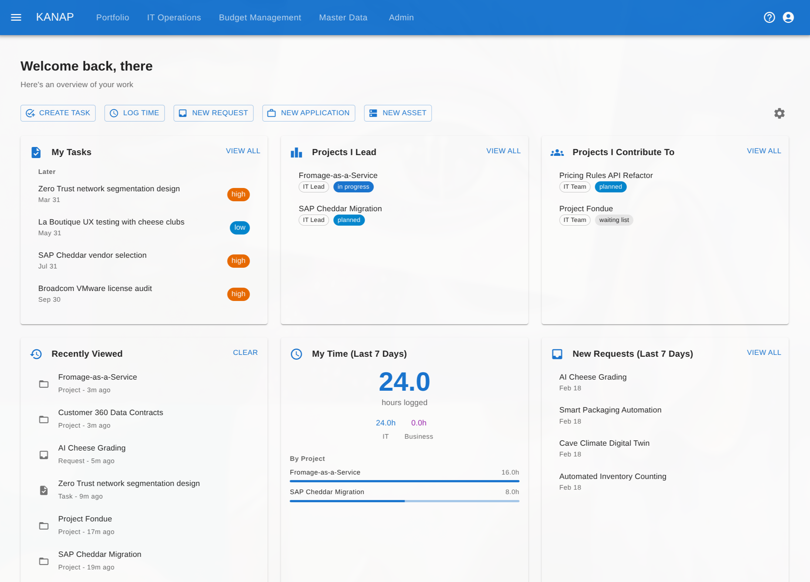

# KANAP

[](https://kanap.net)
[](https://doc.kanap.net)
[](LICENSE)

**The integrated IT management platform for budget planning, enterprise architecture, and portfolio management.**

Built by an IT director who got tired of duct-taping spreadsheets, wikis, and project tools together.

[Website](https://kanap.net) | [Documentation](https://doc.kanap.net) | [Source docs](doc/)

---

## Why KANAP?

IT departments juggle budgets across spreadsheets, track applications in wikis, and manage projects in yet another tool. Nothing connects. When the CFO asks "what are we spending on that system?", the answer takes days to assemble.

KANAP replaces that patchwork with a single platform where costs link to applications, applications link to projects, and projects link back to budgets. One source of truth, zero complexity theater.



## What it does

**Budget Management** &mdash; Multi-year OPEX and CAPEX planning with six allocation methods, multi-currency support, CSV import/export, and executive reporting including chargeback and analytics dashboards.

**IT Operations** &mdash; Document and visualize your information system: application portfolio, infrastructure assets, network interfaces and connections with interactive architecture maps, location and subnet management, and business process catalog.

**Contract Management** &mdash; Track contracts with links to OPEX/CAPEX items, attachments, deadlines, and automated expiration warnings.

**Portfolio Management** &mdash; Manage the project lifecycle from initial request through delivery with roadmap scheduling and capacity analysis.

**Unified Tasks** &mdash; One task system spanning budget items, contracts, CAPEX items, and projects with status tracking, assignments, and email notifications.

## Tech stack

| Layer | Technology |
|-------|-----------|
| Backend | NestJS, TypeScript, TypeORM |
| Frontend | React, TypeScript, Vite, MUI, AG Grid, TanStack Query |
| Database | PostgreSQL 16 with Row-Level Security |
| Infrastructure | Docker, Nginx, S3-compatible storage |

Multi-tenant by design &mdash; single database with RLS isolation, subdomain routing, and RBAC.

## Self-hosted / on-premise

KANAP on-premise runs in single-tenant mode. You must provide:
- PostgreSQL 16+ (with `citext`, `pgcrypto`, and `uuid-ossp`)
- S3-compatible object storage
- A TLS reverse proxy and domain/DNS

```bash
# 1. Clone
git clone https://github.com/kanap-it/kanap.git
cd kanap

# 2. Configure before build/start
cp infra/.env.onprem.example .env
# Edit .env: DATABASE_URL, S3 settings, ADMIN_EMAIL, ADMIN_PASSWORD, JWT secrets, APP_BASE_URL

# 3. Build
docker build -t kanap-api:latest ./backend
docker build -t kanap-web:latest ./frontend

# 4. Start
docker compose -f infra/compose.onprem.yml up -d

# 5. Verify API startup
docker compose -f infra/compose.onprem.yml logs -f api
```

On first boot, KANAP runs migrations and provisions the tenant and admin user from `.env`.
Your reverse proxy must route `/api/*` to `api:8080` and `/*` to `web:80`, preserve `Host`, and set `X-Forwarded-Proto`.

Full documentation:
- [On-premise overview](https://doc.kanap.net/on-premise/)
- [Installation guide](https://doc.kanap.net/on-premise/installation/)

## Project structure

```
backend/    NestJS API, migrations, business logic
frontend/   React SPA, pages, components, hooks
infra/      Docker Compose, Nginx configs, deploy scripts
doc/        Architecture, API reference, runbooks, guides
```

## Self-hosted vs. managed

KANAP is free to self-host using the on-premise deployment mode. A managed cloud service is available at [kanap.net](https://kanap.net) starting at EUR 49/month.

## Contributing

Contributions are welcome! Please [open an issue](https://github.com/kanap-it/kanap/issues) first to discuss what you'd like to change.

## License

[O'Saasy License](LICENSE) &mdash; MIT-based with a single restriction: you may not offer KANAP as a competing hosted/SaaS product. Everything else (use, modify, distribute, sell) is permitted.

Copyright 2025, Kanap SARL.
