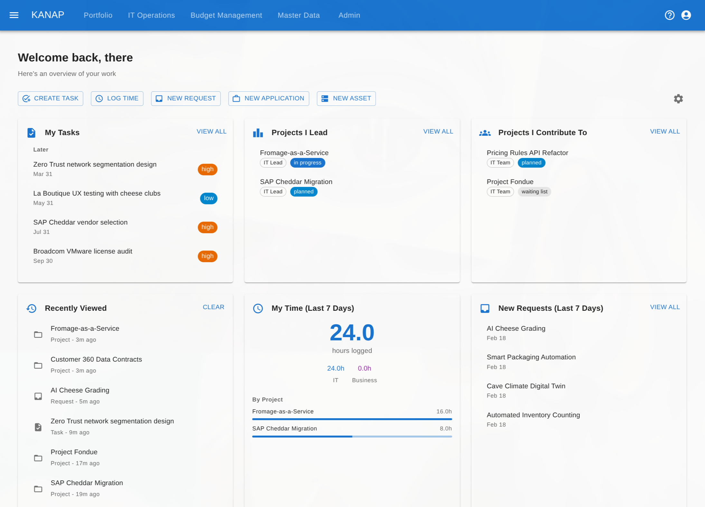

# KANAP

**The open source IT governance platform for modern IT departments.**

KANAP helps CIOs and IT managers run budget, architecture, portfolio, knowledge, tasks, and AI from one connected system.

Self-host it for free, or let us run it for you.

[Website](https://kanap.net) | [Documentation](https://doc.kanap.net) | [Self-hosting guide](https://doc.kanap.net/on-premise/) | [Source docs](doc/)

---

## Why KANAP?

IT departments often run on disconnected fragments:

- budgets in spreadsheets
- applications in wikis or partial CMDBs
- projects in generic project tools
- documentation in Confluence, SharePoint, or people's heads
- tasks spread across tickets, emails, and meetings

Nothing connects. When the CFO asks "what are we spending on that system?", or the CEO asks "what happens if we delay this project?", the answer takes days to assemble.

KANAP replaces that patchwork with a single open source system of record where costs link to applications, applications link to infrastructure, projects link to budgets and tasks, and knowledge links to the entities it describes.

Think of it as the operating system of the IT department: the coordination layer for planning, documenting, budgeting, deciding, and executing.

## What it does

**Budget management**: Multi-year OPEX and CAPEX planning with allocation methods, multi-currency support, CSV import/export, chargeback, analytics dashboards, contracts, attachments, deadlines, and expiration warnings.

**IT landscape**: Document and visualize applications, infrastructure assets, network interfaces, connections, locations, subnets, and business processes with interactive architecture maps.

**Portfolio management**: Manage demand from initial request through project delivery with scoring, roadmap scheduling, capacity analysis, lifecycle tracking, and project/task execution.

**Knowledge management**: Govern IT documentation with markdown editing, structured libraries, review workflows, version history, export to PDF/DOCX/ODT, and links to applications, projects, assets, and tasks.

**Unified tasks**: One task system spanning budget items, contracts, CAPEX items, applications, assets, requests, and projects.

**Plaid AI assistant**: Ask questions, create documents, manage tasks, and explore IT data through natural-language chat. KANAP also exposes an MCP server so external AI tools can query and act on governed IT data directly.

## Open source first

KANAP is licensed under [AGPL v3](LICENSE).

- Full product, not a teaser edition
- Free to self-host
- No feature paywall
- No seat tax for self-hosted deployments
- Source code available for audit and contribution
- Your data can stay on your own infrastructure

## Self-hosting

KANAP runs on Linux with Docker and supports on-premise single-tenant deployments.

Two install paths are documented:

- **[AI-assisted installation](https://doc.kanap.net/on-premise/installation-ai/)**: let a coding agent guide setup interactively on a clean server.
- **[Manual installation](https://doc.kanap.net/on-premise/installation-example/)**: follow the full step-by-step process yourself.

Typical requirements:

- Docker
- PostgreSQL 16+
- S3-compatible object storage
- TLS reverse proxy

## Hosted KANAP and support

Self-hosting is free.

Paid options are for teams that want operational help:

- **Self-hosted support**: priority support for teams running KANAP themselves.
- **Hosted KANAP**: the same open source platform operated by KANAP, with hosting, updates, backups, support, and activation help.

See [kanap.net](https://kanap.net/offer) for current pricing.

## Tech stack

| Layer | Technology |
|-------|------------|
| Backend | NestJS, TypeScript, TypeORM |
| Frontend | React, TypeScript, Vite, MUI, AG Grid, TanStack Query |
| Database | PostgreSQL 16 with Row-Level Security |
| Infrastructure | Docker, Nginx, S3-compatible storage |
| Marketing site | Astro |

Multi-tenant by design: shared database, PostgreSQL RLS isolation, subdomain routing, RBAC, and audit trails.

## Project structure

~~~text
backend/    NestJS API, migrations, business logic
frontend/   React SPA, pages, components, hooks
infra/      Docker Compose, Nginx configs, deploy scripts
doc/        Architecture, API reference, runbooks, guides
marketing/  Astro marketing site
~~~

## Contributing

Contributions are welcome. Please [open an issue](https://github.com/kanap-it/kanap/issues) before larger changes so we can align on scope.

See [CONTRIBUTING.md](CONTRIBUTING.md) for guidelines.

## Security

If you find a security issue, please follow [SECURITY.md](SECURITY.md).

## License

[AGPL v3](LICENSE). You are free to use, modify, and distribute KANAP. The AGPL copyleft clause ensures that anyone running a modified version as a network service must share their changes, keeping the project genuinely open.

Copyright 2025-2026, Kanap SARL.
