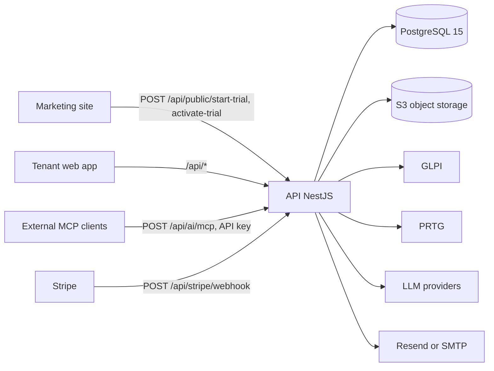

# Architecture

Metadata
- Purpose: Describe high-level system architecture and integrations
- Audience: Engineers, architects, product, operations
- Status: current
- Owner: TBD
- Last Updated: 2026-09-15

## Summary
KANAP is a NestJS API, a Vite/React single-page app and an Astro marketing site in front of one PostgreSQL 15 database. The same code base ships in two deployment modes selected at runtime: `multi-tenant` (the cloud SaaS, one shared database with row-level security per tenant) and `single-tenant` (on-premise, one tenant, no platform layer). See [Deployment Modes](#deployment-modes).

Production topology layers Cloudflare in front of a host Nginx front door for routing/TLS. Platform-administration traffic uses a dedicated host (`platform-admin.kanap.net`) served by the same NestJS/Vite stack but bound to a system tenant instead of a customer tenant.

## Context
Goals, constraints, assumptions, and relevant background for architectural choices.

## Deployment Modes
- `DEPLOYMENT_MODE=single-tenant` selects on-premise mode; any other value (or unset) is `multi-tenant`. Flags are computed once in `backend/src/config/features.ts` and are the single source of truth:
  - `SINGLE_TENANT`, `DEPLOYMENT_MODE`
  - `STRIPE_BILLING` (multi-tenant only, needs `STRIPE_SECRET_KEY`)
  - `ENTRA_SSO` (`ENTRA_CLIENT_ID` present)
  - `EMAIL_ENABLED` (a transport is configured, see Notifications)
  - `AI_CHAT_ENABLED`, `AI_MCP_ENABLED`, `AI_SETTINGS_ENABLED` (booleans), `AI_WEB_SEARCH_READY` (`BRAVE_SEARCH_API_KEY` present)
- Backend gates live in `backend/src/common/feature-gates.ts` (`throwFeatureDisabled()`, `MultiTenantOnlyGuard`, `throwNotAvailableInMode()`). The SPA reads the same flags through `GET /api/config/public` and the `useFeatures()` hook (`frontend/src/config/FeaturesContext.tsx`) to hide routes and navigation.
- Single-tenant consequences: Host-header tenant resolution is skipped and `DEFAULT_TENANT_SLUG` (default `default`) is used; the tenant, its administrator and a local subscription are auto-provisioned on first boot (`backend/src/main.ts`); trial signup endpoints, the platform console and Stripe are off; SMTP email is accepted.
- Compose files: `infra/docker-compose.yml` (dev, with `db`), `infra/compose.qa.yml` / `infra/compose.prod.yml` (cloud), `infra/compose.onprem.yml` (api + web only, loopback ports 8080/8081).
- The full feature gate inventory and the on-premise design live in `doc/on-premise/technical-design.md`; operations in `doc/on-premise/README.md` and `doc/on-premise/operations-internals.md`. CI (`.github/workflows/ci.yml`) builds both modes.

## Components
- **Frontend (`web`)**: React + TypeScript (Vite), MUI + icons, AG Grid community (`ServerDataGrid`), TanStack Query, i18next (en/fr/de/es), zod + react-hook-form, dnd-kit, ag-charts, d3, SVAR Gantt, MDXEditor. Navigation is a top AppBar with workspace tabs (AI, Agents, Portfolio, Knowledge, IT Landscape, Budget Management, Master Data, Admin) plus a per-workspace left drawer; Home is the `/` root. Details in `doc/frontend-architecture.md`.
- **Backend API (`api`)**: NestJS + TypeORM on Node 20. Modules by domain:
  - Budget: spend (OPEX), capex, contracts, accounts / chart of accounts, currency, freeze, analytics, billing, dashboard
  - Master data: companies, departments, suppliers, contacts, locations, users, business processes, master-data operations
  - Portfolio: requests, projects, teams, contributors, time entries; tasks
  - IT Landscape: applications, app instances, assets, connections, interfaces and bindings, IT Ops settings, incidents
  - Knowledge: documents, libraries, folders, types, workflows, integrated documents
  - AI: chat, MCP server, control plane (agents, capabilities, approvals), GLPI and PRTG providers, model registry
  - Platform and admin: tenants, roles, permissions, auth (local + Entra), audit, branding, CoA templates, ops, scheduled tasks, cleanup
  - Cross-cutting: tenancy, storage, email, notifications, i18n, public endpoints, health, seed
- **Data store (`db`)**: PostgreSQL 15. Containerized in dev only; host-installed on QA/prod. Row-level security on every tenant-scoped table.
- **Marketing (`marketing`)**: Astro 5 static site in `marketing/web`, built with Node 22 and served by Nginx. Takes a `PUBLIC_GA_ID` build argument (GA4). Content notes live next to the site (`marketing/web/*.md`).
- **Integrations**: CSV import/export; GLPI (ticketing) and PRTG (monitoring) providers for agents; Microsoft Entra (SSO + directory sync); Stripe (billing, cloud only); Resend or SMTP (email); Brave Search (web search); S3-compatible object storage; MCP (inbound server and outbound bridge).

## Ingress & Routing (prod intent)
- Cloudflare:
  - DNS and TLS termination for `kanap.net`, `qa.kanap.net`, `dev.kanap.net`, and their subdomains.
  - Proxies HTTPS traffic to the origin Nginx instance (QA/prod servers) or to the Cloudflare Tunnel endpoint (local dev).
- Origin Nginx vhosts (`infra/nginx/host/prod.conf`, `qa.conf`, `cloudflare-real-ip.conf`):
  - `kanap.net` and `www.kanap.net` -> `marketing` (127.0.0.1:8082)
  - `location /api/` on every vhost -> `api` (127.0.0.1:8080) with the `/api/` prefix stripped (avoids CORS for signup)
  - `*.kanap.net` -> `web` (127.0.0.1:8081), one subdomain per tenant. `platform-admin.kanap.net` is served by this wildcard block; the backend distinguishes it by `PLATFORM_ADMIN_HOST`.

## Environments
- Dev (local):
  - Fully containerized: `db`, `api`, `web`, and `marketing` via `infra/docker-compose.yml`. The `dev-proxy` compose profile adds an Nginx that mirrors QA/prod routing (`infra/nginx/dev/nginx.conf`).
  - Cloudflare Tunnel terminates HTTPS for `dev.kanap.net` and `*.dev.kanap.net` and forwards to that proxy on `localhost:80`. The tunnel is host-side, not committed.
  - `lvh.me` and `*.lvh.me` remain available as an HTTP-only fallback without Cloudflare.
- QA (`qa.kanap.net`) and Prod (`kanap.net`):
  - DNS and TLS managed by Cloudflare (proxied records for the root and wildcard).
  - Host-installed Nginx (ports 80/443) and host-installed Postgres; the API reaches Postgres through `host.docker.internal`.
  - Containers for `api`, `web`, and `marketing` only, bound to loopback; host Nginx proxies to them.
  - Deploy = `git pull`, `docker compose --env-file backend/.env.<env> -f infra/compose.<env>.yml build api web`, then `up -d api web`.
- On-premise: `infra/compose.onprem.yml` with `DEPLOYMENT_MODE=single-tenant`; the customer provides Postgres, reverse proxy and S3-compatible storage.
- Migrations: in dev the compose command runs `typeorm migration:run` before `start:dev`. QA, prod and on-prem images start with `scripts/migrate-and-start.js` (waits for the database, runs migrations, honours `SKIP_MIGRATIONS`), and TypeORM also has `migrationsRun: true`.

## Data Flow


## Integrations
- CSV import/export remains the primary bulk data surface (`npm run test:csv` covers it).
- Ticketing and monitoring providers are documented in `doc/service-desk-provider-integration.md` and `doc/monitoring-provider-integration.md`.
- MCP: see [AI Control Plane](#ai-control-plane).

## Non-Functional Concerns
- Security: local password auth + JWT, optional Microsoft Entra SSO per tenant, audit logging for all writes, RLS on every tenant table.
- **CORS**: origin allowlist via `CORS_ORIGINS` with wildcard patterns (`https://*.kanap.net`), parsed in `backend/src/common/env.ts`. Production fails to start without it; non-production falls back to permissive CORS with a warning.
- **Rate limiting**: `ThrottlerModule` (60 s window, 10 requests) is always registered; a custom guard (`backend/src/common/rate-limit.guard.ts`) applies it per controller (auth, public signup, applications, document export) and short-circuits when `RATE_LIMIT_ENABLED=false`. `RATE_LIMIT_TRUST_PROXY=true` (set on QA/prod) enables Express `trust proxy` so client IPs come from the proxy headers.
- **Database connection management**: pool `DB_POOL_MAX` (20), `DB_POOL_MIN` (2), `DB_POOL_IDLE_TIMEOUT` (30 s), `DB_POOL_CONNECTION_TIMEOUT` (10 s), configured in `backend/src/app.module.ts`. Twenty connections support roughly 50 to 100 concurrent users.
- **Resilience**: request-level transactions with guaranteed connection release; fail-fast connection timeouts prevent hung requests.

### Files Storage
- All attachments are stored in S3-compatible object storage (Hetzner in the cloud) through the abstract `StorageService`, implemented by `S3StorageService` (AWS SDK v3, `backend/src/common/storage/`).
- Cloud buckets per environment: `cio-dev`, `cio-qa`, `cio-prod`; location `nbg1`, endpoint `https://nbg1.your-objectstorage.com`.
- Object keys are tenant-scoped and recorded in `storage_path` columns; the API streams downloads from S3.
- Tenant branding logos live under `files/<tenant-id>/branding/logo<ext>` and are served through `GET /public/branding/logo` so login and app-shell rendering work without a JWT.
- Transport is TLS. Explicit per-request SSE headers are used where supported; otherwise uploads rely on bucket-default encryption.
- Env: `FILES_STORAGE=s3`, `S3_BUCKET`, `S3_REGION`, `S3_ENDPOINT`, `S3_FORCE_PATH_STYLE`, `AWS_ACCESS_KEY_ID`, `AWS_SECRET_ACCESS_KEY`.
- There is no local-filesystem backend: `FILES_STORAGE` only resolves to S3. On-premise installs need an S3-compatible service (MinIO or equivalent).
- Scheduled cleanup jobs remove orphaned attachments and ghost objects (see Scheduled Tasks).

### Applications Portfolio (IT Landscape)
- Backend: `ApplicationsModule` provides CRUD and sub-resources; all tables are RLS-protected.
- Data model: `applications` (with `is_suite`), `application_owners`, `application_companies`, `application_departments`, `application_links` (`purpose` in `general|recovery_plan|recovery_test`), `application_attachments`, `application_data_residency`, `application_suites` (parent/child), `application_support_contacts`, and link tables to projects, contracts, spend items and capex items. `app_instances` and `app_asset_assignments` place applications on assets.
- Classification (v1): `applications` carries `criticality` (nullable, catalog-driven), `cyber_criticality`, `recovery_wave`, `rto_minutes`, `rpo_minutes`, `classification_justification`, `classification_revision` and a `classification_review` jsonb. Catalogs are per tenant in `tenants.metadata.it_ops` (`backend/src/it-ops-settings/classification-catalog.ts`). A trigger bumps `classification_revision` when linked references (links, data residency) change.
- Derived metric: total users computed from audience with preference for company IT users and department headcount; de-duplicates company vs department.
- Purge: `AdminTenantsService` deletes all `application_*` rows and the matching S3 objects during tenant deletion.

### Assets, Connections & Map
- Assets (`assets`, formerly `servers`) with hardware, support, relations, cluster membership, links, attachments and link tables to projects, spend, capex and contracts. Locations (`locations` and sub-tables) hold sites, contacts and subnets.
- Connections: `connections` (tenant-unique `connection_reference`, name, description, topology `server_to_server|multi_server`, lifecycle, risk fields `criticality` and `data_class` (nullable since classification v1), `contains_pii`, `risk_mode`), `connection_servers` (multi-asset membership, column `asset_id`), `connection_legs` (per-leg endpoints), `connection_protocols` (codes from IT Ops connection types).
- Validation: lifecycle and data class against tenant IT Ops settings; entities against `settings.entities`; protocols against `settings.connectionTypes`. When `risk_mode = 'derived'`, effective risk (`effective_criticality`, `effective_data_class`, `effective_contains_pii`) is computed from linked interfaces via `interface_connection_links`.
- Subnets: IT Ops settings hold per-location subnets (`settings.subnets`) with CIDR, optional VLAN (1-4094), network zone and description. Assets pick a subnet, which fills the network zone. Catalog usage tracking reports subnets in use.
- Endpoints: `/connections`, `/connections/ids`, `/connections/by-server/:serverId`, `/connections/:id`, `/connections/:id/legs`, `/connections/map` (environment + lifecycle filters), `/connections/:id/interface-links`, `/connections/:id/knowledge-documents`, bulk delete.
- Visualization: Connection Map (`/it/connection-map`) renders assets and entities as nodes and connections as edges, with bidirectional meshes for multi-asset topology; environment/lifecycle filters, multi-asset toggle, freeze/auto-center/zoom, and a side panel with deep links to asset, connection and interface workspaces.
- Interface linkage: `interface_connection_links` joins `interface_bindings` to `connections` (unique per pair, cascade delete). APIs: `GET/POST /interface-bindings/:bindingId/connection-links`, `DELETE /interface-bindings/:bindingId/connection-links/:linkId`, `GET /connections/:id/interface-links`, `GET /interfaces/:id/connection-links`. Cross-map links pass `rootIds` and `depth=1` to keep default views scoped.

### Incidents
- `IncidentsModule` keeps a tenant logbook (`INC-N` references): `incidents`, `incident_entries` (timeline), `incident_applications`, `incident_assets`, `incident_attachments`; tasks attach to incidents through `related_object_type = 'incident'` and a dedicated tasks controller. Permission resource `incidents` supports the `contributor` level.

### Knowledge
- `KnowledgeModule` manages documents (`DOC-N`) in libraries with membership, folders, types, versions, edit locks, classifications, contributors, workflows and participants, plus link tables to applications, assets, projects, requests, tasks, connections, interfaces, locations and incidents.
- Integrated documents (`integrated_document_bindings`, `integrated_document_slot_settings`) attach managed documents to business records; `INTEGRATED_DOCS_AUTO_ROLLOUT` in the start script controls the automatic rollout.
- A `search_index` table backs global and agent search; a scheduled job rebuilds it.

### AI Control Plane
- The backend hosts an agentic control plane (Plaid) that governs AI-driven work over a registry of typed **capability contracts** (`backend/src/ai/control-plane/capability/`). Each contract declares its provider kind (`kanap_domain`, `ticketing`, `monitoring`, `virtualization`, `directory`, `communication`, `automation`, `external_mcp`, `web`), supported surfaces, effect (read/propose/write/...), risk level, maximum autonomy (A0 to A6), approval strategy and MCP exposure. The dispatcher validates inputs, enforces surface/approval/pause rules, executes the handler and grades evidence: `kanap_domain` providers record evidence at `system` trust, every other provider at `external` trust.
- **Agents**: two agent types ship, managed in the `/agents` workspace with several agents per tenant. `helpdesk` triages tickets from GLPI (classification, named technician assignment, routine status changes). `sre` diagnoses PRTG monitoring alerts. Definitions (`ai_agent_definitions`) carry a persona, a scope policy, an allowed capability list and an LLM model reference. Ingestion, approval lifecycle and activity retention run as scheduled tasks.
- **Knowledge and web sources** are configured per agent on its scope policy, distinct from tenant-wide AI settings. The policy selects KANAP knowledge (all readable libraries or a subset, always intersected with the configuring admin's readable libraries) and whether the agent may search the web. Internal knowledge takes precedence; web results carry `external` trust and are cited with their URL.
- **`web_search`** is a governed internal capability (provider kind `web`, internal surface, read effect, autonomy `A1`, no approval, not exposed over MCP). Its handler uses `BraveSearchService`, which strips UUIDs, internal references, emails and internal hostnames from the query and refuses to run if nothing public remains. Dispatch is gated on `AI_WEB_SEARCH_READY` and is best-effort.
- **Model registry**: models are rows in `ai_model_configs` per tenant (provider `anthropic|openai|ollama|custom`, model, endpoint, encrypted key, vision support, EUR prices per million tokens, timeout). Chat (`ai_settings.chat_model_config_id`) and agents (`ai_agent_definitions.llm_model_config_id`) reference a config; `null` resolves to the tenant default, then to the platform built-in model configured by platform admins (`platform_ai_config`, `platform_ai_plan_limits`). The flat `ai_settings.llm_*` columns are deprecated. Usage is metered in `ai_builtin_usage`.
- **Chat and MCP**: native chat is served at `/ai/chat` (`ai_conversations`, `ai_messages`, attachments, retention job). An inbound MCP server (`POST /ai/mcp`, JSON-RPC, server name `kanap-mcp`) exposes the MCP-enabled capability contracts to external clients, authenticated by tenant-scoped API keys (`ai_api_keys`) with access policy, rate limiting and an audit trail (`backend/src/ai/control-plane/mcp/`). An outbound bridge registers external MCP servers per tenant (`ai_external_mcp_servers`, tool snapshots) as `external_mcp` capabilities. Both sides are gated by `AI_MCP_ENABLED` through `AiPolicyService`, which also enforces per-tenant AI policy and the subscription gate.
- **Subscription gate**: on frozen or trial-expired tenants every AI feature is off (chat, MCP, agents, scheduled ingestion). `evaluateSubscriptionAccess` in `backend/src/billing/subscription-freeze.util.ts` is the single decision point; it is a no-op when Stripe is not configured, so on-premise is unaffected.
- See `doc/plaid-architecture.md` for the full control-plane design (runs/steps/tool executions, capability registry, approval service, automation catalog, live-readiness harness).

### Scheduled Tasks
- All recurring work registers with `ScheduledTasksService` (`backend/src/admin/scheduled-tasks/`) at module init. There are no `@Cron` decorators left. Each task has a default cron, an override stored in the global `scheduled_tasks` table (editable from the admin console) and a run log in `scheduled_task_runs`.
- Registered tasks include expiration warnings (`check-expirations`, daily 08:00 UTC), weekly review digests (`send-weekly-reviews`, hourly), Entra directory sync (daily 03:00 UTC), ticket and alert ingestion for agents, approval lifecycle sweeping, agent activity and conversation retention, mutation preview expiration, search index reindex, orphaned attachment and ghost object cleanup.

## Multitenancy
- Storage model: single Postgres database per environment (not per-tenant). Tenants share tables keyed by `tenant_id`. See `doc/adr/0002-multitenancy-storage.md`.
- Isolation: RLS on all multi-tenant tables; the API sets a request-scoped session variable (`set_config('app.current_tenant', '<uuid>', true)`) used by the policies. Two canonicalization migrations (`1844300000000`, `1844400000000`) repaired earlier drift and enforce `FORCE ROW LEVEL SECURITY` everywhere. Policies exist in two equivalent forms: `tenant_id = app_current_tenant()` (most tables) and the older `tenant_id = NULLIF(current_setting('app.current_tenant', true), '')::uuid` (about a quarter, `portfolio_projects` included). `app_current_tenant()` is that same expression with no fallback: without context it returns NULL, so both forms filter out every row and inserts fail on `NOT NULL`.
- Indexing: lead with `tenant_id` in composite keys and uniques (`PRIMARY KEY (tenant_id, id)`, `UNIQUE (tenant_id, slug)`).
- Tenancy resolution (`backend/src/main.ts`): apex hosts (`kanap.net`, `www.`, `dev.`, `qa.`, `*.lvh.me`) are no-tenant public hosts; `<slug>.<domain>` resolves a `Tenant` by slug (404 `TENANT_NOT_FOUND` with a marketing redirect otherwise); `PLATFORM_ADMIN_HOST` binds the `platform-admin` system tenant. In single-tenant mode Host parsing is skipped and `DEFAULT_TENANT_SLUG` is used (503 `TENANT_NOT_READY` until provisioned).
- Sessions: cookies are scoped per subdomain; no cross-subdomain cookies.
- Scalability: horizontally scale `web`/`api`; add PgBouncer; partition large tables by `tenant_id` if needed.
- Provisioning flow (cloud only): marketing POSTs to `/api/public/start-trial` (`org`, `slug`, `email`, required `country_iso`, `captchaToken`). The API verifies Turnstile (`off|monitor|enforce`, production defaults to `enforce`), records the request in `trial_signups`, emails an activation link, and `/api/public/activate-trial` provisions the tenant, its Administrator, an initial company from `country_iso` and a local trialing subscription, then returns a password-reset token so the admin sets credentials inside the tenant app.
- Tenant slug reservation policy is centralized in `backend/src/tenants/tenant-slug-policy.ts` and enforced in `POST /public/start-trial` and `TenantsService.createTenant`/`updateTenant`. Unavailable slugs return `400` with code `SUBDOMAIN_NOT_AVAILABLE`.
- Default CoA provisioning: during activation, after `app.current_tenant` is set, the API looks for the single global platform CoA template marked `loaded_by_default` and, when present, copies it into a `GLOBAL` CoA marked as the tenant's Global Default. The initial company auto-assigns to its country's default CoA when one exists, else to the Global Default.
- Tenant branding is stored on `tenants.branding` (jsonb: logo path/version, light/dark primary colors, dark-mode logo toggle). The column sits on the tenant record (no per-table `tenant_id`) and is guarded by host + permission checks in code.
- Activity comment notifications: rich-text comment bodies are sanitized before email rendering; inline images are embedded as CID attachments when possible, with absolute URL fallback.

### Notifications Module
- **NotificationsModule** provides event-driven and scheduled email notifications with per-user preference control.
- **Event-driven triggers**: status changes (portfolio items), team additions and changes, comments (portfolio/tasks), task assignments, shares, expiration warnings (contracts/OPEX). Recipients are computed per event based on role (assignee, requestor, viewer, lead, team member).
- **Task unified-activity notifications**: status + comment submissions are evaluated per recipient preferences; recipients with both enabled get one merged email.
- **Task status action buttons**: deep-link quick actions (`?action=set_status&status=...`) for common transitions.
- **Deduplication**: 5-minute in-memory window per event/recipient; 7 days for expiration warnings; none for shares.
- **Preferences**: `user_notification_preferences` (RLS) stores per-user, per-tenant settings: three groups (portfolio, tasks, budget) each with a master toggle and per-category switches, a global `emails_enabled` toggle, and the weekly review schedule (day, hour, timezone; defaults Monday 08:00 Europe/Paris, all opt-out by default).
- **Scheduled jobs** are registered with the Scheduled Tasks registry (`check-expirations` daily 08:00 UTC over contracts and OPEX items expiring within 30 days; `send-weekly-reviews` hourly, timezone-aware, summarizing assigned tasks, due dates and portfolio activity). *(The weekly review has not been validated in production yet.)*
- **Email templates**: shared `emailWrapper()` gives header, footer, tenant branding and a "Manage notification preferences" link (`/settings/notifications`); emails are localized (en/fr/de/es) and deep links resolve the tenant slug from `APP_URL`.
- **Email transports** (`backend/src/email/transports/`): Resend (`RESEND_API_KEY`) in the cloud; SMTP (`SMTP_HOST`, `SMTP_PORT`, `SMTP_SECURE`, `SMTP_USER`, `SMTP_PASSWORD` or `SMTP_PASS`, `SMTP_FROM`) accepted only in single-tenant mode; a disabled transport when nothing is configured. The in-process queue paces messages (`EMAIL_QUEUE_MIN_INTERVAL_MS`, default 700 ms) and retries Resend `429` responses with exponential backoff.
- **`EMAIL_OVERRIDE`** redirects every outgoing email to one address (dev/QA safety net; never in production).
- Tenant creation notification: on activation the API sends a non-blocking email to `admin@kanap.net` with tenant name, slug, admin email and `country_iso`.

### Platform Administration Channel
- `PLATFORM_ADMIN_HOST` identifies the platform console. The middleware looks up the `platform-admin` **system tenant** and attaches it to the request, so platform admin runs with a real tenant context and RLS applies normally. `req.isPlatformHost = true` lets guards tell platform routes from tenant routes. The whole channel is multi-tenant only (`MultiTenantOnlyGuard`).
- `/public/tenant-info` returns `{ platform: true }`, tenant metadata + branding (`slug`, `name`, `logoPath`, `logoVersion`, `useLogoInDark`, `primaryColorLight`, `primaryColorDark`), or `{ marketing: true }`, letting the SPA swap shells without a separate bundle.
- Branding endpoints (`/admin/branding/*`) require `users:admin` and reject platform-host requests.
- The platform module owns tenant list and stats, plan changes, freeze/unfreeze, synchronous deletion (purge of tenant rows and S3 objects), ops monitoring (`GET /admin/ops/snapshot`: API traffic, DB health, process metrics), platform AI configuration and the scheduled tasks console.

**System tenant protections**
- `platform-admin` has `is_system_tenant = true` and cannot be deleted, frozen or modified; system tenants are always excluded from the admin tenant list.
- Reserved slugs (`tenant-slug-policy.ts`): `www`, `api`, `admin`, `billing`, `account`, `platform-admin`, `app`, `nextcloud`, `migration`, `example`.

### Billing & Subscriptions (cloud)
- `BillingModule` (`backend/src/billing/`) integrates Stripe: `GET /billing/plans|subscription|profile`, `POST /billing/checkout|change-plan|portal|request-invoice`, and `POST /stripe/webhook` (raw body). Subscription state lives on `subscriptions`, not on `tenant.status`.
- Freeze and grace rules are computed in `subscription-freeze.util.ts` and enforced by `PermissionGuard` (`TRIAL_EXPIRED`, `SUBSCRIPTION_FROZEN`) on every permission-checked request, and by the AI policy and agent sweepers. Without `STRIPE_SECRET_KEY` (on-premise, or a cloud dev stack) the gate allows everything.

### Request DB Context
- A global guard (`TenantInitGuard`) opens a per-request QueryRunner transaction and sets the tenant GUC before any other guard, so permission checks already run under RLS. A global interceptor (`TenantInterceptor`) reuses the transaction for the handler and commits or rolls back in `finalize`. Both release the connection on error. Opt-outs: `@Public()` and `@SkipTenantTransaction()`.
- Controllers pass the request `EntityManager` (`req.queryRunner.manager`) into services so every query runs in the tenant-scoped session.
- Outside a request (public endpoints, scheduled tasks, directory sync) `withTenant()` in `backend/src/common/tenant-runner.ts` opens an equivalent scoped transaction.
- `TenancyManager` (`backend/src/common/tenancy/`) is a request-scoped abstraction over the same context. It is available and imported, but the live host-resolution path is the inline middleware in `backend/src/main.ts`.

### Current Coverage (RLS + tenant_id)
Every table with a `tenant_id` column has `ENABLE` + `FORCE ROW LEVEL SECURITY` and a `USING`/`WITH CHECK` policy binding `tenant_id` to the session tenant (212 tables on 2026-09-19, none enabled without force). Since migration `1853580000000` every policy reads the tenant through `app_current_tenant()`, which NULLIFs an empty setting and returns NULL when the context is missing: an unset or empty context filters every row out instead of raising `invalid input syntax for type uuid`, and it never falls back to another tenant. Families covered today:
- Identity and RBAC: users, roles, role_permissions (tenant-scoped, aligned with the parent role), user_roles, refresh_tokens, password_reset_tokens, user_notification_preferences, user_dashboard_config.
- Master data: companies, departments, suppliers and supplier_contacts, contacts, locations (+ contacts, links, sub-items), business_processes (+ categories), accounts, chart of accounts, company_metrics, department_metrics, analytics_categories.
- Budget: spend_items, spend_versions, spend_amounts, spend_allocations, spend_links/attachments/contacts/tasks; capex_items, capex_versions, capex_amounts, capex_allocations, capex_links/attachments/contacts; contracts, contract_spend_items, contract_capex_items, contract_attachments, contract_links, contract_contacts; currency_rate_sets, freeze_states; subscriptions.
- Portfolio: portfolio_requests and portfolio_projects with team, dependencies, phases, milestones, criteria, settings, types/categories/streams, teams, skills, employment types, task types, phase templates, effort allocations, time entries, request link tables (applications, assets, business processes, capex, opex, projects), and the shared `portfolio_activities` history.
- Tasks: tasks (`related_object_type` in `spend_item|contract|capex_item|project|incident`, or standalone), task_attachments, task_applications, task_assets, task_time_entries, user_time_monthly_aggregates.
- IT Landscape: applications and every `application_*` table; assets and every `asset_*` table, including `asset_external_links` (one row per external inventory object, e.g. a Netbox device or VM, `tenant_id` defaulting to `app_current_tenant()`); app_instances, app_asset_assignments; connections, connection_servers, connection_legs, connection_protocols; interfaces and every `interface_*` table (bindings, legs, owners, companies, links, attachments, dependencies, data residency, key identifiers, middleware applications, mapping sets/groups/rules, connection links); incidents and every `incident_*` table.
- Knowledge: documents and every `document_*` table, integrated_document_bindings, integrated_document_slot_settings, search_index.
- AI: ai_settings, ai_api_keys, ai_conversations, ai_messages (+ attachments), ai_model_configs, ai_adapter_configs, ai_runs, ai_run_steps, ai_tool_executions, ai_action_requests, ai_approvals, ai_approval_policies, ai_autonomy_*, ai_evidence, ai_observations, ai_decisions, ai_recommendations, ai_evaluations, ai_emergency_pauses, ai_agent_* (definitions, triggers, target states, work items, audit events), ai_external_mcp_*, ai_mutation_*, ai_automation_job_catalog, ai_live_test_targets, ai_builtin_usage.
- Cross-cutting: audit_log, item_sequences (business references), allocation_rules.
- `allocation_rules` mixes global defaults (`tenant_id IS NULL`, unique per fiscal year) and per-tenant overrides (`UNIQUE (tenant_id, fiscal_year)`, `mode` in `auto|manual_company`, `company_ids`). Its policy is deliberately `tenant_id IS NULL OR tenant_id = app_current_tenant()`; per-tenant rows are removed at purge, global defaults remain.
- Global tables without `tenant_id` (no RLS): tenants, trial_signups, currencies, fx_rates, spread_profiles, account_classifications, coa_templates, scheduled_tasks, scheduled_task_runs, platform_ai_config, platform_ai_plan_limits, and TypeORM's `migrations`.
- `portfolio_criterion_values` lost its `tenant_id` in migration `1767200000000` and got it back in `1853560000000`, with the canonical policy and a `BEFORE INSERT OR UPDATE` trigger that fills `tenant_id` from the parent criterion and rejects a criterion from another tenant (FK checks bypass RLS, the trigger does not).

The authoritative list is the database itself. Check it on any environment with:
```sql
SELECT relname, relforcerowsecurity FROM pg_class WHERE relrowsecurity ORDER BY 1;
```

Notes
- Permission checks (`PermissionGuard`) and RBAC services execute through the request-scoped EntityManager so RLS applies to permission reads as well.
- **Multi-role support**: `PermissionGuard` reads `user_roles` and computes union permissions with `PermissionsService.listForRoles()`, matching `/auth/me`.
- `AuditService` writes `audit_log` through the request EntityManager so rows carry the tenant and pass RLS.
- `portfolio_activities` has canonical tenant RLS (migration `1830000000000`). History views combine two sources: the **creation** entry is resolved from `audit_log` by `resolveRecordCreators()` (`backend/src/audit/record-creator.util.ts`, index migration `1853550000000`), later changes come from `portfolio_activities` with readable labels (`portfolio/utils/activity-labels.ts`). History reads add an explicit `a.tenant_id = app_current_tenant()` predicate as defense in depth.
- Migrations run with **no** `app.current_tenant`. `FORCE ROW LEVEL SECURITY` also binds the table owner, so a backfill must disable RLS around itself (precedent: `1824000000000-audit-log-viewer-metadata-indexes.ts`) or it silently touches zero rows.

### Frontend Permission Gating
- `ProtectedRoute.tsx` enforces route-level access by mapping path segments to backend permission resources. Each workspace has its own alias table (admin, ops, IT, master data, portfolio, knowledge); examples: `roles`, `auth`, `branding`, `audit-logs`, `scheduled-tasks` → `users`; `integrations`, `ai`, `ai-models`, `ai-usage` → `ai_settings`; `agent-control` → `ai_agents`; `billing` → `billing`; `reports` → `reporting`; `assets`, `servers` → `infrastructure`; `operations` → `opex`. AI and agent routes additionally check feature flags and capability availability, and business contributors get a scoped-application carve-out.
- `hasLevel(resource, level)` in `AuthContext` ranks `reader(1) < contributor(2) < member/manager(3) < admin(4)`; `manager` is an alias kept for old clients, the stored enum is `reader|contributor|member|admin`. `contributor` allows editing existing items without creating top-level ones (used by `portfolio_projects` and `incidents`).
- Menu visibility in `Layout.tsx` checks permissions with resource identifiers that must align with backend `@RequireLevel` decorators.
- **Workspace tab visibility**: Portfolio, IT Landscape, Budget Management, Master Data and Admin show when the user has `reader` or higher on any resource of that workspace. Knowledge requires `knowledge:reader`; AI requires the `aiChat` feature and an available chat surface; Agents has its own capability check; global/platform admins bypass; on the platform host only Admin shows.

## Decisions
- Multitenancy storage: single Postgres database per environment with RLS isolation; no per-tenant databases. See `doc/adr/0002-multitenancy-storage.md`.
- Allocation model and metrics: `doc/adr/0001-allocation-model-and-metrics.md`.
- One code base, two deployment modes selected at runtime, gated by feature flags rather than branches.
- Forward-compat: nullable FKs for projects/contracts; `spend_amounts` as reporting source; allocations for chargeback.

## Backend Patterns & Abstractions
- **BaseDeleteService** consolidates delete logic with cascade, storage cleanup and audit logging.
- **TenancyManager** and `withTenant()` for tenant context outside the request path.
- **Service decomposition**: large services split with a facade pattern.
- **Type safety**: Zod DTOs (`ZodValidationPipe` registered globally next to `ValidationPipe`), typed decorators, response types.

See `doc/features/patterns/backend-patterns.md` for usage examples.

## Implementation Notes
- TypeORM: single default `DataSource` export for the CLI; migrations are timestamped classes (e.g. `Init1756684800000`). Migrations run at container start (see Environments).
- Spend module: routes under `/spend-items` and `/spend-versions/:id/...`; amounts/allocations bulk endpoints use `/bulk-upsert`. Maintenance layout (summary builder, CSV service, budget operations facade) is documented in `doc/features/workspaces/spend-module-maintenance.md`.
- Data constraints: `spend_amounts` has unique `(version_id, period)`; the allocation validator enforces a 100% total (±0.01).
- Frontend patterns: `ServerDataGrid` for list views (AG Grid infinite row model, server sorting, column floating filters; only `sort` is URL-synced); `PageHeader` for titles, breadcrumbs and actions; pages fetch via TanStack Query.
- Node module interop: namespace imports for CommonJS libs (`import * as jsonwebtoken`, `import * as argon2`).
- Tests: backend hardening scripts (`npm run test:*`) and the frontend vitest suite both run in CI (cloud matrix job); the on-prem job builds only.

### RLS Starter Pattern (for reference)
- Use a custom GUC to carry tenant id and a policy that binds to it.
```
-- API role (no BYPASS RLS)
-- CREATE ROLE app NOINHERIT LOGIN;
-- GRANT CONNECT ON DATABASE appdb TO app;

-- Example table
-- CREATE TABLE projects (
--   tenant_id uuid NOT NULL,
--   id uuid PRIMARY KEY,
--   name text NOT NULL,
--   slug text NOT NULL,
--   created_at timestamptz NOT NULL DEFAULT now()
-- );
-- CREATE UNIQUE INDEX projects_slug_tenant ON projects (tenant_id, slug);

-- RLS
-- ALTER TABLE projects ENABLE ROW LEVEL SECURITY;
-- ALTER TABLE projects FORCE ROW LEVEL SECURITY;
-- CREATE POLICY tenant_isolation ON projects
--   USING (tenant_id = current_setting('app.current_tenant', true)::uuid);

-- Optional trigger to auto-fill tenant_id from session on insert
-- CREATE FUNCTION set_tenant_id() RETURNS trigger AS $$
-- BEGIN
--   IF NEW.tenant_id IS NULL THEN
--     NEW.tenant_id := current_setting('app.current_tenant', true)::uuid;
--   END IF;
--   RETURN NEW;
-- END; $$ LANGUAGE plpgsql;
-- CREATE TRIGGER projects_set_tenant_id
--   BEFORE INSERT ON projects FOR EACH ROW EXECUTE FUNCTION set_tenant_id();
```

See also: `doc/frontend-architecture.md` for detailed UI guidelines.

### Authentication & SSO
- Local email/password + JWT is the baseline for every user. Access tokens come from `AuthService.signToken`; a refresh token is kept in an `HttpOnly` cookie (`auth-cookie.util.ts`) and feeds `/auth/me`, guards and the SPA's Axios interceptor.
- Microsoft Entra is the only SSO provider (no SAML, Google or generic OIDC). Each tenant connects one Entra directory via **Admin → Authentication**; the tenant row stores `sso_provider` (`none|entra`), `sso_enabled`, `entra_tenant_id` and `entra_metadata`, enforcing a strict 1:1 mapping.
- `EntraAuthService` downloads the discovery document and JWKS, builds authorization URLs, exchanges codes and validates `id_token` claims (audience, `nonce`, `tid`, `oid`). The issuer is validated against `https://login.microsoftonline.com/<tid>/v2.0` to support multi-tenant authorities. Env: `ENTRA_CLIENT_ID`, `ENTRA_CLIENT_SECRET`, `ENTRA_AUTHORITY` (e.g. `https://login.microsoftonline.com/organizations`), `ENTRA_REDIRECT_URI` (public HTTPS URL of `/auth/entra/callback`). The whole feature is gated by `ENTRA_SSO`.
- Setup flow: `POST /auth/entra/setup/start` (tenant admin, JWT; a `GET` variant exists for browser redirects) returns `{ url }` with a signed short-lived `state` carrying the OIDC nonce. The URL uses `prompt=consent`. The shared callback validates the nonce, persists the Entra tenant id and redirects to the tenant host's `/admin/auth?setup=success`.
- Login flow: `/login` offers "Sign in with Microsoft" → `GET /auth/entra/login?redirectTo=...` on the tenant host → 302 to Microsoft with signed `state`. The callback validates the token (nonce, `tid` vs `tenant.entra_tenant_id`), links or provisions the user (external subject first, then email), signs a short-lived handoff and redirects to `/login/callback#handoff=...`. The SPA redeems it through `POST /auth/entra/session` on the tenant host, which sets the refresh cookie and returns the access token; `AuthContext.login()` clears the fragment and navigates.
- Directory sync: a daily scheduled task (`entra-directory-sync.service.ts`) pulls users and manager relationships from Microsoft Graph per tenant, running under `withTenant()`, and reports `consent_required` when the app registration lacks permissions. Group sync is not implemented.
- **HTTPS requirement**: Entra redirect URIs must be HTTPS. In development use the same tunnel for the SPA, `ENTRA_REDIRECT_URI` and `VITE_API_URL`; nonce validation is stateless and needs no cross-subdomain cookie.

## Open Questions
- Local-filesystem storage backend for air-gapped on-premise installs.
- Production validation of the weekly review digest.

## References
- `doc/on-premise/technical-design.md` (feature gate inventory), `doc/plaid-architecture.md`, `doc/frontend-architecture.md`, `doc/adr/`, `doc/database/database-indexes.md`, `doc/api-reference.md`.
