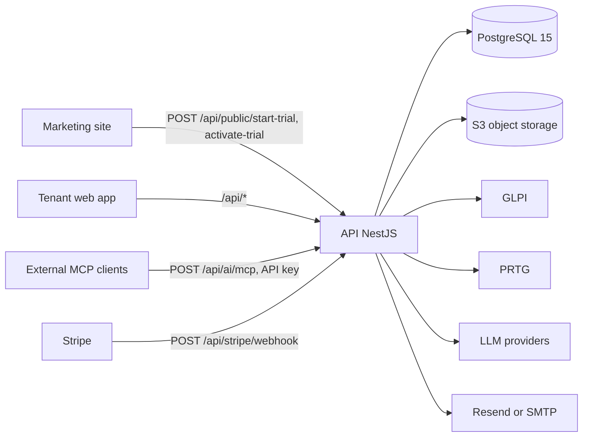

# Architecture

Metadata
- Purpose: Describe high-level system architecture and integrations
- Audience: Engineers, architects, product, operations
- Status: current
- Owner: TBD
- Last Updated: 2026-10-02

## Summary
KANAP is a NestJS API, a Vite/React single-page app and an Astro marketing site in front of one PostgreSQL 15 database. The same code base ships in two deployment modes selected at runtime: `multi-tenant` (the cloud SaaS, one shared database with row-level security per tenant) and `single-tenant` (on-premise, one tenant, no platform layer). See [Deployment Modes](#deployment-modes).

Production topology layers Cloudflare in front of a host Nginx front door for routing/TLS. Platform-administration traffic uses a dedicated host (`platform-admin.kanap.net`) served by the same NestJS/Vite stack but bound to a system tenant instead of a customer tenant.

## Context
Goals, constraints, assumptions, and relevant background for architectural choices.

## Deployment Modes
- `DEPLOYMENT_MODE=single-tenant` selects on-premise mode; any other value (or unset) is `multi-tenant`. Flags are computed once in `backend/src/config/features.ts` and are the single source of truth:
  - `SINGLE_TENANT`, `DEPLOYMENT_MODE`
  - `STRIPE_BILLING` (multi-tenant only, needs `STRIPE_SECRET_KEY`)
  - `ENTRA_SSO` (`ENTRA_CLIENT_ID` present)
  - `EMAIL_ENABLED` (a transport is configured, see Notifications)
  - `AI_CHAT_ENABLED`, `AI_MCP_ENABLED`, `AI_SETTINGS_ENABLED` (booleans), `AI_WEB_SEARCH_READY` (`BRAVE_SEARCH_API_KEY` present)
- Backend gates live in `backend/src/common/feature-gates.ts` (`throwFeatureDisabled()`, `MultiTenantOnlyGuard`, `throwNotAvailableInMode()`). The SPA reads the same flags through `GET /api/config/public` and the `useFeatures()` hook (`frontend/src/config/FeaturesContext.tsx`) to hide routes and navigation.
- Single-tenant consequences: Host-header tenant resolution is skipped and `DEFAULT_TENANT_SLUG` (default `default`) is used; the tenant, its administrator and a local subscription are auto-provisioned on first boot (`backend/src/main.ts`), the tenant with the default global chart of accounts as at cloud activation (`tenants/single-tenant-provisioning.ts`, only when it creates the tenant); trial signup endpoints, the platform console and Stripe are off; SMTP email is accepted.
- Compose files: `infra/docker-compose.yml` (dev, with `db`), `infra/compose.qa.yml` / `infra/compose.prod.yml` (cloud), `infra/compose.onprem.yml` (api + web only, loopback ports 8080/8081).
- The full feature gate inventory and the on-premise design live in `doc/on-premise/technical-design.md`; operations in `doc/on-premise/README.md` and `doc/on-premise/operations-internals.md`. CI (`.github/workflows/ci.yml`) builds both modes.

## Components
- **Frontend (`web`)**: React + TypeScript (Vite), MUI + icons, AG Grid community (`ServerDataGrid`), TanStack Query, i18next (en/fr/de/es), zod + react-hook-form, dnd-kit, ag-charts, d3, SVAR Gantt, MDXEditor. Navigation is a top AppBar with workspace tabs (AI, Agents, Portfolio, Knowledge, IT Landscape, Budget Management, Master Data, Admin) plus a per-workspace left drawer; Home is the `/` root. Details in `doc/frontend-architecture.md`.
- **Backend API (`api`)**: NestJS + TypeORM on Node 24. Modules by domain:
  - Budget: spend (OPEX), capex, contracts, accounts / chart of accounts, currency, freeze, analytics, billing, dashboard
  - Master data: companies, departments, suppliers, contacts, locations, users, business processes, master-data operations
  - Portfolio: requests, projects, teams, contributors, time entries; tasks
  - IT Landscape: applications, app instances, assets, connections, interfaces and bindings, IT Ops settings, incidents
  - Knowledge: documents, libraries, folders, types, workflows, integrated documents
  - AI: chat, MCP server, control plane (agents, capabilities, approvals), GLPI and PRTG providers, model registry
  - Platform and admin: tenants, roles, permissions, auth (local + Entra), audit, branding, CoA templates, ops, scheduled tasks, cleanup
  - Cross-cutting: tenancy, storage, email, notifications, i18n, public endpoints, health, seed
- **Data store (`db`)**: PostgreSQL 15. Containerized in dev only; host-installed on QA/prod. Row-level security on every tenant-scoped table.
- **Marketing (`marketing`)**: Astro 7 static site in `marketing/web`, built with Node 24 and served by Nginx. Content notes live next to the site (`marketing/web/*.md`).
- **Integrations**: CSV import/export; GLPI (ticketing) and PRTG (monitoring) providers for agents; Microsoft Entra (SSO + directory sync); Stripe (billing, cloud only); Resend or SMTP (email); Brave Search (web search); S3-compatible object storage; MCP (inbound server and outbound bridge).

## Ingress & Routing (prod intent)
- Cloudflare:
  - DNS and TLS termination for `kanap.net`, `qa.kanap.net`, `dev.kanap.net`, and their subdomains.
  - Proxies HTTPS traffic to the origin Nginx instance (QA/prod servers) or to the Cloudflare Tunnel endpoint (local dev).
- Origin Nginx vhosts (`infra/nginx/host/prod.conf`, `qa.conf`, `cloudflare-real-ip.conf`):
  - `kanap.net` and `www.kanap.net` -> `marketing` (127.0.0.1:8082)
  - `location /api/` on every vhost -> `api` (127.0.0.1:8080) with the `/api/` prefix stripped (avoids CORS for signup)
  - `*.kanap.net` -> `web` (127.0.0.1:8081), one subdomain per tenant. `platform-admin.kanap.net` is served by this wildcard block; the backend distinguishes it by `PLATFORM_ADMIN_HOST`.

## Environments
- Dev (local):
  - Fully containerized: `db`, `api`, `web`, and `marketing` via `infra/docker-compose.yml`. The `dev-proxy` compose profile adds an Nginx that mirrors QA/prod routing (`infra/nginx/dev/nginx.conf`).
  - Cloudflare Tunnel terminates HTTPS for `dev.kanap.net` and `*.dev.kanap.net` and forwards to that proxy on `localhost:80`. The tunnel is host-side, not committed.
  - `lvh.me` and `*.lvh.me` remain available as an HTTP-only fallback without Cloudflare.
- QA (`qa.kanap.net`) and Prod (`kanap.net`):
  - DNS and TLS managed by Cloudflare (proxied records for the root and wildcard).
  - Host-installed Nginx (ports 80/443) and host-installed Postgres; the API reaches Postgres through `host.docker.internal`.
  - Containers for `api`, `web`, and `marketing` only, bound to loopback; host Nginx proxies to them.
  - Deploy = `git pull`, `docker compose --env-file backend/.env.<env> -f infra/compose.<env>.yml build api web marketing`, then `up -d api web marketing`. The public site is the `marketing` service: a deploy that leaves it out keeps serving the previous site.
- On-premise: `infra/compose.onprem.yml` with `DEPLOYMENT_MODE=single-tenant`; the customer provides Postgres, reverse proxy and S3-compatible storage.
- Migrations: in dev the compose command runs `typeorm migration:run` before `start:dev`. QA, prod and on-prem images start with `scripts/migrate-and-start.js` (waits for the database, runs migrations, honours `SKIP_MIGRATIONS`), then start the API. Only the connection is retried, while the database is not ready or goes away during the migrations (ECONNRESET, ECONNREFUSED, PostgreSQL 57P01, 57P03 and class 08; `MIGRATION_MAX_ATTEMPTS` tries in all, 30 by default, `MIGRATION_RETRY_DELAY_MS` apart, 2 s): a migration that fails on its own stops the entrypoint at once (exit 1) and logs its message and the start of the failed statement. The pending migrations run in one transaction, so the database is left as it was before that start; the container's restart policy runs the entrypoint again. Then the API starts: in the same process, or as a cluster of `API_WORKERS` processes forked once the migrations ran (see [Several API Processes](#several-api-processes)). TypeORM also has `migrationsRun: true` in a single process (a no-op after the entrypoint) and `false` in a cluster worker: TypeORM takes no lock, two processes migrating at once would collide.
- Images: the API image (`backend/Dockerfile`) has four stages. `base` holds the Alpine system, the document converters (pandoc, typst, inkscape) and the fonts; `build` holds every dependency and the compiled `dist/`; `production-dependencies` prunes the development dependencies; `runtime` is the default target and the one the on-premise, QA and prod compose files name (`target: runtime`): compiled code, production dependencies, the start-up script and the demo data set, without sources or development tools, started as the `node` user. `dev` is the full tree: the local stack runs it, and so do maintenance commands that run TypeScript (`docker build --target dev -t kanap-api-tools backend`). Every base image in the Dockerfiles and compose files is pinned to the digest of its multi-architecture index (`name:tag@sha256:...`); Dependabot proposes the new digests and `.github/scripts/check-image-pins.sh` checks the pins in CI. CI builds the API (runtime and dev), web and marketing images on every change that touches them. The server compose files add a health check on `api` and `web` (status only, nothing restarts on it), Docker logs capped at 5 files of 10 MB (`json-file`), `no-new-privileges`, a process limit and `cap_drop: ALL` (the web container keeps the few capabilities nginx needs to start and switch user). The web container sends the security headers of `frontend/nginx/security-headers.conf` and hides the nginx version (`server_tokens off`). Each release can attach a component inventory and third-party notices (see `doc/sbom.md`).
- Stop: the image starts the entrypoint with the exec form of `CMD` and the compose files add `init: true`, so `docker stop` reaches Node; `stop_grace_period: 30s` leaves the drain time (`SHUTDOWN_DRAIN_TIMEOUT_MS`, default 20 s). The cron jobs stop at once and the API stops accepting connections; the requests in flight finish; 1.5 s after the last response (the work it started without awaiting gets going), the work left is given until 2 s before the end of the drain time: notification chains and queued FX refreshes (tracked, `common/background-work.ts`), running scheduled tasks (a run still going then is recorded as failed, "interrupted", instead of staying "running" for an hour), the notifications those tasks started, then the email queue (emails still queued at the deadline are lost, logged). Then the app closes and the process exits 0; past the drain time it exits 1. The image used to start Node through `sh -lc`, which never passed SIGTERM on: every stop waited 10 s and was killed, which cut requests, queued emails and running tasks alike; the locale that login shell exported is now set in the image (`LANG=C.UTF-8`, `CHARSET`, `LC_COLLATE`).

## Data Flow

```mermaid
flowchart LR
  Marketing[Marketing site] -->|POST /api/public/start-trial, activate-trial| API[API NestJS]
  Web[Tenant web app] -->|/api/*| API
  MCP[External MCP clients] -->|POST /api/ai/mcp, API key| API
  Stripe[Stripe] -->|POST /api/stripe/webhook| API
  API --> DB[(PostgreSQL 15)]
  API --> S3[(S3 object storage)]
  API --> GLPI[GLPI]
  API --> PRTG[PRTG]
  API --> LLM[LLM providers]
  API --> Mail[Resend or SMTP]
```

## Integrations
- CSV import/export remains the primary bulk data surface (`npm run test:csv` covers it).
- Ticketing and monitoring providers are documented in `doc/service-desk-provider-integration.md` and `doc/monitoring-provider-integration.md`.
- MCP: see [AI Control Plane](#ai-control-plane).

## Non-Functional Concerns
- Security: local password auth + JWT, optional Microsoft Entra SSO per tenant, audit logging for all writes, RLS on every tenant table.
- **Security events** (`backend/src/audit/security-events.ts`): the tenant's `audit_log` also holds sign-in and session events and exports, without a schema change. Sign-in events use `table_name = 'auth'` and one of `login`, `login_failed`, `logout`, `refresh_denied`, `password_reset_requested`, `password_reset_completed`, `sso_login`, `sso_login_failed`; the account in `record_id` and `user_id` when the request named a known one; a short code from a fixed list in `source_ref` (`bad_password`, `unknown_user`, `disabled`, `invalid_token`, ...); `after_json = { ip, user_agent }`, the address from `clientAddress()` (`common/client-address.ts`) when it is a valid IPv4 or IPv6 address of at most 45 characters (null otherwise) and the agent cut to 200 characters. No password, token, hash, link or e-mail address is stored (an attempt on an unknown address keeps its reason only). `SecurityEventsService` writes them after the outcome, in a transaction of its own (a refused sign-in rolls its transactions back), without the response waiting, and never rejects (`common/never-rejects.ts`). Paths covered: password sign-in (the platform console signs in the same way, on its own tenant), the provisioning token exchange, sign-in with Microsoft (callback and session; a failure is recorded only in the tenant a verified state or hand-off names, or in the host's tenant when Entra sign-in is set up for it: a request where nothing verifies writes nothing, and both routes carry their own sign-in rate limit, `RATE_LIMITS.ssoSignIn`, 60 a minute per client address, wider than the password sign-in's 5 because the staff of one organisation often share one outbound address), session renewal, sign-out, password reset (invitations end there too). A request without a tenant writes nothing. Exports: every route whose path ends with `/export` (`POST /export` included), and every other route that sends a file the server produces, marked `@ExportRoute()` (`GET /incidents/:id/report`), writes `table_name = 'export'`, `action = 'export'`, `after_json = { resource, path, ip, user_agent }` (address and agent as for sign-in events) through `ExportEventsInterceptor` (`common/request-pipeline.ts`), in the request transaction before the handler: a failed or refused export leaves no row. Role changes (create, rename, permissions, duplicate, delete) are logged on `roles` with before, after and actor. The `auth-event-retention` task deletes `auth` rows older than 365 days; the rest of `audit_log` is kept. A password sign-in on an unknown address or on an account without a local password runs the same argon2 check as a wrong password, against a fixed hash (`FIXED_PASSWORD_HASH`, `auth/auth.service.ts`), so the response time does not depend on the account existing. A password reset request for a known account issues its link and sends its e-mail after the response (`AuthController.deliverPasswordReset`, `@NeverRejects()`, its own connections in the request's tenant, no entity manager of the request) and then records its event: a link that cannot be saved or an e-mail that cannot be sent is an error line in the server log (transport and error code; the link, the token and every e-mail address are left out) and the reason `email_not_sent` (also given when the address is on a reserved `.example` domain, where nothing is sent), so the answer is the same for every address whether the e-mail goes out or not.
- **CORS**: one origin policy (`backend/src/common/cors-policy.ts`, parsing in `backend/src/common/env.ts`) shared by the CORS middleware and the cookie-based session routes (`POST /auth/refresh`, `POST /auth/logout`). Accepted: exact `CORS_ORIGINS` entries, the application address (`APP_BASE_URL`, or the tenant's address), the address of the request itself, and in multi-tenant mode wildcard patterns (`https://*.kanap.net`) for the targeted tenant only (single-tenant: patterns still accepted with a start-up warning). A refused origin gets a 403 without CORS headers. Run mode (`APP_ENV`): production fails to start without `CORS_ORIGINS` and `APP_BASE_URL`; development allows every origin when `CORS_ORIGINS` is empty; any other value applies the production origin rules and warns at start (with neither `CORS_ORIGINS` nor an application address, every origin stays allowed in this version).
- **Rate limiting**: `ThrottlerModule` (60 s window, 10 requests) is always registered; a custom guard (`backend/src/common/rate-limit.guard.ts`) applies it per controller (auth, public signup, applications, document export) and short-circuits when `RATE_LIMIT_ENABLED=false`. `RATE_LIMIT_TRUST_PROXY` gives the number of reverse proxies in front of the API (`false`, `true` for one, or 1 to 3) and sets Express `trust proxy` to it, so `req.ip` is the entry the outermost trusted proxy appended to `X-Forwarded-For` (`common/client-address.ts`). Unset or invalid, the default is one proxy in single-tenant mode and none in multi-tenant mode (QA and prod set it explicitly); the start-up log has one `[RATE-LIMIT]` line that says which applies. With one API process the counts live in its memory; with several they live in the database (see [Several API Processes](#several-api-processes)).
- **Database connection management**: per API process, pool `DB_POOL_MAX` (20, at least 2), `DB_POOL_MIN` (2), `DB_POOL_IDLE_TIMEOUT` (30 s), `DB_POOL_CONNECTION_TIMEOUT` (10 s), configured in `backend/src/app.module.ts`. With `API_WORKERS` processes the API can open `API_WORKERS × DB_POOL_MAX` connections; see [Database Pool](#database-pool).
- **Resilience**: request-level transactions with guaranteed connection release; fail-fast connection timeouts prevent hung requests.

### Several API Processes
One Node process runs all the JavaScript of the API on one thread: while a request computes, every other request of every tenant waits (measured on 2026-10-01: a trivial request waited up to 2 s behind a list rebuild, plan planning/perf-scale lot 4A). `API_WORKERS` runs several API processes in the same container.

**Run mode: Node cluster in one container.** `API_WORKERS` (default 1, at most 16) is read by the entrypoint `scripts/migrate-and-start.js`. With 1 nothing changes: the API runs in the entrypoint's process. With N > 1 the entrypoint runs the migrations, then becomes a cluster primary (`backend/src/common/cluster/cluster-primary.ts`) and forks N workers, each a full API process (`dist/main.js`) with its own pool. Once the workers start, the primary serves no request and holds no database connection. It hands each worker `KANAP_WORKER_ID` (1 to N), `KANAP_WORKER_COUNT` and `KANAP_CLUSTER_STARTED_AT`, forks a dead worker again in its slot after 1 s, and exits 1 after 5 worker exits within 60 s so the container restart policy takes over. On SIGTERM it forwards the signal, waits for the workers to drain (drain time + 5 s), kills a worker still running, then exits. Connections are spread by the cluster module, round robin on Linux; a request stays on the worker that got its connection, so behind a proxy that opens one connection per request (the host nginx examples of this repository) requests spread evenly.

Why not several containers behind nginx: an on-premise customer runs one compose file and one reverse proxy of their own. Several containers would mean an upstream block with one port per container in the customer's proxy, a migration lock between containers, and N copies of everything that runs once. The cluster keeps one container, one port, one log stream, one memory limit, and one place where the migrations run. The coordination below lives in the database anyway, so a second container (an operator running two by mistake, or a future scale-out) stays safe for jobs, notifications, provisioning and migrations; only the per-process items accepted below would count per container.

**Lead process.** The single process, or worker 1 (`isLeadProcess()` in `process-role.ts`), does the once-per-start work: the startup scheduled tasks (`runOnStartup`, today `lifecycle-status-sync`) and the connection budget check. It alone prints the start-up report lines (`[ENV]`, `[SECRETS]`, `[RATE-LIMIT]`, `[CORS]`, `[DB]`, `[SECURITY]`, an administrator account left unchanged); a line that reports a change (a tenant, an account or a subscription created) is printed by the process that made it. Nest's own lines (routes, cron jobs scheduled, application started) describe each process and are printed by each.

**Inventory: what assumed one process, and the decision for each.**

| Item | Where | One-process assumption | Decision |
|---|---|---|---|
| Migrations at start | `scripts/migrate-and-start.js`, TypeORM `migrationsRun` | TypeORM takes no lock; every process would migrate | Run once by the entrypoint before any worker starts; `migrationsRun` is `false` in a cluster worker |
| Integrated-document rollout at start | `migrate-and-start.js` | | Already under a session advisory lock; runs once, in the entrypoint |
| Start-up writes: admin seed, single-tenant tenant, administrator and subscription | `main.ts` | Check then insert: two processes could both insert | Under one session advisory lock (`common/cluster/startup-lock.ts`): processes take turns, the later ones find the rows. The `SEED_ADMIN` path no longer returns from `bootstrap()` when the tenant is missing (the API never listened) |
| Scheduled tasks (14: expiration warnings, weekly reviews, Entra sync, agent ingestions and sweeper, retention, previews, search reindex, attachment and ghost cleanup, lifecycle status sync, list-context purge, Netbox sync) | `ScheduledTasksService` | Every process schedules every task. The session advisory lock of `executeTask` only skips a run that overlaps another: a fast task could end before the next process tries it and run once per process | Each cron tick is claimed once in `scheduled_tasks.last_tick_at` (the tick's scheduled time, the same in every process): one process moves it and runs, the others skip. The overlap lock stays for long runs and manual triggers. A stored tick more than a day ahead (a clock that was ahead, a VM restored from a snapshot) is claimed over, with a warning; a lost claim is logged only with `LOG_LEVEL=debug` |
| Task registration at start | `ScheduledTasksService.onApplicationBootstrap` | Insert of a missing task by two processes: unique violation, the second process failed to start | `INSERT ... ON CONFLICT (name) DO NOTHING`: the second insert adds nothing, and no failed statement reaches the log |
| Cron change or disable from the admin console | `updateTask` | Reaches the process that answered only | The claim also checks the stored cron and `enabled`: another process reschedules or drops its job at its next tick instead of running |
| Startup tasks (`runOnStartup`) | `main.ts` | Once per process | Lead process only |
| Ops metrics | `OpsMetricsStore`, `DbMetricsService` | Per process: the snapshot showed the process that answered | Each process publishes a summary every 15 s to `ops_process_metrics` when N > 1; the snapshot lists and adds them up (see Supervision) |
| Liveness route `/health` | tenancy middleware, `TenantInitGuard` | | Never looked up and `@Public()`: no tenant lookup and no tenant transaction, so polling it costs no connection and a saturated pool does not make the API look dead (it used to take two connections per call in single-tenant mode, and answer 503 under saturation) |
| Event notification dedupe (5 minutes per recipient, item and trigger) | `NotificationsService` | In-memory map: two quick changes answered by two processes both mailed | Claimed in the database, `notification_dedupe` (tenant-scoped, RLS forced), one upsert per claim, committed before the email goes out. If the claim fails the process falls back to its in-memory window. Expiration warnings were already deduplicated in the database (`audit_log` rows under an advisory lock); the weekly review runs once per tick and stamps `weekly_review_last_sent_at`; share notifications have no dedupe, as before |
| HTTP rate limits (login 5/min, sign-in with Microsoft 60/min, refresh, password reset, provisioning exchange, public forms, exports and imports, saved list filters) | `RateLimitGuard`, `ThrottlerModule` | In-memory counts: N processes, N times the budget | One `ThrottlerModule`, in `app.module.ts`: no other module imports its own (it would give its routes a separate in-memory counter, as `AuthModule` once did for the sign-in routes; `auth-rate-limit-processes.integration.spec.ts`). One process: in memory, unchanged. Several: `rate_limit_hits` (UNLOGGED, keys are SHA-256 hashes), one upsert per hit on a second pool connection, outside the request's transaction (a refused login rolls the request back, a count written inside it would be lost): a rate-limited request holds two connections for a moment, hence `DB_POOL_MAX` ≥ 2. Fixed window: at a window boundary up to twice the limit can pass within seconds (the in-memory counter expires each hit on its own). When the database does not answer within 1.5 s (pool exhausted, database down) the hit is counted in the process's memory, with one warning a minute: the limit then holds per process |
| Built-in AI rate limits (per tenant per minute, per user per hour) | `AiBuiltinRateLimiter` | In memory | Accepted per process: the built-in model is a cloud feature (cloud runs one process), and the monthly quota that bounds the cost is reserved in the database (`ai_builtin_usage`) for every message. With N processes the per-minute and per-hour bursts are N times higher |
| MCP API key rate limit | `AiMcpRateLimiter` | In memory | Accepted per process: it protects each process from a runaway client; the total is N times the configured limit |
| Email queue and pacing (700 ms between messages for Resend) | `EmailService` | One queue | Accepted per process: N processes send up to N times faster; Resend `429` answers are retried with backoff. SMTP (on-premise) has no such limit. A stop waits for the queue to empty, within the drain time (see Stop under Environments); emails still queued at the deadline, or when a process is killed, are lost, logged |
| Login FX refresh (first login after 30 days) | `FxIngestionService.maybeRefreshOnLogin` | Read the date, then queue; the per-process job map deduplicated concurrent logins | The date is claimed with a conditional update before the refresh is queued: one refresh for logins answered by several processes. The scheduled FX refresh is disabled. A manual refresh is deduplicated per process only (an admin's two clicks on two processes fetch twice, harmless) |
| World Bank CSV cache file | `WorldBankClient`, `os.tmpdir()` | One writer | The workers of a container share the directory: written to a temporary file, then renamed over the cache file |
| Access-token legacy window | `auth/access-token.util.ts` | Opened at each process start | No longer tied to a start: access tokens without the purpose marker are refused unless `JWT_LEGACY_ACCESS_TOKEN_DEADLINE` names an instant, the same for every process. `PROCESS_STARTED_AT` (the cluster start, `KANAP_CLUSTER_STARTED_AT`) only dates the start-up report |
| Tenant by host slug, roles and permissions | tenancy middleware, `PermissionGuard` | | Not cached: read per request, nothing to invalidate |
| Platform AI configuration | `PlatformAiConfigService` | 60 s cache, cleared on save by the answering process | Accepted: another process sees a change within 60 s (cloud only) |
| Tenant slug for email links | notification services | Cached forever per process | Unchanged (a slug change already needs a restart in one process) |
| Caches of outside systems (GLPI, Entra discovery and tokens, agent targeting options, Stripe prices, World Bank data in memory) | various | Per process | Accepted: each process fills its own, bounded by their TTL |
| Netbox preview inventory (2 minutes, reused by a second preview) | `NetboxSyncService` | One process | Accepted: a second preview answered by another process reads Netbox again (slower, same result); after a run, another process may show a preview from an inventory up to 2 minutes old. A run always reads Netbox |
| Netbox sync running lock | `NetboxSyncService` | | Already a session advisory lock across processes |
| AI chat streaming | `ai-chat.controller.ts` | | Per request (NDJSON over one HTTP response), stopped by the client disconnecting; no websocket, no server-side session |
| Upload temporary files | document import and export | | Per request (`mkdtemp`, removed in `finally`); CSV and attachment uploads stay in memory |

**Memory** (measured 2026-10-02 on the `perf` tenant, 5,000 OPEX lines, 50 virtual users): an API process starts at about 200 MB resident and stays under 300 MB under load; the cluster primary uses 120 MB after the migrations, falling to 50 to 85 MB (it keeps the modules it loaded to migrate). The whole container: 260 MB with one process, 450 to 520 MB with two workers, 600 to 680 MB with four (the workers share code pages). QA has 3.8 GB and no swap: keep `API_WORKERS` at 1 there. On a dedicated on-premise server, N = the cores the API may use, typically 2 to 4, within memory: plan 0.4 GB per process, plus PostgreSQL, plus 1 GB of headroom for image builds.

**Measured effect** (same data, `scripts/perf/bench.mjs` load mode, list and workspace scenarios, single-tenant container on a 16-core dev machine): at 10 users one process is enough, more change nothing. At 50 users, from 1 to 2 to 4 processes: opening the list p95 199, 177, 109 ms; opening a line 237, 142, 82 ms; next line 161, 83, 49 ms; saving a field 151, 69, 57 ms; event loop lag probe p95 8.4, 3.9, 2.1 ms; no error in any run. With one process the pool stayed full (20 connections in use, requests waiting): transactions wait for the busy main thread. With two, the pools used 15 connections of 40 in all.

### Database Pool
- **Pool per process.** `DB_POOL_MAX` (default 20, at least 2: a scheduled task holds one connection for its lock while its queries take another, and with several processes a rate-limited request takes a second one for its count; a lower value is raised to 2 with a warning at start) connections per API process. At start the lead process checks `API_WORKERS × DB_POOL_MAX ≤ max_connections − reserved (superuser_reserved_connections + reserved_connections) − 10` and logs one line, a warning when it does not fit, with a pool size that would (never under 2; when even 2 does not fit, fewer processes or more `max_connections`) (`common/db-pool-budget.ts`); the API starts anyway. Since the SQL list engine (step 2) requests hold their connection for milliseconds: at 50 users on 5,000 budget lines, two workers used 15 connections in all and four workers 17, so with 4 workers a pool of 10 each is enough; keep the total under about 80.
- **PgBouncer** (transaction pooling) becomes worth it past about 80 connections from the API, or when other applications share the server. The request path is compatible: the tenant and the bounded waits are set with `set_config(..., true)` inside each request's transaction and end with it. Not compatible as is, to change first: the session advisory locks held across statements outside a transaction (`ScheduledTasksService.executeTask`, the Netbox running lock, the startup provisioning lock, the integrated-document rollout), `withTenantExecution({ transaction: false })` which sets the tenant for the session (the Netbox sync; under transaction pooling the next statement can land on another server connection, and the setting stays on one another client then gets), and the migrations (run them on a direct connection). Prepared statements are unnamed (node-postgres default), fine with PgBouncer.

### Supervision
The ops snapshot (`backend/src/admin/ops/`, plan planning/perf-scale lot 4D) is served to platform admins (`GET /admin/ops/snapshot`, cloud) and, with `OPS_METRICS_TOKEN` set (24 characters or more; a shorter one leaves the route disabled and the start says so), to a monitoring tool in both modes: `GET /api/ops/metrics` with `Authorization: Bearer <token>` (404 without the setting). That route is never looked up by the tenancy middleware and opens no tenant transaction, and leaves out the messages of the recent server errors (they can quote internals; the platform console keeps them). The snapshot holds, per process:
- requests per window (1, 5, 15 minutes), status classes, p50 / p95 / p99 per route pattern over 5 minutes (30 busiest routes);
- event loop lag over the last full minute (`eventLoopLagMs`: what a 10 ms timer is late by, p50 / p95 / p99 / max; it used to count the timer resolution and was never reset) and the worst minute of the last five (`eventLoopLag5m`);
- the pool (`db.pool`): connections in use now and highest over a minute, requests waiting, the time to get a connection (p50 / p95 / max over a minute, p95 over 5 minutes, timed around the pg pool's `connect`), connections the pool could not give over 5 minutes;
- PostgreSQL activity of the API's connections (`pg_stat_activity` by application name) and database counters, read every 10 s at most;
- `health`: `ok`, `warn` or `critical` with the alerts below.

The snapshot answers when the pool is saturated, when it matters most: the figures above held in memory are always served; the pg_stat reads and the other processes' rows are not read while the process's pool is saturated (every connection open and requests waiting: they would queue behind them), and otherwise given 1 s each, in parallel. Without them the last values read are served, flagged `db.statsStale` (with `db.statsError`), and the other processes are left out.

With several processes each one publishes a summary every 15 s (UNLOGGED table `ops_process_metrics`; its row is deleted when the process stops, a killed process ages out after 45 s, rows older than 10 minutes are purged by the publishers and rows older than a day at every start). The snapshot adds `processes` (each live process, the newest row per worker slot: a worker forked again after a crash leaves an older row behind) and `aggregate`: sums for requests, memory and the current pool use, the fullest pool over the minute with its process (`inUsePctMax1m`, `fullestProcess`; the sum of the per-process highs is given as `inUseMax1mUpperBound`, an upper bound since the highs need not coincide), the worst process for the event loop, merged latency histograms for the p95s (a percentile read from the histogram is the upper bound of its bucket). `health` is evaluated on the aggregate.

An alert fires when the value is above its threshold. The latency thresholds are histogram bucket bounds, so a value at most the threshold never reads as above it.

| Alert | Warn | Critical | Meaning |
|---|---|---|---|
| `event_loop_p95_ms` (1 min, worst process) | > 100 ms | > 500 ms | The main thread is busy; every request waits behind it |
| `pool_wait_p95_ms` (1 min) | > 50 ms | > 1 s | Requests wait for a database connection |
| `pool_in_use_pct` (highest over 1 min, fullest pool) | > 90 % | | A pool is nearly full |
| `pool_failures_5m` | | > 0 | Requests got no connection and were answered 503 |
| `error_5xx_pct` (5 min, from 20 requests) | > 1 % | > 5 % | Server errors |
| `route_p95_ms:<route>` (5 min, from 20 requests on the route) | > 1 s | > 3 s | A slow route; AI, Netbox, import, export, bulk and CSV routes are left out |
| `rss_mb:<process>` | > 1024 MB | | Memory of one API process |

### Files Storage
- All attachments are stored in S3-compatible object storage (Hetzner in the cloud) through the abstract `StorageService`, implemented by `S3StorageService` (AWS SDK v3, `backend/src/common/storage/`).
- Cloud buckets per environment: `cio-dev`, `cio-qa`, `cio-prod`; location `nbg1`, endpoint `https://nbg1.your-objectstorage.com`.
- Object keys are tenant-scoped and recorded in `storage_path` columns; the API streams downloads from S3.
- Tenant branding logos live under `files/<tenant-id>/branding/logo<ext>` and are served through `GET /public/branding/logo` so login and app-shell rendering work without a JWT.
- Transport is TLS. Explicit per-request SSE headers are used where supported; otherwise uploads rely on bucket-default encryption.
- Env: `FILES_STORAGE=s3`, `S3_BUCKET`, `S3_REGION`, `S3_ENDPOINT`, `S3_FORCE_PATH_STYLE`, `AWS_ACCESS_KEY_ID`, `AWS_SECRET_ACCESS_KEY`.
- There is no local-filesystem backend: `FILES_STORAGE` only resolves to S3. On-premise installs need an S3-compatible service (MinIO or equivalent).
- Scheduled cleanup jobs remove orphaned attachments and ghost objects (see Scheduled Tasks).

### PostgreSQL Settings
PostgreSQL ran on its defaults (128 MB shared buffers, 4 MB work memory; the step 0 bench of plan planning/perf-scale saw the amounts aggregate spill its sort to disk). Its configuration belongs to whoever runs the server (the host on QA and prod, the customer on premise), so KANAP ships a sizing script and applies nothing itself, except per-table autovacuum settings through a migration.
- **`infra/postgres/kanap-pg-tune.sh`** prints an include file sized from the host's memory, for a server shared with the KANAP containers or dedicated (`--dedicated`): `shared_buffers` 25 % of RAM dedicated, 15 % shared, 10 % shared under 6 GB (image builds on the same host need the room), at most 8 GB; `effective_cache_size` 75 % or 50 %; `work_mem` 8 MB under 6 GB, 16 MB up to 24 GB, 32 MB above; `maintenance_work_mem` 5 % between 64 MB and 1 GB; `random_page_cost = 1.1` and `effective_io_concurrency = 200` (SSD); `pg_stat_statements` with `track_io_timing`; `log_min_duration_statement = 500ms` with `log_parameter_max_length = 0`; `log_lock_waits`. The rule is in the script's header.
- **Statement statistics.** `shared_preload_libraries` is one list, and a value in an included file replaces the one in `postgresql.conf`: the script keeps the server's current libraries when given them (`--preload "$(psql -XAtc 'SHOW shared_preload_libraries')"`) and writes the line commented out otherwise. PostgreSQL does not start when a preloaded library is missing (RHEL and derivatives ship it in `postgresqlNN-contrib`): the script looks for `pg_stat_statements.so` on the host (`pg_config --pkglibdir`, then the usual package paths) and writes the line commented out when it is not there. A deploy then needs a PostgreSQL restart (for `shared_buffers` and the preload) and, once, `CREATE EXTENSION pg_stat_statements` in the KANAP database as a superuser.
- **Logged parameters.** A statement over 500 ms is logged with its bind parameters, which can carry personal data (names, e-mails, comment text): the script sets `log_parameter_max_length = 0` (PostgreSQL 13+), and the cloud servers should have the same before `log_min_duration_statement` is turned on there.
- **QA and prod**: nothing is applied by a deploy. QA has 3.8 GB shared with the containers and no swap: the shared rule gives 380 MB of shared buffers and 8 MB of work memory.
- **Autovacuum of the amounts** (migration `1853820000000`, the only setting a deploy applies): `spend_amounts` and `capex_amounts` are vacuumed after 2 % dead rows instead of 20 %, analysed after 1 % changed instead of 10 %, and on PostgreSQL 13+ vacuumed after 5 % inserted rows. No memory, no restart. A table the KANAP role does not own keeps its settings, and a table busy for more than 5 s (a running VACUUM holds the same lock) is skipped; both cases log the statement to run instead of failing the deploy.

### Applications Portfolio (IT Landscape)
- Backend: `ApplicationsModule` provides CRUD and sub-resources; all tables are RLS-protected.
- Data model: `applications` (with `is_suite`), `application_owners`, `application_companies`, `application_departments`, `application_links` (`purpose` in `general|recovery_plan|recovery_test`), `application_attachments`, `application_data_residency`, `application_suites` (parent/child), `application_support_contacts`, and link tables to projects, contracts, spend items and capex items. `app_instances` and `app_asset_assignments` place applications on assets.
- Classification (v1): `applications` carries `criticality` (nullable, catalog-driven), `cyber_criticality`, `recovery_wave`, `rto_minutes`, `rpo_minutes`, `classification_justification`, `classification_revision` and a `classification_review` jsonb. Catalogs are per tenant in `tenants.metadata.it_ops` (`backend/src/it-ops-settings/classification-catalog.ts`). A trigger bumps `classification_revision` when linked references (links, data residency) change.
- Derived metric: total users computed from audience with preference for company IT users and department headcount; de-duplicates company vs department.
- Purge: `AdminTenantsService` deletes all `application_*` rows and the matching S3 objects during tenant deletion.

### Assets, Connections & Map
- Assets (`assets`, formerly `servers`) with hardware, support, relations, cluster membership, links, attachments and link tables to projects, spend, capex and contracts. Locations (`locations` and sub-tables) hold sites, contacts and subnets.
- Connections: `connections` (tenant-unique `connection_reference`, name, description, topology `server_to_server|multi_server`, lifecycle, risk fields `criticality` and `data_class` (nullable since classification v1), `contains_pii`, `risk_mode`), `connection_servers` (multi-asset membership, column `asset_id`), `connection_legs` (per-leg endpoints), `connection_protocols` (codes from IT Ops connection types).
- Validation: lifecycle and data class against tenant IT Ops settings; entities against `settings.entities`; protocols against `settings.connectionTypes`. When `risk_mode = 'derived'`, effective risk (`effective_criticality`, `effective_data_class`, `effective_contains_pii`) is computed from linked interfaces via `interface_connection_links`.
- Subnets: IT Ops settings hold per-location subnets (`settings.subnets`) with CIDR, optional VLAN (1-4094), network zone and description. Assets pick a subnet, which fills the network zone. Catalog usage tracking reports subnets in use.
- Endpoints: `/connections`, `/connections/ids`, `/connections/by-server/:serverId`, `/connections/:id`, `/connections/:id/legs`, `/connections/map` (environment + lifecycle filters), `/connections/:id/interface-links`, `/connections/:id/knowledge-documents`, bulk delete.
- Visualization: Connection Map (`/it/connection-map`) renders assets and entities as nodes and connections as edges, with bidirectional meshes for multi-asset topology; environment/lifecycle filters, multi-asset toggle, freeze/auto-center/zoom, and a side panel with deep links to asset, connection and interface workspaces.
- Interface linkage: `interface_connection_links` joins `interface_bindings` to `connections` (unique per pair, cascade delete). APIs: `GET/POST /interface-bindings/:bindingId/connection-links`, `DELETE /interface-bindings/:bindingId/connection-links/:linkId`, `GET /connections/:id/interface-links`, `GET /interfaces/:id/connection-links`. Cross-map links pass `rootIds` and `depth=1` to keep default views scoped.

### Incidents
- `IncidentsModule` keeps a tenant logbook (`INC-N` references): `incidents`, `incident_entries` (timeline), `incident_applications`, `incident_assets`, `incident_attachments`; tasks attach to incidents through `related_object_type = 'incident'` and a dedicated tasks controller. Permission resource `incidents` supports the `contributor` level.

### Knowledge
- `KnowledgeModule` manages documents (`DOC-N`) in libraries with membership, folders, types, versions, edit locks, classifications, contributors, workflows and participants, plus link tables to applications, assets, projects, requests, tasks, connections, interfaces, locations and incidents.
- Integrated documents (`integrated_document_bindings`, `integrated_document_slot_settings`) attach managed documents to business records; `INTEGRATED_DOCS_AUTO_ROLLOUT` in the start script controls the automatic rollout.
- A `search_index` table backs global and agent search; a scheduled job rebuilds it. Row triggers refresh an entry when its own row changes; renames of related records (a user, a company) wait for the daily rebuild.
- Budget line entries also carry the line's analytics values (migration `1853940000000`): an OPEX or CAPEX entry holds the names of the values the line holds on the enabled dimensions of its type, in the vector at weight B and in `extra_json.analytics` ("Nature de coût: Matériel; Récurrence: Récurrent", dimension order), which Plaid reads. Dimension names are not indexed. The values are the line's own data, written with the line under its lock, so statement triggers on `*_item_analytics_values` refresh the lines whose values were set, changed or cleared: each line once per statement and type, in the writer's tenant (PostgreSQL allows no column list on a trigger with transition tables, so the update trigger compares the old and new rows itself). Changes to the values and dimensions themselves follow the rule for related records: a value renamed, or a dimension renamed, disabled, past its end of validity, restricted to one line type or reordered, reaches a line's entry at the line's next write or at the daily rebuild (`POST /ai/admin/search-index/reindex` rebuilds a tenant at once). A cascade from the values and dimensions to the lines holding them was tried and dropped: it wrote the entries of lines its writer did not hold, and a value edit deadlocked with an import holding those lines. A refresh of given lines reads them through the primary keys (`search_index_refresh_spend_items` and `_capex_items` have one path for the tenant's lines, one for given lines). Since lot C1 (migration `1853980000000`) a CAPEX entry no longer carries the former CAPEX enums in its summary and B terms: its PP&E type, investment type and priority are found by their value names, as dimension values.

### AI Control Plane
- The backend hosts an agentic control plane (Plaid) that governs AI-driven work over a registry of typed **capability contracts** (`backend/src/ai/control-plane/capability/`). Each contract declares its provider kind (`kanap_domain`, `ticketing`, `monitoring`, `virtualization`, `directory`, `communication`, `automation`, `external_mcp`, `web`), supported surfaces, effect (read/propose/write/...), risk level, maximum autonomy (A0 to A6), approval strategy and MCP exposure. The dispatcher validates inputs, enforces surface/approval/pause rules, executes the handler and grades evidence: `kanap_domain` providers record evidence at `system` trust, every other provider at `external` trust.
- **Agents**: two agent types ship, managed in the `/agents` workspace with several agents per tenant. `helpdesk` triages tickets from GLPI (classification, named technician assignment, routine status changes). `sre` diagnoses PRTG monitoring alerts. Definitions (`ai_agent_definitions`) carry a persona, a scope policy, an allowed capability list and an LLM model reference. Ingestion, approval lifecycle and activity retention run as scheduled tasks.
- **Knowledge and web sources** are configured per agent on its scope policy, distinct from tenant-wide AI settings. The policy selects KANAP knowledge (all readable libraries or a subset, always intersected with the configuring admin's readable libraries) and whether the agent may search the web. Internal knowledge takes precedence; web results carry `external` trust and are cited with their URL.
- **`web_search`** is a governed internal capability (provider kind `web`, internal surface, read effect, autonomy `A1`, no approval, not exposed over MCP). Its handler uses `BraveSearchService`, which strips UUIDs, internal references, emails and internal hostnames from the query and refuses to run if nothing public remains. Dispatch is gated on `AI_WEB_SEARCH_READY` and is best-effort.
- **Model registry**: models are rows in `ai_model_configs` per tenant (provider `anthropic|openai|ollama|custom`, model, endpoint, encrypted key, vision support, EUR prices per million tokens, timeout). Chat (`ai_settings.chat_model_config_id`) and agents (`ai_agent_definitions.llm_model_config_id`) reference a config; `null` resolves to the tenant default, then (multi-tenant only) to the platform built-in model configured by platform admins (`platform_ai_config`, `platform_ai_plan_limits`), once the workspace has confirmed it (next bullet). `AiModelResolverService` is the single resolution point for chat, agents, ingestion and the fallback after a model is archived. The flat `ai_settings.llm_*` columns are deprecated. Usage is metered in `ai_builtin_usage`.
- **Included model confirmation** (multi-tenant only; single-tenant has no included model, the new columns stay empty and nothing changes). Before any workspace data reaches the platform built-in model, an administrator of the workspace confirms the provider shown and where it is processed.
  - *Identity.* `platform_ai_config.disclosure_name` (1 to 80 characters) and `disclosure_location` (ISO 3166-1 alpha-2 code in upper case, or `EU`) are what the platform console labels "Provider name shown to customers" and "Where data is processed". Both columns are nullable. The identity key is `builtinProviderKey` = `provider|endpoint host|name|location` (`ai/platform/platform-ai-config.service.ts`): a change of technical provider or endpoint host, of the name or of the location produces a new key, a change of model alone does not. While the name or the location is empty the identity is null and the included model counts as not configured. The platform console refuses a change of provider or endpoint host unless the name and the location are sent in the same save, and asks for a confirmation in the UI when it will make workspaces confirm again. The migration (`1853885000000`) adds the columns and pre-fills Anthropic / `US` when the platform row calls the Anthropic API directly (provider `anthropic`, no endpoint or `api.anthropic.com`); any other setup stays empty with a warning. It writes nothing in tenant tables.
  - *Acceptance.* `ai_settings.builtin_accepted_key`, `builtin_accepted_at` and `builtin_accepted_by` (nullable text, timestamptz, uuid) hold the workspace's confirmation. It is valid only while `builtin_accepted_key` equals the platform's current key. `PATCH /ai/settings` takes `accept_builtin_provider_key` (the key shown in the settings view; `null` withdraws). A key that is not the current one is refused with `400` `BUILTIN_PROVIDER_CHANGED` and the current identity in `builtin_provider`. Turning the assistant on (`chat_enabled: true`) while the included model is unconfirmed is refused with `400` `BUILTIN_PROVIDER_CONFIRMATION_REQUIRED` and the identity to confirm; the UI resends the same payload together with the key. Other changes save while the assistant waits. Changes go through the usual `ai_settings` audit entry (before and after views).
  - *Gate.* In the built-in branch of the resolver, one `getBuiltinRuntime()` read of the platform record supplies both the identity compared with the workspace's key and the runtime that is called. A mismatch fails with `builtin_not_accepted`. Callers that send nothing to the included model pass `includedModelGate: 'none'`: the MCP access check and message budget, and the agents' tool context. The settings view, `GET /ai/capabilities` (chat reason `builtin_not_accepted`, flag `builtin_confirmation_needed` when an enabled agent falls back on the unconfirmed model) and the agent quota gate (`AiAgentBuiltinQuotaService`: the scheduled poller pauses, a manual run fails, nothing is consumed) all read the same readiness. An agent or the assistant on a registry model is never gated.
  - *View.* `GET /ai/settings` returns `builtin_provider` (`in_use`, `used_by_assistant`, `name`, `location`, `key`, `accepted`, `accepted_at`, `accepted_by_name`). The platform config view (`GET /admin/ai/config`, `PATCH /admin/ai/config`) carries `disclosure_name`, `disclosure_location` and the derived `disclosure_key`.
- **Chat and MCP**: native chat is served at `/ai/chat` (`ai_conversations`, `ai_messages`, attachments, retention job). An inbound MCP server (`POST /ai/mcp`, JSON-RPC, server name `kanap-mcp`) exposes the MCP-enabled capability contracts to external clients, authenticated by tenant-scoped API keys (`ai_api_keys`) with access policy, rate limiting and an audit trail (`backend/src/ai/control-plane/mcp/`). An outbound bridge registers external MCP servers per tenant (`ai_external_mcp_servers`, tool snapshots) as `external_mcp` capabilities. Both sides are gated by `AI_MCP_ENABLED` through `AiPolicyService`, which also enforces per-tenant AI policy and the subscription gate.
- **Subscription gate**: on frozen or trial-expired tenants every AI feature is off (chat, MCP, agents, scheduled ingestion). `evaluateSubscriptionAccess` in `backend/src/billing/subscription-freeze.util.ts` is the single decision point; it is a no-op when Stripe is not configured, so on-premise is unaffected.
- See `doc/plaid-architecture.md` for the full control-plane design (runs/steps/tool executions, capability registry, approval service, automation catalog, live-readiness harness).

### Scheduled Tasks
- All recurring work registers with `ScheduledTasksService` (`backend/src/admin/scheduled-tasks/`) at module init. There are no `@Cron` decorators left. Each task has a default cron, an override stored in the global `scheduled_tasks` table (editable from the admin console) and a run log in `scheduled_task_runs`.
- Registered tasks include expiration warnings (`check-expirations`, daily 08:00 UTC), weekly review digests (`send-weekly-reviews`, hourly), Entra directory sync (daily 03:00 UTC), ticket and alert ingestion for agents, approval lifecycle sweeping, agent activity and conversation retention, mutation preview expiration, search index reindex, orphaned attachment and ghost object cleanup, and the retention of sign-in events (`auth-event-retention`, daily 03:40 UTC, one transaction per tenant: `audit_log` rows with `table_name = 'auth'` older than 365 days).
- Every API process schedules every enabled task. A cron tick runs in one process only: the process that moves `scheduled_tasks.last_tick_at` to the tick's scheduled time runs the task, the others skip (`claimTick`); a stored tick more than a day ahead is claimed over, with a warning. The same claim checks the stored cron and `enabled`, so a change made in the admin console, which reaches one process, makes the others reschedule or drop their job at their next tick. `executeTask` then takes the task's session advisory lock and releases it on one dedicated connection, so a run that overlaps another run of the same task (a long run, a manual trigger) is skipped. At a stop no run starts any more, the running ones get the drain time, and one still going is recorded as interrupted. A task registered with `runOnStartup` also runs once when the API server starts: `main.ts` calls `runStartupTasks()` after `listen`, in the lead process only (the single process, or worker 1), so scripts and specs that build an AppModule context never run it.
- `lifecycle-status-sync` (hourly, and once at server start) sets the stored `status` from `disabled_at` on the twelve tables where the status is derived from the end of validity (`LIFECYCLE_STATUS_TABLES` in `backend/src/cleanup/lifecycle-status-sync.service.ts`, checked against the catalog by its spec). One short transaction per table and tenant with a 500 ms lock timeout: a table whose row is locked by an edit is skipped until the next run. Frozen tenants included, both deployment modes. Only `status` changes: no audit row, `updated_at` kept, no line's `row_version` bumped (its trigger ignores `status`). Without it, a future end of validity that passes leaves the stored value stale until the next edit. The status-change emails (CAPEX, OPEX, contracts) take the status before an edit from the stored end of validity, so they never depend on this task having run.

## Multitenancy
- Storage model: single Postgres database per environment (not per-tenant). Tenants share tables keyed by `tenant_id`. See `doc/adr/0002-multitenancy-storage.md`.
- Isolation: RLS on all multi-tenant tables; the API sets a request-scoped session variable (`set_config('app.current_tenant', '<uuid>', true)`) used by the policies. Two canonicalization migrations (`1844300000000`, `1844400000000`) repaired earlier drift and enforce `FORCE ROW LEVEL SECURITY` everywhere. Policies exist in two equivalent forms: `tenant_id = app_current_tenant()` (most tables) and the older `tenant_id = NULLIF(current_setting('app.current_tenant', true), '')::uuid` (about a quarter, `portfolio_projects` included). `app_current_tenant()` is that same expression with no fallback: without context it returns NULL, so both forms filter out every row and inserts fail on `NOT NULL`.
- Indexing: lead with `tenant_id` in composite keys and uniques (`PRIMARY KEY (tenant_id, id)`, `UNIQUE (tenant_id, slug)`).
- Tenancy resolution (`backend/src/common/tenancy/request-tenancy.middleware.ts`, mounted by `backend/src/http-app.ts`): apex hosts (`kanap.net`, `www.`, `dev.`, `qa.`, `*.lvh.me`) are no-tenant public hosts; `<slug>.<domain>` resolves a `Tenant` by slug (404 `TENANT_NOT_FOUND` with a marketing redirect otherwise); `PLATFORM_ADMIN_HOST` binds the `platform-admin` system tenant. In single-tenant mode Host parsing is skipped and `DEFAULT_TENANT_SLUG` is used (503 `TENANT_NOT_READY` until provisioned).
- Sessions: cookies are scoped per subdomain; no cross-subdomain cookies.
- Scalability: several API processes per container (`API_WORKERS`, see [Several API Processes](#several-api-processes)); PgBouncer past about 80 connections, after the session-state changes listed in [Database Pool](#database-pool); partition large tables by `tenant_id` if needed.
- Provisioning flow (cloud only): marketing POSTs to `/api/public/start-trial` (`org`, `slug`, `email`, required `country_iso`, `captchaToken`). The API verifies Turnstile (`off|monitor|enforce`, production defaults to `enforce`), records the request in `trial_signups`, emails an activation link, and `/api/public/activate-trial` provisions the tenant, its Administrator, an initial company from `country_iso` and a local trialing subscription, then returns a password-reset token so the admin sets credentials inside the tenant app.
- Tenant slug reservation policy is centralized in `backend/src/tenants/tenant-slug-policy.ts` and enforced in `POST /public/start-trial` and `TenantsService.createTenant`/`updateTenant`. Unavailable slugs return `400` with code `SUBDOMAIN_NOT_AVAILABLE`.
- Default CoA provisioning: during activation, after `app.current_tenant` is set, the API looks for the single global platform CoA template marked `loaded_by_default` and, when present, copies it into a `GLOBAL` CoA marked as the tenant's Global Default. The initial company auto-assigns to its country's default CoA when one exists, else to the Global Default.
- Tenant branding is stored on `tenants.branding` (jsonb: logo path/version, light/dark primary colors, dark-mode logo toggle). The column sits on the tenant record (no per-table `tenant_id`) and is guarded by host + permission checks in code.
- Activity comment notifications: rich-text comment bodies are sanitized before email rendering; inline images are embedded as CID attachments when possible, with absolute URL fallback.

### Notifications Module
- **NotificationsModule** provides event-driven and scheduled email notifications with per-user preference control.
- **Event-driven triggers**: status changes (portfolio items), team additions and changes, comments (portfolio/tasks), task assignments, shares, expiration warnings (contracts/OPEX). Recipients are computed per event based on role (assignee, requestor, viewer, lead, team member).
- **Task unified-activity notifications**: status + comment submissions are evaluated per recipient preferences; recipients with both enabled get one merged email.
- **Task status action buttons**: deep-link quick actions (`?action=set_status&status=...`) for common transitions.
- **Deduplication**: 5-minute window per event, recipient and trigger, claimed in the database (`notification_dedupe`, `notifications/notification-dedupe.ts`) so that several API processes share it, with the process's memory as fallback if the claim fails; one reminder per recipient and reminder day for expiration warnings (`audit_log` rows `expiry_reminders`); none for shares. Notifications run after the response, not awaited: each is tracked, and a stop waits for them (see Stop under Environments).
- **Preferences**: `user_notification_preferences` (RLS) stores per-user, per-tenant settings: three groups (portfolio, tasks, budget) each with a master toggle and per-category switches, a global `emails_enabled` toggle, and the weekly review schedule (day, hour, timezone; defaults Monday 08:00 Europe/Paris, all opt-out by default).
- **Scheduled jobs** are registered with the Scheduled Tasks registry (`check-expirations` daily 08:00 UTC over contracts and OPEX items expiring within 30 days; `send-weekly-reviews` hourly, timezone-aware, summarizing assigned tasks, due dates and portfolio activity). *(The weekly review has not been validated in production yet.)*
- **Email templates**: shared `emailWrapper()` gives header, footer, tenant branding and a "Manage notification preferences" link (`/settings/notifications`); emails are localized (en/fr/de/es) and deep links resolve the tenant slug from the configured application address (`APP_BASE_URL`, `PUBLIC_APP_URL`, then `APP_URL`).
- **Email transports** (`backend/src/email/transports/`): Resend (`RESEND_API_KEY`) in the cloud; SMTP (`SMTP_HOST`, `SMTP_PORT`, `SMTP_SECURE`, `SMTP_USER`, `SMTP_PASSWORD` or `SMTP_PASS`, `SMTP_FROM`) accepted only in single-tenant mode; a disabled transport when nothing is configured. The in-process queue paces messages (`EMAIL_QUEUE_MIN_INTERVAL_MS`, default 700 ms) and retries Resend `429` responses with exponential backoff.
- **`EMAIL_OVERRIDE`** redirects every outgoing email to one address (dev/QA safety net; never in production).
- Tenant creation notification: on activation the API sends a non-blocking email to `admin@kanap.net` with tenant name, slug, admin email and `country_iso`.

### Platform Administration Channel
- `PLATFORM_ADMIN_HOST` identifies the platform console. The middleware looks up the `platform-admin` **system tenant** and attaches it to the request, so platform admin runs with a real tenant context and RLS applies normally. `req.isPlatformHost = true` lets guards tell platform routes from tenant routes. The whole channel is multi-tenant only (`MultiTenantOnlyGuard`).
- `/public/tenant-info` returns `{ platform: true }`, tenant metadata + branding (`slug`, `name`, `logoPath`, `logoVersion`, `useLogoInDark`, `primaryColorLight`, `primaryColorDark`), or `{ marketing: true }`, letting the SPA swap shells without a separate bundle.
- Branding endpoints (`/admin/branding/*`) require `users:admin` and reject platform-host requests.
- The platform module owns tenant list and stats, plan changes, freeze/unfreeze, synchronous deletion (purge of tenant rows and S3 objects), ops monitoring (`GET /admin/ops/snapshot`: API traffic, DB health, process metrics), platform AI configuration and the scheduled tasks console.

**System tenant protections**
- `platform-admin` has `is_system_tenant = true` and cannot be deleted, frozen or modified; system tenants are always excluded from the admin tenant list.
- Reserved slugs (`tenant-slug-policy.ts`): `www`, `api`, `admin`, `billing`, `account`, `platform-admin`, `app`, `nextcloud`, `migration`, `example`.

### Billing & Subscriptions (cloud)
- `BillingModule` (`backend/src/billing/`) integrates Stripe: `GET /billing/plans|subscription|profile`, `POST /billing/checkout|change-plan|portal|request-invoice`, and `POST /stripe/webhook` (raw body). Subscription state lives on `subscriptions`, not on `tenant.status`.
- Freeze and grace rules are computed in `subscription-freeze.util.ts` and enforced by `PermissionGuard` (`TRIAL_EXPIRED`, `SUBSCRIPTION_FROZEN`) on every permission-checked request, and by the AI policy and agent sweepers. Without `STRIPE_SECRET_KEY` (on-premise, or a cloud dev stack) the gate allows everything.

#### Internal tenants
An internal tenant is a demonstration or test tenant that runs with no money flow. A platform administrator marks it from the tenant detail in the platform console ("Mark as internal tenant"), which calls `POST /admin/tenants/:id/mark-internal`.
- The tenant's subscription becomes `status = active`, `trial_end = null`, `plan_name = 'Internal'` (`INTERNAL_PLAN_NAME` in `billing/plans.config.ts`), `seat_limit = null` (unlimited), `payment_mode = bank_transfer` and `next_payment_at = null`. A dated line is appended to the subscription notes. The change runs in one tenant-scoped transaction and is audited on `tenants_plan` with `source_ref = 'mark-internal'`.
- A tenant whose trial has expired is usable again at once: `evaluateSubscriptionAccess` allows any `active` subscription, whatever its period end.
- Nothing is sent to Stripe and the Stripe ids are left as they are. The action is refused (409) when the subscription carries a `stripe_subscription_id`, whatever its status. A live one belongs to a paying customer. An ended one would not hold: the billing page refreshes a linked subscription from Stripe and would write the Stripe status back.
- Nothing reverts the change on its own. Stripe refreshes and webhooks only touch a tenant linked to Stripe, and the scheduled jobs only read the subscription. If the tenant later subscribes through checkout, the Stripe webhook writes the paid plan over it.
- The action is refused on system tenants and on deleted tenants. It does not lift a manual freeze (`tenant.status = frozen`), which stays a separate action.
- The platform console has no commercial indicators (customer count, revenue, trial count) today. Any that are added must leave out subscriptions whose `plan_name` is `INTERNAL_PLAN_NAME`.
- The plan form also edits the subscription status and the trial end date (`PATCH /admin/tenants/:id/plan`), for example to extend a trial. An empty seat limit means unlimited.

### Request DB Context
- A global guard (`TenantInitGuard`) opens a per-request QueryRunner transaction and sets the tenant GUC before any other guard, so permission checks already run under RLS. A global interceptor (`TenantInterceptor`) reuses the transaction for the handler, commits it before the handler's value goes out (a failed commit answers 500, unless a handler that writes the response itself has already answered), and rolls it back before a handler error reaches the exception filter. Both release the connection on error. Opt-outs: `@Public()` and `@SkipTenantTransaction()`.
- Controllers pass the request `EntityManager` (`req.queryRunner.manager`) into services so every query runs in the tenant-scoped session.
- **Bounded waits** (`backend/src/common/request-db-timeouts.ts`): the statement that sets the tenant also sets, transaction-local, `lock_timeout` 5 s, `statement_timeout` 30 s and `idle_in_transaction_session_timeout` 60 s (env `DB_LOCK_TIMEOUT_MS`, `DB_STATEMENT_TIMEOUT_MS`, `DB_IDLE_IN_TRANSACTION_TIMEOUT_MS`, milliseconds, 0 = no limit). `@LongRunningRequest(...)` raises them on a route, never lowers them: `BULK_WRITE_TIMEOUTS` (30 s / 2 min / 5 min) on CSV imports, budget column copy and clear, allocation copy, master-data year copy, freeze/unfreeze and bulk delete of budget lines; `OUTSIDE_WORK_TIMEOUTS` (idle 10 min) on Netbox, Entra directory sync, document exports, the platform AI provider test and Stripe calls; `TENANT_PURGE_TIMEOUTS` (idle 30 min) on tenant deletion. Every `multipart/form-data` request (a file upload) gets the 10 min idle limit too: the guard opens the transaction before the route's `FileInterceptor` reads the body, so a slow upload counts as idle in transaction. The waits are kept on the request (`req._requestDbTimeouts`) so a runner reopened mid-request (`import-connection.ts`, an import that gives its connection back) gets the same ones. Work that waits on an outside service and does not need the transaction meanwhile gives the connection back first: an import reopens a transaction after it (`createRequestReleaseConnection`); the user invitation commits its token and status, sends its e-mail and queries nothing after (`createRequestCommitThenRun`). Either refuses to go on (503 `busy`) when the request's connection was already lost.
- **Database errors** (`backend/src/common/filters/database-error.mapping.ts`, applied by `ReleaseTenantRunnerFilter` after its rollback and release): 23505 → 409 `duplicate`, 23503 → 409 `parent_gone` (or `in_use` for a refused DELETE), 40P01 / 40001 → 409 `retry`, 55P03 / 57014 / 25P03 → 503 `busy` with `Retry-After: 2` (a fixed 2 s, whatever the cause). Not a database error but in the same family: 409 `operation_running`, a bulk budget operation refused while another one of the tenant runs (`budget-locks.ts`); a client does not retry it by itself. The body carries the `code` (the frontend translates `errors:<code>`) and a plain-language message; one `[db]` warning line is logged instead of a stack trace, naming the SQLSTATE, the table and the constraint, never the driver's `detail` (it quotes row values).
- **Lost or missing connection**: no connection from the pool after the tenant lookup (`connectRequestRunner` in the guard and the interceptor: pool timeout, database unreachable) and a connection that ended while the request held its transaction (the server ended it after `idle_in_transaction_session_timeout`, 25P03, or the database restarted) answer 503 `busy` (`DatabaseConnectionError`), never 500 and never 2xx. TypeORM leaves such a runner released with its transaction still marked active: `TenantInterceptor` refuses to report a commit on it, and the filter turns the "already released" errors of later queries into the same 503. Nothing the request wrote is committed. The liveness route (`/health`) is never looked up and opens no transaction: it answers as long as the process serves requests.
- **Frontend autosave** (`frontend/src/hooks/useAutosave.ts`): `retry` and `busy` are retried by itself after the longer of the server's `Retry-After` and its own backoff (1, 2, then 4 s), at most three times per pending edit in all (flushes included), with the edit kept on screen; once they are spent the edit stays pending and marked not saved, an explicit save or navigation tries once more, and leaving asks for confirmation instead of blocking. A conflict (`duplicate`, `parent_gone`, `in_use`) is not retried: the message shows and the screen reloads the server state. Workspace pages (OPEX, CAPEX, incident, contributor) buffer unsaved fields per item (`frontend/src/hooks/patchBuffer.ts`): a field is only ever sent to the item it was typed on, and a refused field is never sent again with a later edit. A 409 `edit_conflict` (someone else changed the field, see "Edit conflicts" below) is neither retried nor dropped: the autosave shows its `conflict` state, the page keeps the edit and asks the user per field (`EditConflictBanner`), and leaving with a choice not made asks for confirmation, through the workspace's own controls and through the app's links (`frontend/src/hooks/leaveGuard.ts`).
- **Client abort** (`backend/src/common/request-finalizer.middleware.ts`): a response closed before it finished, while the request still holds its runner, rolls the transaction back and releases the connection; the handler's later queries fail at once (`ClientAbortedError`) instead of running outside the transaction. The exception filter answers nothing: it drops the abort's own fallout (`ClientAbortedError`, TypeORM's "already released" errors, a refusal below 500) and logs any other error at error level. One warning line, `client aborted, transaction rolled back`; an abort that lands during the COMMIT leaves the commit to finish and says `client aborted during the commit, its changes may be saved`. A handler that answers itself (`@Res()`, the file downloads) ends its response while `TenantInterceptor` commits: the finalizer then leaves the runner to the interceptor and sends nothing on that connection.
- Outside a request (public endpoints, scheduled tasks, directory sync) `withTenant()` in `backend/src/common/tenant-runner.ts` opens an equivalent scoped transaction.
- `TenancyManager` (`backend/src/common/tenancy/`) is a request-scoped abstraction over the same context. It is available and imported, but the live host-resolution path is `createRequestTenancyMiddleware` (`backend/src/common/tenancy/request-tenancy.middleware.ts`), mounted by `applyTenancyAndPipeline` (`backend/src/http-app.ts`, called from `backend/src/main.ts`). A failed tenant lookup (pool exhausted, database down) answers 503 `busy` instead of going on without a tenant; an unknown tenant answers 404 `TENANT_NOT_FOUND` as before. A tenant whose sample data status is `resetting` gets 409 `tenant_resetting` on its write requests (reads, token refresh and sign-out go on), so nothing written during the reset survives it.
- **Sample data** (cloud only, `backend/src/demo-data/demo-data.service.ts`): an administrator loads the Fromage & Co set into a workspace still in its starting state (no business data, no configuration a reset would erase: own charts of accounts or accounts, calendars beyond the starting company's, dimension values other than the seeded values of the three CAPEX dimensions, portfolio classification, AI integrations and agents). The API runs `fixtures/fromage-co/setup-tenant.mjs --server-mode` as a child process (no shell, an environment of `PATH`, `NODE_ENV` and the `KANAP_DEMO_*` inputs only, the administrator's access token in that environment only) against itself on `127.0.0.1:$PORT` with the tenant's Host. The state lives in `tenants.metadata.demo` (`idle`, `loading`, `loaded`, `failed`, `resetting`), written by conditional updates of that key with a run id, so several API processes agree on it. A failed, timed out (12 min, and 60 s under the access token lifetime) or interrupted load is reset to the post-activation state (`TenantResetService`) once its process has ended. A load or a reset whose heartbeat (15 s, one write at a time) is older than 2 minutes was left by a stopped API process: the lead process (at start-up, then every 2 minutes) and every status read take it over. Loads over every tenant are capped by `DEMO_LOAD_MAX_CONCURRENT` (default 2), claimed under one advisory lock.

### Budget Writes: Lock Order and Freshness Counters
- **One lock order** for every writer of an OPEX or CAPEX line's budget (`backend/src/spend/budget-locks.ts`, plan planning/perf-scale lot 3B): (0) a bulk operation first takes the tenant's budget-operations advisory lock; (1) the line, `FOR NO KEY UPDATE` (`FOR UPDATE` before its delete), several lines in id order (`lockBudgetYear` for every line of a year); (2) its versions, several in id order; (3) the months of a version, created then locked in period order (`amounts-write.util.ts`, which locks the version again first); (4) the round-input records in column order, then their costed lines; (5) allocations, URL links, applications, projects and contacts. Writers of one line therefore take turns. Paths: item update (API, AI, both item CSV imports), version create and PATCH, amounts (`bulk-upsert`, column copy and clear, both CSV imports), costed lines, allocation saves and copy, line delete (bulk deletes in id order), contacts, relations and links of the line, the AI financial plan, relation and business record paths, which lock before they compare what the preview saw, and the FX pin or unpin of a freeze or unfreeze (every version of a year). One exception is left as it is: deleting a supplier, a company or a user sets the lines that name it to NULL (`ON DELETE SET NULL`) in the order PostgreSQL finds them, outside the id order and without the tenant lock; against a bulk operation that holds one of those lines and writes a reference to the deleted row, one side can end with a deadlock, answered 409 `retry`. Rare, and retried as is.
- **Targeted writes**: a line update (`item-locked-update.ts`), a version PATCH (`updateBudgetVersionUnderLock` in `budget-version-ensure.ts`) and a link PATCH read the row again under its lock and `UPDATE` only the columns the request supplied (plus `updated_at`, and the derived status and end of validity of a line when they change), never `save()` of a row read before: a column another request committed meanwhile stays, and `resolveItemWrite` (chart of accounts, cost center) checks the locked row. The audit `before` is the locked row; every audit row is stamped `clock_timestamp()` (the moment of the write, not the start of its transaction), so a record's history follows the order its changes were committed in.
- **Edit conflicts** (plan planning/perf-scale lot 3C, decisions D2 and D3; contract in `backend/src/common/edit-conflicts.ts`, OPEX and CAPEX line PATCH first through `spend/item-edit-conflicts.ts`): a PATCH body may carry `base`, per changed field the value the user's edit started from (analytics values per dimension: `base.analytics_values.<dimension id>`). Without `base` nothing is compared (the AI, the CSV imports, older clients). Under the line's row lock, after `resolveItemWrite` and before the UPDATE, each field the request changes and names in `base` is compared with the stored value (`sameFieldValue`: blank text and null are empty, texts trimmed, ids without case, timestamps as instants, numbers numerically; the AI preview's comparison uses the same function). A field differs when someone else changed it meanwhile; a field already holding the requested value is no conflict; two edits of different fields never conflict, nor two dimensions; the status follows the end of validity and is never compared. Any conflict refuses the whole request (nothing written, the other fields of the request included: one request is one action of the user, such as a company and the account it clears, and the client then knows that nothing of it is saved): 409 `{ code: 'edit_conflict', row_version, conflicts: [{ field, base, current, mine, labels: { base, current, mine }, changed_by: { id, name }, changed_at }] }`. `labels` name id values (supplier, company, account, owners, project, contract, cost center, analytics value). A currency compares without case (a field may bring its own equality, `EditedField.same`). Who and when come from the latest audit row of the line that changed the field and wrote the current value (`idx_audit_log_tenant_record_created`); a value no audit row explains was written outside the audit trail (a referenced row deleted by `ON DELETE SET NULL`, a script): nobody is named, never the line's last editor, and the time is the line's `updated_at`. The request is checked (`resolveItemWrite`, 400) before it is compared, so a refused field of a request answers 400 even when another field of it conflicts. On the client, `PatchBuffer` keeps each field's base from its first keystroke until it is saved (a field typed again while being sent starts from the value being sent; a refusal gives the older base back), every overview, drawer and metadata field of the OPEX and CAPEX workspaces goes through it, and a refused edit is parked whole until the user chooses: "Keep their value" drops the field and shows their value from the answer (the end of validity with its status; the company and the account together: keeping their company or their account drops the user's other one, and decides its row), "Apply yours" sends it again with their value as base. A parked edit is never sent with another one (the 400 would drop it): an edit of another field of the line goes alone, an edit of a parked field joins it and waits (the banner shows that newer value as the user's), and once every choice is made what is left goes in a request of its own. A pick waits for the text still in its typing pause and goes after it, in its own request. Disabling a line with no end of validity sends the status alone (the server sets the date, or keeps one already passed), so two windows disabling the same line are no conflict. The banner says "You changed this field in another window" when the change is the user's own, never shows an id (a record gone is said so), scrolls past 40% of the screen, is a labelled region with a polite live region for its title, and hands the focus to the field or the content column after the last choice. The OPEX and CAPEX buffers live for the session (`useSharedPatchBuffer`, one per kind of page, cleared by `AuthContext` when a session ends or starts; another tenant is another address): a line left with a choice waiting by the browser's back button, or a save answered with a 409 after the page went, shows its banner and the user's values again on the next visit, and the other lines of the workspace name it with a link to it. A tab change keeps the choice and the banner without asking; previous/next and close ask first; the app's links (left menu, top bar, user menu, any in-app `a[href]`) ask the page through its leave guard (`leaveGuard.ts`, a capture click listener installed by `Layout`, since `BrowserRouter` has no navigation blocker); a hard unload warns. The browser's back and forward buttons are not asked (no blocker): the session buffer keeps the choice instead.
- **Budget and allocation edit conflicts** (plan planning/perf-scale lots 3D and 3E, decisions D2, D3, D5; contract in `backend/src/spend/budget-edit-conflicts.ts` and `backend/src/spend/allocation-save.ts`). A `bulk-upsert` body may carry `base`, what the user's edit started from, as values (not a hash: the screen holds them, and the answer names the months that moved; `amountRowsSignature` of the AI preview signs every column of the year, which a column edit must not compare): a monthly entry sends `base.months`, rows shaped like `months` with, per changed cell, the value the screen showed; a yearly total, quarters and costed lines send `base.columns.<column>.months`, the column's twelve months (January first), and costed lines also `base.columns.<column>.lines`, the stored lines the drafts started from. Without `base` nothing is compared (the AI, the CSV imports, the column operations, older clients). With it, once the line is locked (every writer of a line's budget holds it first, so what is read is what the write replaces) and before the first write (`AmountsWriteContext.beforeWrite`, called by `writeAmountsPayload` and `writeLinesPayload` with what they are about to store), each cell or column the request writes and names in its base is compared in cents (a missing month is zero): a cell conflicts when its stored value is neither its base nor the value written; a column when a month is not its base or (costed lines) its lines are not the base's, unless it already holds what the request writes; removing costed lines (`lines: []`) leaves the months as stored, so only its lines are compared. Two people on different months or columns never conflict; a yearly total typed over a month someone changed in that column does. Any conflict refuses the whole request (D5): 409 `edit_conflict` with `budget_rev` and one entry per column: `field` (the column's storage name), `periods` (the months that moved), `base`, `current` and `mine` (twelve decimal strings each; « Overwrite » sends `current` back as the base), `current_lines` when lines were compared, `changed_by` and `changed_at`. Who and when: the latest amounts audit row of the version that changed the column in a moved month and wrote its current value (the amounts audit rows of `bulk-upsert` and of the budget rows import are now keyed by the version, `record_id`), for lines alone the latest audit row of the column's record that changed its lines; a column copy or clear writes no amounts audit row: its audit row on the line (`operation`, the column, the year, the column's total after it) names who ran it when it is the column's latest change and left its current total; a value nothing explains (an item CSV total, a row older than lot 3D, a script) names nobody, at the moment those months were last written. "Apply the distribution to all columns" sends the typed column's total and `also_measures` only: the server spreads the other columns from their stored totals, read under the months' lock, so a column someone else changed keeps its total and takes the period and distribution; they carry no base, so a period or distribution another person set on one of those columns is replaced by the one applied (their total is kept). A frozen column refuses the whole spread before any month is created or locked. `budget_rev` is never the base of a cell or column (it counts every column of the version, D2). Allocations: `PUT /spend-versions/:id/allocations` and `PUT /capex-versions/:id/allocations` take `{ method, driver, rows, base_signature }` and store method, driver and rows in one request under the line's then the version's lock (scenario 10: a method is never stored by one request and its rows by another); `GET …/allocations` answers the stored `method`, `driver` and `base_signature`, read in one statement. The signature covers the method, the driver and the stored rows (companies, departments, percentages as stored, origin), not the amounts; `default` is the signature of an untouched allocation, the base of a save made before the year has a version. A stale signature answers 409 `edit_conflict` with one entry `field: 'allocations'` (`current` and `mine` as method, driver and rows; who and when from the version's allocation and method audit rows, the allocation audit rows of a save now keyed by the version) and the current `base_signature`; the same allocation saved twice is no conflict, and a manual method with no row yet saves the method alone; rows that are not allocation rows (not objects, ids that are not ids) answer 400. The method PATCH (`PATCH …/versions`) and the rows POST (`…/allocations/bulk-upsert`) stay for the AI and other callers: the rows POST reads the method stored on the version, as before. On the client (`frontend/src/components/finance/BudgetTab.tsx`, `budgetConflicts.ts`, `LinesPanel.tsx`, `AllocationsTab.tsx`): the budget tab keeps the year as last known on the server (loaded, or written by its own saves: whole columns for a total or a panel write, only the cells written for a monthly entry) and sends it as the base when a save goes; a reload never moves a cell being typed, not saved yet or waiting for a choice, so a base stays what the screen showed when the edit began. Every save reloads the year (others' changes show, the cells typed since stay), and a reload older than a write sent since is dropped (the write reloads after itself). What waits for the user's choice is what the server refused: for a monthly entry, the refused months only (tinted, read-only; the column's header gets a warning dot), the request's other cells, of that column too, going again on their own; for a yearly total or a panel write, the whole column. A 409 `edit_conflict` the screen cannot read (no column it knows) is shown as an error (`errors:edit_conflict_unreadable`), the edits kept on screen, not saved; the banner (`EditConflictBanner`, `wording: 'column'`) offers « Reload the column » (their values where the choice waited, the user's edits there dropped; the column's other months stay) and « Overwrite » (the edits go again with the column the server answered as their base). A refused panel write (spread or lines) is parked whole until each of its refused columns has a choice; « Reload the column » on its own column drops it, and the lines panel starts again from the stored lines. The lines panel replaces its drafts with the stored lines whenever nothing is pending (every line complete and sent, no save on its way, no choice waiting), keeping the rows' places, and sends the lines it started from as the base. While a choice waits the spread panel and the lines panel of that column are read-only, and the tab is busy. Moving to another tab of the line keeps the choice: the item page holds it for the line (`heldChoices.ts`: waiting columns, a parked panel write, the values typed in them) and the tab gives it back, banner included, when it comes back; leaving the line asks first with a warning that names the columns (or the allocation) waiting, and drops them (fried, 2026-10-02: no session buffer for the budget); changing the year asks the same way. The Allocations tab sends the PUT with the signature it read, keeps a refused allocation on screen and offers « Reload the allocation » or « Overwrite » (`wording: 'allocation'`); an edit made while the choice waits is part of what « Overwrite » sends; the choice is kept across the line's tabs like the budget's. The budget view (yearly or monthly) is each user's choice, kept in the browser (`budgetViewPreference.ts`, key `budget-view:<user id>`, like the grids' columns): the tab no longer writes the version's shared `input_grain`, which stays the view of a user who never chose (the way the line was entered), set when a version is created and by the AI and imports. The budget list's `spread_mode_for_y` (`spend-summary.builder.ts`) and that default view still derive from `input_grain`, which the tab no longer writes: on lines entered from now on they say how the version was created, not how it was last viewed (left as it is).
- **Bulk operations** (column copy and clear, allocation copy, OPEX and CAPEX item CSV imports, budget rows import, and a freeze or unfreeze that pins or unpins the year's FX rate set): `pg_try_advisory_xact_lock(<namespace "BOPS">, hashtext('budget-ops:' || tenant))`, the two-key form, a key space apart from the single-key locks of scheduled tasks and syncs, held until the request ends; a second one of the same tenant is refused at once with 409 `operation_running` ("Another budget operation ... is running"), a code of its own that the autosave never retries; a dry run takes no lock. They then lock their target lines in id order, then the versions, and read again under the locks what they decide on (skip or overwrite, insert or update; for the OPEX line import, the company a blank company cell keeps and the chart its account number resolves in). A freeze or unfreeze locks every line with a version of the year, then those versions, before its UPDATE: it used to lock them in scan order and deadlocked with an import or a bulk line delete.
- **AI preview approval**: approving or rejecting a preview reads it again `FOR NO KEY UPDATE`; a second approval waits, then finds it executed and returns it, so its operation never runs twice. A batch locks all its previews in id order before it runs any (in the order given). An execution that meets data held by another operation past the lock timeout (or a deadlock) is rolled back to its savepoint and leaves the preview pending, approvable again, with a plain message instead of PostgreSQL's.
- **Freshness counters** (migration `1853740000000`, read-only in the API: the item detail and the version list carry them, and since lot 3G the line's meta and the answers of the saves, see "What others changed"; the CSV `kanap_token` of decision D6 is built from them): `row_version` on spend_items and capex_items, one more when a column other than `updated_at`, `status` and `row_version` changes (BEFORE UPDATE row trigger `budget_line_row_version`) or when the line's analytics values change (statement triggers on `*_item_analytics_values`); `budget_rev` on spend_versions and capex_versions, one more when the version's `allocation_method` or `allocation_driver` changes (BEFORE UPDATE row trigger `budget_version_budget_rev`; no other column of the version counts: not the view choice `input_grain`, nor the FX pin `fx_rate_set_id` and `reporting_currency` a freeze rewrites on every version of a year, which would show every line as changed since its export, nor the approval, dates, name or notes) or when its amounts (a step of the 2A totals function on `*_amounts`), round inputs, costed lines or allocations really change (statement triggers on the transition tables comparing old and new rows; a month counts NULL as 0). A write that changes nothing bumps nothing (an upsert of the stored value, an identical copy, an allocation split saved again, an unchanged CSV row); a request of several statements may bump several times (the token compares by equality); the hourly lifecycle sync never bumps. The triggers run as the caller under RLS and update the line or the version after their children, which is deadlock-free only because every writer holds them already (the lock order above). The line's trigger has no `WHEN` guard (a whole-row comparison fails once a column has no equality, such as `json`); its body compares the rows as `jsonb`. A new version starts at 1, a new line at 1, or 2 when it is created with analytics values (their insert bumps it); a delete has nothing to bump. The line's search index trigger skips an update that changed nothing but `row_version`: the analytics values' own search index triggers refresh the line (migration `1853940000000`).
- **What others changed** (plan planning/perf-scale lot 3G, scenario 20; contract in `backend/src/common/record-meta.ts`, budget lines in `backend/src/spend/item-meta.ts`, client in `frontend/src/hooks/othersChanges.ts`): `GET /spend-items/:id/meta` and `GET /capex-items/:id/meta` (the detail's read level, a reference or a uuid, 404 when the line is not in the tenant) answer `{ id, row_version, changed_by, changed_at, versions: [{ id, budget_year, budget_rev, changed_by, changed_at }] }` in one statement with the tenant in its predicates (the line by its key, its versions by `(tenant_id, item, budget_year)`, every audit lookup on `idx_audit_log_tenant_record_created`); presence (lot 3H) is meant to be one more key of it. Who and when, for the line: the audit row of the line that recorded the current `row_version` in its `after` and another one in its `before` (each value of the counter is written by exactly one write), looked for among the line's 50 newest audit rows only (`COUNTER_WRITER_WINDOW`: only writes that changed nothing counted come after it); a change no audit row explains (a script, `ON DELETE SET NULL`, a history older than the counters) names nobody and has no time, never the line's last editor (the rule of lot 3C). Names only: `changed_by.name` is the first and last name, null for a user who has none (the screen says « un utilisateur », never the e-mail; the conflicts of lots 3C to 3E follow the same rule). For a version: `budget_changed_at` (migration `1853840000000`: set to `clock_timestamp()` by a BEFORE UPDATE trigger whenever `budget_rev` moves, by default on a new version, NULL on the versions older than the migration until their next change) is when; who is the first audit row written at or after it about the version (amounts, allocations, the version itself), one of its round inputs, or a column copy or clear of its year on the line, among the line's first 10 rows since that moment (`OPERATION_WINDOW`: the operation holds the line and logs right after its write; a clear of a column with a record and no amount logs that row too) (every budget writer holds the line's lock and logs after it writes, so that row is the change's own); a change nothing logs (an item CSV import's totals, a script) names nobody at its moment, unless a logged write that changed nothing came after it. The saves answer the counters they leave: the line PATCH its `row_version` (the detail's columns), `bulk-upsert` and the allocations `GET`/`PUT` the version's `budget_rev`, the version create the version; the allocations answers also carry the year's `totals`, read after the counter (the Allocations tab takes both from one answer, so what it knows is never newer than what it shows). On the screen (OPEX and CAPEX workspaces, `components/finance/useLineOthersChanges.ts`), the page knows the counters it read or wrote: the line's from its first fresh load (read since the page shows the line, or less than 30 s old: a copy kept from an earlier visit is read again first) and its own saves' answers, each year's from the Budget and Allocations tabs' loads and their own saves (a reload after the tab's own write leaves it to that write's answer). Every 30 seconds while the browser tab is visible, at once when it becomes visible again, and never while a save is pending or on its way, the meta is read; an answer that comes back while a save is pending or on its way is dropped, one that comes back after a save compares with the counter that save answered (the counters only grow). A larger `row_version`, or a larger `budget_rev` (or a version created) for the year a Budget or Allocations tab shows, is a change made elsewhere. With nothing of the user pending (no field of the line buffered, being saved or waiting for a choice, no budget or allocation choice kept for the line, nothing pending in the tab shown: a cell or total not saved, a spread amount typed, a spread period or distribution chosen and not written yet, a costed line not complete or not sent, an allocation row being picked; no Relations edit not saved; no focus in a text field of the workspace), what moved is refreshed in place (the detail, whose form keeps the fields held; the Budget tab's quiet reload, which keeps a cell typed or waiting and its base, the spread panel following its column when nothing is typed there; the Allocations tab's stored allocation, its pinned rows kept pinned; a cached allocation older than the counter the page knows is read again) and the header says « Modifié par Marie Dupont à 14:02 » (« Vous avez modifié ce poste ailleurs à 14:02 » for the user's own change from another window, an AI approval or an import, « Modifié ailleurs » when nobody is known; `OthersChangesNotice`, a polite live region). A refresh that fails (it rejects) is not counted as shown: the next read tries again. Something pending: nothing is refreshed, the header shows « Modifié ailleurs » and « Recharger », which refreshes the same way and keeps what is pending (the Allocations tab then refreshes the year's amounts only): it meets the 3C, 3D or 3E conflict checks when it is sent. No mark while a conflict banner of the line is shown (the field banner, or the Budget or Allocations banner of the tab shown): it already says someone else changed it. The mark goes once a later read finds nothing newer than what the page knows. A meta answering 404 shows « Ce poste a été supprimé » and stops the reads. Other years' versions and the trend chart are not watched (only the year shown). The detail also refetches on window focus when it is stale, unless something is pending. Cost, measured on a tenant of 5,000 OPEX lines and 25,000 versions (200,000 audit rows): 0.3 ms executed, 1.5 ms p50 and 1.9 ms p95 from the API's side, 2.5 ms p50 and 3.0 ms p95 over HTTP through the request pipeline; on a line with 3,000 audit rows of about 1.2 kB, none carrying the counter, 1.6 ms executed and 2.5 ms p50 (31 ms before the windows bounded the audit reads); 50 users with one line open each send 1.7 requests per second.
- **Budget statement triggers and stale statistics** (migration `1853850000000`, plan planning/perf-scale item 4C bis). Every scan of a budget table inside a trigger carries the tenant's row level security filter. When a table's statistics predate its rows, taken while its pages held no live row (after a purge, after a large first import that failed and rolled back, an ANALYZE of an empty table), the planner reads it as one row, or the tenant as a fraction of a percent of it, whatever it now holds. The 2A and 3B functions joined their keys (an `unnest` of arrays, or a transition table) to the versions, lines and totals tables, so the planner put those tables on the outer side of a nested loop: the tenant's whole table scanned once per key. On 25,000 versions, one statement inserting 1,000 round inputs took 53 s, every statement of 1,000 to 50,000 months or round inputs ran past the 30 s request timeout, and every single-version write scanned the tenant's versions (about 72 ms instead of 0.2 to 0.5 ms: the budget rows import of the perf tenant went from 1.3 s to 129 s per 1,000 rows). The functions were replaced with bodies that give the same counters, totals and locks in the same order, and follow five rules (any new statement trigger on the budget tables follows them too; `budget-trigger-stale-statistics.integration.spec.ts` checks them with statistics taken on empty tables and, inside its transaction, the primary keys of the versions and round inputs dropped, so that a read per key is quadratic wherever the spec runs):
  1. No join. A transition table is only filtered, grouped or unioned; the old and new rows of an UPDATE are paired by grouping them on their identity and the compared columns (`HAVING count(*) = 1` is a changed row, or one without its pair), never by joining `old_rows` to `new_rows`.
  2. No read per key. The versions, lines, round inputs and totals a statement touches are read by one statement over all its keys, `id = ANY (<array>)`, the key's tenant checked as text (`tenant_id::text || id::text = ANY (<pairs>)`), never as `tenant_id = <the key's tenant>`. With such statistics every index costs about the same for a lookup by id, and which one PostgreSQL picks depends on index heights, catalog order and the orderings a statement can use: the first bodies looked keys up one at a time, comparing tenant_id with the key's tenant, and a new database (CI on PostgreSQL 16, a new PostgreSQL 15) served each lookup through `idx_spend_versions_tenant_year`, reading the tenant's 25,000 versions for each of 16,000 keys, where `appdb_perf` used the primary key. Whatever the plan, one statement reads each table at most once: an index probe per key, or one pass over the tenant's rows with the arrays hashed. A read of one or a few keys may also take that pass, as any read by id of the application does under such statistics: one pass per statement, never one per key.
  3. A totals row is changed with `INSERT ... ON CONFLICT (version_id) DO UPDATE`, which finds it through the primary key without a plan, for the rows known to exist (step 3) as for the versions that gained months (step 4).
  4. Keys are de-duplicated before any read, and several rows are locked in id order by that one statement (`ORDER BY id` under `FOR NO KEY UPDATE`: the rows are locked as the sort returns them, whatever the scan) before they are updated, as 3B did; a single row is updated directly.
  5. Each function is set `plan_cache_mode = force_custom_plan`: a statement that reads a function variable is planned again on every call, with the arrays as constants (their length known, `= ANY` hashed), so a plan made while a table was small never serves it once large, inside one import transaction included. Statements over the transition tables alone keep the plan of their first call: they join nothing, so any plan is linear. Step 4 of the amounts function (the totals rows of versions that gained months) runs in the server's `auto` mode, set with `set_config(..., true)`, which the function's SET clause confines to the call: it reads no table, and it is the one statement whose foreign key checks run (one per created row), which the function's mode would plan again row by row. Cost: about 0.3 ms per single-version amounts statement over the 2A/3B bodies on fresh statistics (1.1 ms instead of 0.8 ms for an update of a version's twelve months); no measurable difference on the perf tenant's budget rows import (144.8 s and 140.3 s against 150.8 s and 141.7 s for the 2A/3B bodies, run back to back). `EXECUTE ... USING` gives the same plans but parses, analyses and applies row level security on every call: 17 % slower on that import, so not used.

  | Function (migration) | Fires on | Reads, locks, writes | Before 1853850000000 | Now |
  |---|---|---|---|---|
  | `spend_amounts_version_totals`, `capex_amounts_version_totals` (2A, 3B step 0) | AFTER INSERT, UPDATE, DELETE on `*_amounts`, for each statement, transition tables | versions (budget year, `budget_rev`), totals | months joined to their version row by row; old and new months joined on `id`; versions and totals locked and updated through a join on `unnest(k_tenant, k_version)` | months grouped per tenant, version and year; the groups' versions read in one statement, a group kept when its tenant, version and year are a version's own tenant, id and budget year; versions bumped as in rule 4; totals rows locked as in rule 4, changed by `INSERT ... ON CONFLICT` |
  | `*_round_inputs_budget_rev`, `*_allocations_budget_rev` (3B) | the same on round inputs and allocations | versions (`budget_rev`) | old and new rows joined on `id`; versions locked and updated through a join on `unnest` | rows paired by grouping (rule 1); versions bumped as in rule 4 |
  | `*_round_input_lines_budget_rev` (3B) | the same on costed lines | round inputs (the line's version), versions | lines joined to their round input, then as above | the lines' round inputs read in one statement, each one whose tenant and id are a line's naming its version, then as above |
  | `*_item_analytics_values_row_version` (3B) | the same on analytics values | lines (`row_version`) | old and new values joined on the line and dimension; lines locked and updated through a join on `unnest` | values paired by grouping; lines bumped as in rule 4 |

  The migration is self-healing: a trigger missing, disabled (`tgenabled` D), firing in replica sessions only (R) or calling another function is created again and logged, the others are left as they are. When an amounts trigger had to be created again, the months written while it did not fire are missing from the totals, so the migration rebuilds every tenant's totals from the months (`budget_version_totals_rebuild(NULL)`, RLS off around it and put back as found, a SHARE lock on the amounts tables until it commits) and logs the rows it corrected. The `budget_rev` and `row_version` bumps such writes missed cannot be rebuilt; the log says so.

  Not affected (no transition table, no join on a set of keys): the row triggers `budget_line_row_version` and `budget_version_budget_rev` (they compare the row with itself), `*_budget_year_guard` (one `EXISTS` on the months' `(version_id, period)` index), `*_version_totals_truncate`, and the line search index triggers (one line per call to `search_index_refresh_*`, read through the primary keys since migration `1853940000000`; the SQL bodies before planned `p_ids IS NULL OR id = ANY(p_ids)` for every call and read the tenant's lines and entries each time). The search index triggers on `*_item_analytics_values` (migration `1853940000000`) follow the rules: their transition rows are only grouped, the lines are read once per tenant and statement over all the keys, and they carry the search path and plan cache mode above. `budget_version_totals_rebuild()` is not a trigger (migration backfill, tenant import, repair): it aggregates whole tables like a report and depends on table statistics the same way, so after a load with the triggers off, ANALYZE the budget tables before it.
- **Statistics after a large import** (plan item 4C bis, `backend/src/spend/budget-import-statistics.ts`): the budget rows import and the OPEX and CAPEX line imports, once at least 1,000 rows of their file were written (inserted or updated; not a dry run, not a refused file), commit the request and give its connection back before answering (`createRequestCommitThenRun`), then run `ANALYZE` on the tables they write (versions, months, round inputs, totals of each type written, plus the lines and their analytics values for a line import) on a pooled connection of their own, in the background (`trackBackgroundWork`: a stop waits for it), one short transaction per table so each table's lock is held only while it is sampled. A table the KANAP role does not own (owner or member of the owner role, the check of migration `1853820000000`) is skipped and named in a warning with the statement its owner can run, never logged as analysed. Lock timeout 5 s, statement timeout 5 min; a failure is one warning (autovacuum analyses later). After the commit, not inside the request: there ANALYZE would hold its locks until the import commits, delay the answer, and its in-place row counts would survive a rollback. Why at all: until autovacuum gets to them (a minute or more after the commit, never for a change under 10% of a large shared table), lists and reports read the new tenant's tables with the old statistics (74 ms instead of 8 ms for a 300-line list in lot 2A). The CSV project will rewrite these importers; the call stays the last line of the three routes.

### Budget Line Nature
- **One family, two natures** (plan planning/budget-unifie.md, lots Z0 and Z1): every budget line is a row of `spend_items` with its `nature`, `opex` or `capex` (migration `1853950000000`: `NOT NULL DEFAULT 'opex'`, CHECK `spend_items_nature_check`, index `(tenant_id, nature)`), and its children are rows of the `spend_*` tables (versions, months, totals, column rounds and costed lines, allocations, analytics values, contacts, links, attachments) and of `application_spend_items`, `asset_spend_items`, `contract_spend_items`, `portfolio_project_opex` and `portfolio_request_opex`. Migration `1853960000000` added `ppe_type`, `investment_type` and `priority` (nullable); since lot C1 no code reads or writes them (see "CAPEX criteria" below), lot C2 drops them. Migration `1853970000000` moved every CAPEX line and its children out of the `capex_*` tables, keeping each UUID, `row_version` and `budget_rev`. The `capex_*` tables stay, dormant, until lot Z2 drops them: nothing reads or writes them, and their search triggers and three `RESTRICT` keys are gone. Tasks keep `related_object_type = 'capex_item'`.
- **Numbers**: `item_number` is the line's `BL` number, from one sequence for both natures (`item_sequences`, key `spend`). `legacy_number` (unique per tenant when set) keeps the reference of before: `OPX-n` (n is the line's own number) or `CPX-n` (the old CAPEX number; the `capex` key still numbers the lines created through the CAPEX routes). In `common/resolve-item-id.ts`, `/spend-items/:id` takes a UUID, `OPX-n`, `BL-n` or a plain number of an OPEX line, and `/capex-items/:id` a UUID, `CPX-n`, a plain number (read as `CPX-n`) or `BL-n` of a CAPEX line. The id or reference of a line of the other nature is a 404.
- **The rule**: no code reads or writes a line, or a child of a line, without naming its nature (`backend/src/spend/budget-nature.ts`):
  - every statement on `spend_items` names it (`natureAnd(alias, nature)`, `nature` in a TypeORM `where`, `linkedLineOf` for a child, `lineNumberSql` for the number a nature shows). Both entries of the scope tables point at `spend_*` with their nature, and `assertScopeNatures` refuses at load an entry that reads `spend_items` without one;
  - the locks of `budget-locks.ts` name it, so they gate every writer: a line of the other nature is not locked, and its caller answers 404 or skips it;
  - a route addressed by a child's id finds the child's line through `findBudgetLineOf` / `budgetLineOfChild` or a lock first. A child of a line of the other nature answers 404;
  - one service per concern carries the nature as a field: `CapexItemsService` (and the CAPEX versions, amounts, allocations, contacts and delete services) is its OPEX twin with `nature = 'capex'`.
- **CAPEX routes**: `/capex-items*` and `/capex-versions*` (`spend/capex-*.controller.ts`) are aliases on those services. They keep the contract of before for one version, until the unified screens (lot U). `spend/budget-line-presentation.ts` gives a CAPEX line its old shape: `description` is `product_name`, `item_number` is its CPX number, and it has no `product_name`, `contract_id`, `nature` or `legacy_number`. Its children name it `capex_item_id`. A CAPEX `description` input is written to `product_name` (`item-write.util.ts`). Every line of both natures also returns `reference` (`BL-n`).
- **Audit labels**: the audit rows of a CAPEX line keep their labels of before (`capex_items`, `capex_versions`, `capex_amounts`, …; one table of correspondence, `auditTableOf` in `budget-nature.ts`) and the CAPEX shape, so the history and the conflict checks read the field names they knew.
- **Outside `spend/`**: the SQL that reads `spend_*` names the nature too: the chargeback report (OPEX), the "used by N lines" counts of each nature (accounts, charts of accounts, cost centers, working-day calendars, dimensions and values, tenant statistics, reference checks), the expiry reminders, the freeze's FX pin, the currency page's budget years, the stale tasks of the dashboard, the task labels and targets, the supplier contact propagation, the link lists and counts of applications, assets, contracts, projects and requests, and the AI readers and resolvers (`spend-items.registry.ts` and `capex-items.registry.ts`, both on `spend_items` with a `baseWhere` on the nature). A bulk replacement of an object's OPEX (or CAPEX) links lists, keeps and removes the links to lines of that nature only, and refuses (400) an id that names no such line of the tenant.
- **Not restricted, on purpose**: the statements about every line whatever its nature: the hourly lifecycle status sync (a status derived from `disabled_at`), the FX ingestion's currencies in use, the demo data's emptiness check, the tenant purge and the tenant reset.
- **Search**: the logical types of the index follow the nature. An OPEX line has one entry of type `spend_items` (`OPX`, its number) and a CAPEX line one of type `capex_items` (`CPX`, its legacy number, titled with `product_name`). One trigger on `spend_items` (`search_index_sync_spend_items`) routes by `NEW.nature` and deletes the entry of the other type. `search_index_refresh_spend_items` and `search_index_refresh_capex_items` each read their nature and purge an entry whose line is gone or of the other nature. `search_index_refresh_budget_lines` (analytics value changes) hands each nature's ids to its own refresh, and `search_index_refresh_tasks` labels a `capex_item` task from its CAPEX line.
- **CAPEX criteria** (lot C1): the PP&E type, investment type and priority of a CAPEX line are the values of three ordinary dimensions every tenant has, `ppe_type`, `investment_type` and `priority` (`applies_to = 'capex'`, required, English names; `backend/src/analytics/capex-dimensions.seed.ts`, called by `seedTenantDefaults`, so tenant creation, trial activation, reset and the first start on-premise create them; migration `1853980000000` for the existing tenants, with its own copy of the table and of the SQL, kept equal by `analytics/__tests__/capex-dimensions-seed.spec.ts`). The line holds them as rows of `spend_item_analytics_values`, written through `analytics_values` like any dimension; the write gate, the budget file, the AI and the screens know no other field for them. The migration links each CAPEX line to the value of its column, per active tenant, with row level security lifted and the statement triggers of `spend_item_analytics_values` off (`row_version` unchanged, so exported tokens and open workspaces stay valid), checks that no line with a column set lacks its link, and rebuilds the CAPEX search entries; its `down()` computes the columns again from the values (by name) and keeps the dimensions, values and links. A dimension column of the lists sorts by the value's position in its dimension, then by name (`FieldSql.position`, `budget-list.config.ts`), in the list and in the aggregate's key order.
- **Revert**: `1853970000000.down()` moves the CAPEX lines back into `capex_*`. It refuses while a CAPEX line has an empty CAPEX field, a `contract_id` or no tenant: revert `1853980000000` first, whose `down()` fills the fields again from the dimension values (a value added since, or no value, leaves the field empty and blocks this revert; a tenant without a dimension of a criterion's code, such as a tenant deleted before lot C1, keeps that field as it is, its lines counted in the log). A link already there is never changed by a rerun of `1853980000000.up()`: a criterion the previous version changed on a line between a revert and the next deploy is not taken back into the dimension value, and the log names those lines (`kept link(s) name another value than the line's column`, the first 50, with the column and the value) so that they can be fixed by hand. It also names the links it makes on a value CAPEX lines cannot choose (a dimension of that code kept as it is, whose value of that name is disabled or for OPEX lines only). `1853960000000.down()` refuses while a CAPEX line is in `spend_items`. A revert restores metadata: a stored file deleted since is not brought back, and the rows `up()` left out in `capex_*` (an allocation to a missing company or department, a child of another tenant than its line, named in its log) are lost. A rerun of `up()` copies no line of a tenant already moved (a line deleted since stays deleted) and refuses, before any write, a moved line that lacks its children or a totals trigger that does not fire.
- **Proof**: `spend/__tests__/budget-line-foreign-nature.integration.spec.ts` (a CAPEX line through the OPEX routes, reports, counts, reminders, freeze, locks, operations and bulk replacements), `capex-alias-foreign-nature.integration.spec.ts` (an OPEX line through every CAPEX route: 404 for a user with the CAPEX right only, 200 once the line is turned CAPEX) and `budget-lines-merge-migration.integration.spec.ts` (the move on a dirty database, a second run, the refusals and `down()`).

### Current Coverage (RLS + tenant_id)
Every table with a `tenant_id` column has `ENABLE` + `FORCE ROW LEVEL SECURITY` and a `USING`/`WITH CHECK` policy binding `tenant_id` to the session tenant (221 tables on 2026-09-28, none enabled without force). Since migration `1853580000000` no policy casts the raw setting any more: 201 read the tenant through `app_current_tenant()` and 20 keep the equivalent `NULLIF(current_setting('app.current_tenant', true), '')::uuid` form. Both yield NULL when the context is missing or empty, so every row is filtered out instead of raising `invalid input syntax for type uuid`, and neither falls back to another tenant. Families covered today:
- Identity and RBAC: users, roles, role_permissions (tenant-scoped, aligned with the parent role), user_roles, refresh_tokens, password_reset_tokens, user_notification_preferences, user_dashboard_config.
- Master data: companies, departments, suppliers and supplier_contacts, contacts, locations (+ contacts, links, sub-items), business_processes (+ categories), accounts, chart of accounts, company_metrics, department_metrics, analytics_axes (the tenant's analytics dimensions, exactly one `is_default` per tenant) and analytics_categories (their values; a value references its dimension by `(tenant_id, axis_id)`), cost_centers (groups and cost centers in one tree; the parent and the OPEX/CAPEX lines reference a node by `(tenant_id, id)`, so these foreign keys cannot cross tenants even though FK checks bypass RLS), working_day_profiles (working-day calendars: per year, the working days of the twelve months; a standard calendar also names a country, `country_iso`, and maybe a region, `region_code`, set at creation only: its years follow that country's public holidays, generated in memory from the bundled `date-holidays` rules, and `days_by_year` holds only the years edited by hand; a quantity × price line references its calendar by `(tenant_id, working_day_profile_id)` with `ON DELETE RESTRICT`, so a line cannot name another tenant's calendar and a calendar in use cannot be deleted).
- Budget: spend_items, spend_versions, spend_amounts, spend_allocations, spend_round_inputs (period, provenance and FTE of each budget column) and spend_round_input_lines (the quantity × price lines a column is computed from; a line references its round by `(tenant_id, round_input_id)`, backed by the round's `UNIQUE (tenant_id, id)`, and goes with it), spend_links/attachments/contacts/tasks; capex_items, capex_versions, capex_amounts, capex_allocations, capex_round_inputs and capex_round_input_lines (same shape), capex_links/attachments/contacts (dormant since lot Z1: the CAPEX lines are in `spend_*`, see "Budget Line Nature"; lot Z2 drops them); spend_version_totals and capex_version_totals (derived, keyed by `version_id`: the sums of the five amount columns over the months of the version's own budget year, kept by statement triggers on the amounts tables as increments, never deleted by them. A version with a month in its year has exactly one row holding those sums; a version without such a month has no row or a row of zeros, its months having been deleted after the row was created; the row goes with its version. A TRUNCATE of an amounts table truncates its totals, and a version's budget year cannot change once it has months. Never exported, rebuilt by the tenant import with `budget_version_totals_rebuild()`, checked by `backend/scripts/verify-version-totals.ts`); spend_item_analytics_values and capex_item_analytics_values (one value per line and dimension; the value is referenced by `(tenant_id, category_id, axis_id)`, so a line can only hold a value of its own tenant that belongs to the named dimension); contracts, contract_spend_items, contract_capex_items, contract_attachments, contract_links, contract_contacts; currency_rate_sets, freeze_states; subscriptions.
- Portfolio: portfolio_requests and portfolio_projects with team, dependencies, phases, milestones, criteria, settings, types/categories/streams, teams, skills, employment types, task types, phase templates, effort allocations, time entries, request link tables (applications, assets, business processes, capex, opex, projects), and the shared `portfolio_activities` history.
- Tasks: tasks (`related_object_type` in `spend_item|contract|capex_item|project|incident`, or standalone), task_attachments, task_applications, task_assets, task_time_entries, user_time_monthly_aggregates.
- IT Landscape: applications and every `application_*` table (the OPEX and CAPEX link tables, `application_spend_items` and `application_capex_items`, reference their application and their line by `(tenant_id, id)` composite keys with `ON DELETE CASCADE`, since migration `1853690000000`; `applications`, `spend_items` and `capex_items` carry `UNIQUE (tenant_id, id)` for them, so a link cannot join two tenants even though FK checks bypass RLS); assets and every `asset_*` table, including `asset_external_links` (one row per external inventory object, e.g. a Netbox device or VM, `tenant_id` defaulting to `app_current_tenant()`); app_instances, app_asset_assignments; connections, connection_servers, connection_legs, connection_protocols; interfaces and every `interface_*` table (bindings, legs, owners, companies, links, attachments, dependencies, data residency, key identifiers, middleware applications, mapping sets/groups/rules, connection links); incidents and every `incident_*` table.
- Knowledge: documents and every `document_*` table, integrated_document_bindings, integrated_document_slot_settings, search_index.
- AI: ai_settings, ai_api_keys, ai_conversations, ai_messages (+ attachments), ai_model_configs, ai_adapter_configs, ai_runs, ai_run_steps, ai_tool_executions, ai_action_requests, ai_approvals, ai_approval_policies, ai_autonomy_*, ai_evidence, ai_observations, ai_decisions, ai_recommendations, ai_evaluations, ai_emergency_pauses, ai_agent_* (definitions, triggers, target states, work items, audit events), ai_external_mcp_*, ai_mutation_*, ai_automation_job_catalog, ai_live_test_targets, ai_builtin_usage.
- Cross-cutting: audit_log, item_sequences (business references), allocation_rules, notification_dedupe (when an event notification was last sent, per recipient, item and trigger; purged after a day, never exported), list_contexts (saved list filters: `POST /list-contexts { list, state: { filters } }` answers a content-addressed id, base64url of SHA-256 over tenant, list and canonical filters (set values sorted), 22 characters; the state holds the column filters only, any other parameter is refused; a GET carrying `ctx=<id>` gets the saved filters as its `filters` parameter from `ListContextInterceptor` (registered after `TenantInterceptor`, before the pipes, `common/request-pipeline.ts`), inline filters first, and `ctx` on a route without a tenant transaction answers 400; the grids send it instead of inline filters past 1,500 characters; at most 1,000 per tenant, the least recently used deleted when a new one is saved; saving is rate limited per user; purged after 90 days unused by the `list-context-purge` task; never exported).
- `allocation_rules` mixes global defaults (`tenant_id IS NULL`, unique per fiscal year) and per-tenant overrides (`UNIQUE (tenant_id, fiscal_year)`, `mode` in `auto|manual_company`, `company_ids`). Its policy is deliberately `tenant_id IS NULL OR tenant_id = app_current_tenant()`; per-tenant rows are removed at purge, global defaults remain.
- Global tables without `tenant_id` (no RLS): tenants, trial_signups, currencies, fx_rates, spread_profiles, account_classifications, coa_templates, scheduled_tasks, scheduled_task_runs, platform_ai_config, platform_ai_plan_limits, rate_limit_hits (UNLOGGED, HTTP rate limit counts keyed by hashes, used with several API processes), ops_process_metrics (UNLOGGED, per-process ops summaries), and TypeORM's `migrations`.
- `portfolio_criterion_values` lost its `tenant_id` in migration `1767200000000` and got it back in `1853560000000`, with the canonical policy and a `BEFORE INSERT OR UPDATE` trigger that fills `tenant_id` from the parent criterion and rejects a criterion from another tenant (FK checks bypass RLS, the trigger does not).

The authoritative list is the database itself. Check it on any environment with:
```sql
SELECT relname, relforcerowsecurity FROM pg_class WHERE relrowsecurity ORDER BY 1;
```

Notes
- Permission checks (`PermissionGuard`) and RBAC services execute through the request-scoped EntityManager so RLS applies to permission reads as well.
- **Multi-role support**: `PermissionGuard` reads `user_roles` and computes union permissions with `PermissionsService.listForRoles()`, matching `/auth/me`.
- `AuditService` writes `audit_log` through the request EntityManager so rows carry the tenant and pass RLS.
- `portfolio_activities` has canonical tenant RLS (migration `1830000000000`). History views combine two sources: the **creation** entry is resolved from `audit_log` by `resolveRecordCreators()` (`backend/src/audit/record-creator.util.ts`, index migration `1853550000000`), later changes come from `portfolio_activities` with readable labels (`portfolio/utils/activity-labels.ts`). History reads add an explicit `a.tenant_id = app_current_tenant()` predicate as defense in depth.
- Migrations run with **no** `app.current_tenant`. `FORCE ROW LEVEL SECURITY` also binds the table owner, so a backfill must disable RLS around itself (precedent: `1824000000000-audit-log-viewer-metadata-indexes.ts`) or it silently touches zero rows.

### Frontend Permission Gating
- `ProtectedRoute.tsx` enforces route-level access by mapping path segments to backend permission resources. Each workspace has its own alias table (admin, ops, IT, master data, portfolio, knowledge); examples: `roles`, `auth`, `branding`, `audit-logs`, `scheduled-tasks` → `users`; `integrations`, `ai`, `ai-models`, `ai-usage` → `ai_settings`; `agent-control` → `ai_agents`; `billing` → `billing`; `reports` → `reporting`; `assets`, `servers` → `infrastructure`; `operations` → `opex`. AI and agent routes additionally check feature flags and capability availability, and business contributors get a scoped-application carve-out.
- `hasLevel(resource, level)` in `AuthContext` ranks `reader(1) < contributor(2) < member/manager(3) < admin(4)`; `manager` is an alias kept for old clients, the stored enum is `reader|contributor|member|admin`. `contributor` allows editing existing items without creating top-level ones (used by `portfolio_projects` and `incidents`).
- Menu visibility in `Layout.tsx` checks permissions with resource identifiers that must align with backend `@RequireLevel` decorators.
- **Workspace tab visibility**: Portfolio, IT Landscape, Budget Management, Master Data and Admin show when the user has `reader` or higher on any resource of that workspace. Knowledge requires `knowledge:reader`; AI requires the `aiChat` feature and an available chat surface; Agents has its own capability check; global/platform admins bypass; on the platform host only Admin shows.

## Decisions
- Multitenancy storage: single Postgres database per environment with RLS isolation; no per-tenant databases. See `doc/adr/0002-multitenancy-storage.md`.
- Allocation model and metrics: `doc/adr/0001-allocation-model-and-metrics.md`.
- One code base, two deployment modes selected at runtime, gated by feature flags rather than branches.
- Forward-compat: nullable FKs for projects/contracts; `spend_amounts` as reporting source; allocations for chargeback.

## Backend Patterns & Abstractions
- **BaseDeleteService** consolidates delete logic with cascade, storage cleanup and audit logging.
- **TenancyManager** and `withTenant()` for tenant context outside the request path.
- **Service decomposition**: large services split with a facade pattern.
- **Type safety**: Zod DTOs (`ZodValidationPipe` registered globally next to `ValidationPipe`), typed decorators, response types.

See `doc/features/patterns/backend-patterns.md` for usage examples.

## Implementation Notes
- TypeORM: single default `DataSource` export for the CLI; migrations are timestamped classes (e.g. `Init1756684800000`). Migrations run at container start (see Environments).
- Spend module: routes under `/spend-items` and `/spend-versions/:id/...`; amounts/allocations bulk endpoints use `/bulk-upsert`; the Allocations tab saves a version's method, driver and rows with `PUT /spend-versions/:id/allocations` (and its CAPEX twin). Maintenance layout (summary builder, CSV service, budget operations facade) is documented in `doc/features/workspaces/spend-module-maintenance.md`.
- Data constraints: `spend_amounts` has unique `(version_id, period)`; the allocation validator enforces a 100% total (±0.01).
- Frontend patterns: `ServerDataGrid` for list views (AG Grid infinite row model, server sorting, column floating filters; only `sort` is URL-synced); `PageHeader` for titles, breadcrumbs and actions; pages fetch via TanStack Query.
- Node module interop: namespace imports for CommonJS libs (`import * as jsonwebtoken`, `import * as argon2`).
- Tests: backend hardening scripts (`npm run test:*`) and the frontend vitest suite both run in CI (cloud matrix job); the on-prem job builds only.

### RLS Starter Pattern (for reference)
- Use a custom GUC to carry tenant id and a policy that binds to it.
```
-- API role (no BYPASS RLS)
-- CREATE ROLE app NOINHERIT LOGIN;
-- GRANT CONNECT ON DATABASE appdb TO app;

-- Example table
-- CREATE TABLE projects (
--   tenant_id uuid NOT NULL,
--   id uuid PRIMARY KEY,
--   name text NOT NULL,
--   slug text NOT NULL,
--   created_at timestamptz NOT NULL DEFAULT now()
-- );
-- CREATE UNIQUE INDEX projects_slug_tenant ON projects (tenant_id, slug);

-- RLS
-- ALTER TABLE projects ENABLE ROW LEVEL SECURITY;
-- ALTER TABLE projects FORCE ROW LEVEL SECURITY;
-- CREATE POLICY tenant_isolation ON projects
--   USING (tenant_id = current_setting('app.current_tenant', true)::uuid);

-- Optional trigger to auto-fill tenant_id from session on insert
-- CREATE FUNCTION set_tenant_id() RETURNS trigger AS $$
-- BEGIN
--   IF NEW.tenant_id IS NULL THEN
--     NEW.tenant_id := current_setting('app.current_tenant', true)::uuid;
--   END IF;
--   RETURN NEW;
-- END; $$ LANGUAGE plpgsql;
-- CREATE TRIGGER projects_set_tenant_id
--   BEFORE INSERT ON projects FOR EACH ROW EXECUTE FUNCTION set_tenant_id();
```

See also: `doc/frontend-architecture.md` for detailed UI guidelines.

### Authentication & SSO
- Local email/password + JWT is the baseline for every user. Access tokens come from `AuthService.signToken`; a refresh token is kept in an `HttpOnly` cookie (`auth-cookie.util.ts`) and feeds `/auth/me`, guards and the SPA's Axios interceptor.
- `JwtAuthGuard` verifies with a key built once from `JWT_SECRET` (`auth/jwt-key.ts`, rebuilt only if the secret changes). Given the secret as a string, jsonwebtoken first tried it as a public key (a thrown error) then built the key on every authenticated request: about 980 µs of main-thread time per request, 19 µs with the key built once (measured on Node 20).
- Microsoft Entra is the only SSO provider (no SAML, Google or generic OIDC). Each tenant connects one Entra directory via **Admin → Authentication**; the tenant row stores `sso_provider` (`none|entra`), `sso_enabled`, `entra_tenant_id` and `entra_metadata`, enforcing a strict 1:1 mapping.
- `EntraAuthService` downloads the discovery document and JWKS, builds authorization URLs, exchanges codes and validates `id_token` claims (audience, `nonce`, `tid`, `oid`). The issuer is validated against `https://login.microsoftonline.com/<tid>/v2.0` to support multi-tenant authorities. Env: `ENTRA_CLIENT_ID`, `ENTRA_CLIENT_SECRET`, `ENTRA_AUTHORITY` (e.g. `https://login.microsoftonline.com/organizations`), `ENTRA_REDIRECT_URI` (public HTTPS URL of `/auth/entra/callback`). The whole feature is gated by `ENTRA_SSO`.
- Setup flow: `POST /auth/entra/setup/start` (tenant admin, JWT; a `GET` variant exists for browser redirects) returns `{ url }` with a signed short-lived `state` carrying the OIDC nonce. The URL uses `prompt=consent`. The shared callback validates the nonce, persists the Entra tenant id and redirects to the tenant host's `/admin/auth?setup=success`.
- Login flow: `/login` offers "Sign in with Microsoft" → `GET /auth/entra/login?redirectTo=...` on the tenant host → 302 to Microsoft with signed `state`. The callback validates the token (nonce, `tid` vs `tenant.entra_tenant_id`), links or provisions the user (external subject first, then email), signs a short-lived handoff and redirects to `/login/callback#handoff=...`. The SPA redeems it through `POST /auth/entra/session` on the tenant host, which sets the refresh cookie and returns the access token; `AuthContext.login()` clears the fragment and navigates.
- Directory sync: a daily scheduled task (`entra-directory-sync.service.ts`) pulls users and manager relationships from Microsoft Graph per tenant, running under `withTenant()`, and reports `consent_required` when the app registration lacks permissions. Group sync is not implemented.
  - Permissions: the sync uses application permissions (client credentials, scope `https://graph.microsoft.com/.default`). The app registration needs `User.Read.All`, which also covers reading the manager. Without it the tenant reports `consent_required` and keeps login-time enrichment only. After consent is granted, `invalidateAppToken` drops the cached token, because a token issued before the grant lacks the new permission.
  - Lookup: users are read in batches by object id with `GET /v1.0/users?$filter=id in (...)&$expand=manager($select=id)`. An id missing from the answer is a user removed from the directory, and a user with `accountEnabled = false` is deactivated. KANAP disables the matching account in both cases. If a directory refuses the manager expansion, the read is repeated once without it, so the reporting line never costs a tenant its profile refresh or its removed-account detection.
  - Managers: Graph omits the `manager` property when none is set, it does not return `null`. "Not set" and "not returned" are therefore the same case, and an absent manager never clears a stored value (a degraded expansion would otherwise wipe an org chart overnight). A manager is applied only to a person who has a contributor row and only when the manager is already a KANAP user, through `TeamMemberConfigService` (same rules as a manual edit: not self, no cycle). Such a reporting line carries `manager_source = 'entra'` and is read-only in the app. A run that changes nothing writes nothing.
  - Sign-in token: the delegated sign-in scope is `User.Read`, below what Graph requires to read a manager. The sign-in profile read therefore asks for the manager and falls back to a read without it. In practice the nightly application-permission sync is what imports reporting lines.
  - Identity link: users are linked by the `oid` claim, stored in `users.external_subject`, never by `sub`. The link does not depend on the app registration: recreating the registration keeps every user linked, and only the admin consent must be granted again.
- **HTTPS requirement**: Entra redirect URIs must be HTTPS. In development use the same tunnel for the SPA, `ENTRA_REDIRECT_URI` and `VITE_API_URL`; nonce validation is stateless and needs no cross-subdomain cookie.

## Open Questions
- Local-filesystem storage backend for air-gapped on-premise installs.
- Production validation of the weekly review digest.

## References
- `doc/on-premise/technical-design.md` (feature gate inventory), `doc/plaid-architecture.md`, `doc/frontend-architecture.md`, `doc/adr/`, `doc/database/database-indexes.md`, `doc/api-reference.md`.
