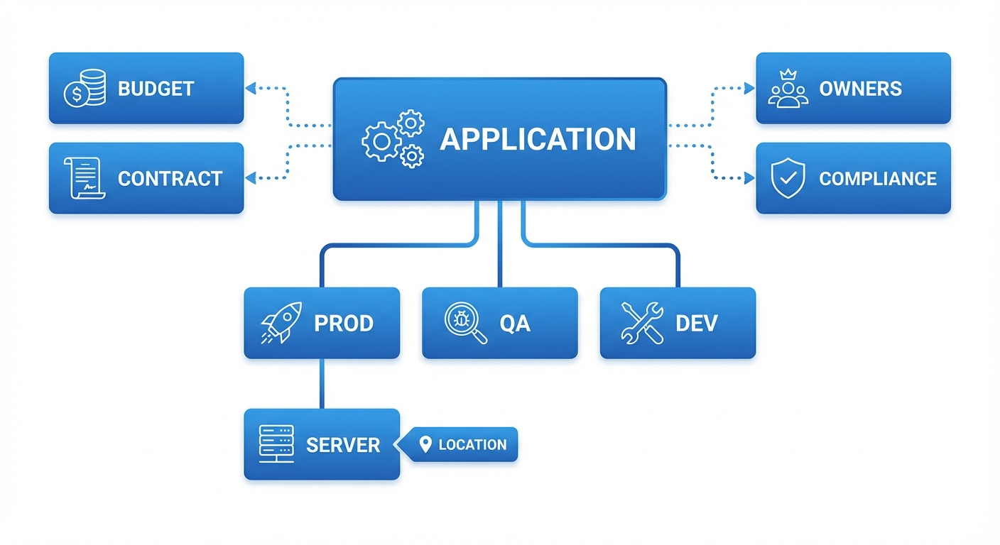

# IT Ops Schnelleinstieg: Von der Anwendung zum Server

Dieser Leitfaden führt Sie durch die Dokumentation einer Anwendung und ihrer unterstützenden Infrastruktur -- von der Erstellung des App-Eintrags bis zur Verknüpfung mit dem Server, auf dem sie gehostet wird. Er ist darauf ausgelegt, Sie schnell produktiv zu machen und deckt die wesentlichen Schritte ab, ohne Sie in Optionen zu ertränken.

!!! tip "Bevorzugen Sie eine einseitige Zusammenfassung? :material-file-pdf-box:"
    Alle wichtigen Schritte auf einer einzigen A4-Seite -- ausdrucken, aufhängen, mit dem Team teilen.

    [:material-download: Spickzettel herunterladen (PDF)](downloads/kanap-itops-fast-track.pdf){ .md-button .md-button--primary }

Für vollständige Details siehe die Referenzdokumentation zu [Anwendungen](../applications.md) und [Assets](../assets.md).

---

## Das Gesamtbild

Alles in KANAPs IT-Landschaft-Modul ist verbunden, um ein vollständiges Bild Ihrer Landschaft zu zeichnen:

| Objekt | Was es repräsentiert |
|--------|---------------------|
| **Anwendung** | Eine Geschäftsanwendung oder ein IT-Dienst, den Sie dokumentieren möchten |
| **Umgebung** | Wo sie läuft -- Prod, QA, Dev usw. (in KANAP „Instanzen" genannt) |
| **Server (Asset)** | Die Infrastruktur, die sie hostet -- VMs, physische Server, Container |

Die Kette ist einfach: **Anwendung → Umgebung → Server**. Am Ende dieses Leitfadens haben Sie diese Kette vollständig dokumentiert.

!!! info "Warum das wichtig ist"
    Wenn jemand fragt „Wo läuft diese App?", „Wer ist verantwortlich?" oder „Ist sie compliant?" -- haben Sie die Antwort in Sekunden, anstatt Tabellenkalkulationen zu durchsuchen.

---

## Schritt 1: Ihre Anwendung erstellen

Gehen Sie zu **IT-Landschaft > Anwendungen** und klicken Sie auf **Neue App / Neuer Dienst**.

Füllen Sie das Wesentliche aus:

| Feld | Was eingeben | Beispiel |
|------|-------------|---------|
| **Name** | Ein klarer, wiedererkennbarer Name | `Salesforce CRM` |
| **Kategorie** | Der primäre Zweck | `Fachbereichsanwendung` |
| **Anbieter** | Der Lieferant (aus Ihren Stammdaten) | `Salesforce Inc` |
| **Kritikalität** | Geschäftliche Bedeutung | `Geschäftskritisch` |
| **Lebenszyklus** | Aktueller Status | `Aktiv` |

Klicken Sie auf **Speichern**. Ihre Anwendung ist jetzt im Register, und der vollständige Arbeitsbereich öffnet sich mit neun Tabs für die detaillierte Dokumentation.

!!! tip "Beginnen Sie mit dem, was Sie wissen"
    Beschreibung, Herausgeber, Version, Lizenzierung -- alles nützlich, aber in diesem Stadium optional. Sie können später anreichern. Das Ziel ist, die App ins System zu bekommen.

---

## Schritt 2: Eine Umgebung hinzufügen (Instanz)

Jede Anwendung läuft irgendwo. Der **Instanzen**-Tab dokumentiert Ihre Umgebungen.

Öffnen Sie Ihre Anwendung und gehen Sie zum **Instanzen**-Tab. Klicken Sie auf **Hinzufügen** und wählen Sie den Umgebungstyp (Prod, Pre-prod, QA, Test, Dev oder Sandbox).

Für jede Instanz können Sie erfassen:

| Feld | Was es bewirkt | Beispiel |
|------|---------------|---------|
| **Umgebung** | Der Umgebungstyp | `Prod` |
| **Basis-URL** | Die Zugriffs-URL | `https://mycompany.salesforce.com` |
| **Lebenszyklus** | Instanz-spezifischer Status | `Aktiv` |
| **SSO aktiviert** | Ist Single Sign-On aktiv? | `Ja` |
| **MFA unterstützt** | Wird Multi-Faktor-Authentifizierung unterstützt? | `Ja` |
| **Notizen** | Zusätzlicher Kontext | `Primäre EU-Instanz` |

!!! tip "Von Prod kopieren"
    Sobald Ihre Produktionsinstanz eingerichtet ist, verwenden Sie die Schaltfläche **Von Prod kopieren**, um schnell QA-, Dev- und andere Umgebungen mit ähnlichen Einstellungen zu erstellen.

Instanzänderungen werden sofort gespeichert -- kein Klick auf die Hauptspeicher-Schaltfläche nötig.

---

## Schritt 3: Verantwortliche zuweisen

Gehen Sie zum Tab **Eigentümer & Zielgruppe**. Hier dokumentieren Sie, wer verantwortlich ist.

### Fachbereichsverantwortliche

Die Fachbereichs-Stakeholder, die für die Anwendung rechenschaftspflichtig sind. Fügen Sie eine oder mehrere Personen hinzu -- deren Berufsbezeichnung erscheint automatisch.

### IT-Verantwortliche

Die IT-Teammitglieder, die für den technischen Betrieb und Support verantwortlich sind. Gleicher Mechanismus -- Personen hinzufügen, Rollen erscheinen.

### Zielgruppe (Optional)

Wählen Sie aus, welche **Unternehmen** und **Abteilungen** diese Anwendung nutzen. KANAP berechnet automatisch die Benutzeranzahl basierend auf Ihren Stammdaten.

!!! warning "Warum Verantwortliche wichtig sind"
    Verantwortlichkeit erleichtert es, **die richtigen Personen zu erreichen**, wenn es darauf ankommt -- geplante Wartung, Dienstunterbrechungen, Upgrade-Entscheidungen, Lizenzverlängerungen. Sie steuert auch die Bereichsfilter **Meine Apps** und **Apps meines Teams** in der Hauptliste. Ohne Verantwortliche ist die App nur in der „Alle Apps"-Ansicht sichtbar -- was bedeutet, dass sich niemand verantwortlich fühlt und niemand benachrichtigt wird.

---

## Schritt 4: Zugriffsmethoden festlegen

Gehen Sie zum Tab **Technik & Support**. Unter **Zugriffsmethoden** wählen Sie, wie Benutzer auf diese Anwendung zugreifen:

- **Web** -- browserbasierter Zugriff
- **Lokal installierte Anwendung** -- Desktop-Client
- **Mobile Anwendung** -- Telefon-/Tablet-App
- **VDI / Remote Desktop** -- virtueller Desktop
- **Terminal / CLI** -- Kommandozeilenoberfläche
- **Proprietäre HMI** -- industrielle Oberfläche
- **Kiosk** -- dediziertes Terminal

Zugriffsmethoden sind in den [IT-Landschaft-Einstellungen](../it-ops-settings.md#zugriffsmethoden) konfigurierbar, Ihre Liste kann also zusätzliche Optionen enthalten.

Setzen Sie außerdem:

| Feld | Was es bedeutet |
|------|----------------|
| **Extern zugänglich** | Ist diese App aus dem Internet erreichbar? |
| **Datenintegration / ETL** | Nimmt diese App an Datenpipelines teil? |

---

## Schritt 5: Mit anderen Objekten verknüpfen (Verknüpfungen)

Gehen Sie zum **Verknüpfungen**-Tab, um Ihre Anwendung mit dem Rest Ihrer IT-Verwaltungsdaten zu verbinden.

| Verknüpfungstyp | Was Sie verbinden | Warum |
|-----------------|-------------------|-------|
| **OPEX-Positionen** | Wiederkehrende Kosten (Lizenzen, SaaS-Gebühren) | Das vollständige Kostenbild sehen |
| **CAPEX-Positionen** | Investitionsprojekte | Investitionen verfolgen |
| **Verträge** | Lieferantenvereinbarungen | Wissen, wann Verlängerungen fällig sind |
| **Projekte** | Portfolio-Projekte | Verbindung zu Ihrem Projektportfolio |
| **Relevante Websites** | Dokumentation, Wikis, Runbooks | Schnellzugriff auf externe Ressourcen |
| **Anhänge** | Dateien (Drag-and-Drop oder Dateiauswahl) | Spezifikationen und Dokumente neben der App aufbewahren |

!!! tip "Das können Sie auch später tun"
    Verknüpfungen sind mächtig, aber nicht blockierend. Erstellen Sie sie, wenn Sie die Daten haben -- die App ist ohne sie voll funktionsfähig.

---

## Schritt 6: Compliance-Informationen hinzufügen

Gehen Sie zum **Compliance**-Tab. Dies wird zunehmend wichtig für Audits und regulatorische Anforderungen.

| Feld | Was eingeben | Beispiel |
|------|-------------|---------|
| **Datenklasse** | Sensibilitätsstufe | `Vertraulich` |
| **Enthält PII** | Speichert personenbezogene Daten? | `Ja` |
| **Datenresidenz** | Länder, in denen Daten gespeichert werden | `Frankreich, Deutschland` |
| **Letzter DR-Test** | Datum des letzten Disaster-Recovery-Tests | `2025-11-15` |

!!! info "Datenklassen sind konfigurierbar"
    Die Standardklassen (Öffentlich, Intern, Vertraulich, Eingeschränkt) können unter **IT-Landschaft > Einstellungen** an die Datenklassifizierungsrichtlinie Ihrer Organisation angepasst werden.

---

## Schritt 7: Ihren Server erstellen (Asset)

Gehen Sie zu **IT-Landschaft > Assets** und klicken Sie auf **Asset hinzufügen**.

### Übersichts-Tab

Füllen Sie die Kernfelder aus:

| Feld | Was eingeben | Beispiel |
|------|-------------|---------|
| **Name** | Hostname oder Kennung | `PROD-WEB-01` |
| **Asset-Typ** | Der Servertyp (Dropdown) | `Virtuelle Maschine` |
| **Ist Cluster** | Umschalter, ob es ein Cluster ist | `Nein` |
| **Standort** | Wo es gehostet wird (Pflicht) | `Paris Rechenzentrum` |
| **Lebenszyklus** | Aktueller Status | `Aktiv` |
| **Inbetriebnahmedatum** | Wann es in Betrieb ging | `2025-01-15` |
| **End-of-Life-Datum** | Geplante Außerbetriebnahme | -- |
| **Notizen** | Zusätzlicher Kontext | -- |

Sobald ein Standort ausgewählt ist, werden mehrere **schreibgeschützte Felder** automatisch abgeleitet:

- **Hosting-Typ** (On-Premises, Cloud, Colocation usw.)
- **Cloud-Anbieter / Betreiberunternehmen** (z. B. AWS, Azure oder das Unternehmen, das die Einrichtung betreibt)
- **Land**
- **Stadt**

!!! info "Der Standort ist der Schlüssel"
    Der Standort steuert viele Attribute Ihres Assets automatisch. Standorte werden unter **IT-Landschaft > Standorte** verwaltet -- richten Sie sie einmal ein und jedes zugewiesene Asset erbt Hosting-Typ, Anbieter, Land und Stadt. Sie müssen diese nicht manuell eingeben.

Klicken Sie auf **Speichern**, um den vollständigen Arbeitsbereich freizuschalten. Für physische Asset-Typen werden zusätzliche **Hardware**- und **Support**-Tabs verfügbar, um Seriennummern, Herstellerdetails und Lieferanten-Supportverträge zu erfassen.

### Technik-Tab

Gehen Sie zum **Technik**-Tab, um hinzuzufügen:

| Abschnitt | Felder | Details |
|-----------|--------|---------|
| **Umgebung** | Umgebungs-Dropdown | `Produktion`, `QA`, `Dev` usw. |
| **Identität** | Hostname, Domain, FQDN, Aliasse, OS | FQDN wird automatisch aus Hostname + Domain berechnet |
| **IP-Adressen** | Typ, IP, Subnetz | Netzwerkzone und VLAN werden aus dem Subnetz abgeleitet |

!!! info "Mehrere IP-Adressen"
    Ein Server kann mehrere IP-Adressen haben -- fügen Sie so viele hinzu wie nötig (z. B. Management-Interface, Produktions-VLAN, Backup-Netzwerk). Jeder Eintrag kann seinen eigenen Typ und sein eigenes Subnetz haben, und Netzwerkzone und VLAN werden automatisch abgeleitet.

---

## Schritt 8: Den Server mit Ihrer Anwendung verknüpfen

Dies ist die letzte Verbindung -- Ihr Server wird der Anwendungsumgebung zugeordnet, die er unterstützt.

Es gibt **zwei Wege**, um diese Zuordnung zu erstellen:

### Von der Anwendungsseite

1. Öffnen Sie Ihre Anwendung
2. Gehen Sie zum **Server**-Tab
3. Wählen Sie die **Produktions**-Umgebung
4. Klicken Sie auf **Zuordnung hinzufügen**
5. Wählen Sie Ihr Asset (`PROD-WEB-01`)
6. Legen Sie die **Rolle** fest (Web, Datenbank, Anwendung usw.)

### Von der Asset-Seite

1. Öffnen Sie Ihr Asset
2. Gehen Sie zum **Zuordnungen**-Tab
3. Klicken Sie auf **Zuordnung hinzufügen**
4. Füllen Sie die Zuordnungsfelder aus:

| Feld | Was eingeben | Beispiel |
|------|-------------|---------|
| **Anwendung** | Die zu verknüpfende Anwendung | `Salesforce CRM` |
| **Umgebung / Instanz** | Welche Instanz | `Produktion` |
| **Rolle** | Serverrolle für diese App | `Web` |
| **Seit-Datum** | Wann die Zuordnung begann | `2025-01-15` |
| **Notizen** | Kontext | -- |

!!! success "Die Kette ist komplett"
    Sie haben jetzt den vollständigen Pfad dokumentiert:

    **Salesforce CRM** → **Produktionsinstanz** → **PROD-WEB-01**

    Jeder kann in Sekunden von „Welche App?" zu „Welcher Server?" zu „Wo steht er?" nachverfolgen.

---

## Wie alles zusammenhängt

Jede Information, die Sie eingeben, fließt in etwas Größeres ein:

### Anwendungslandschaft-Ansicht

Ihre Anwendungsliste wird zu einem Live-Register, das jede Anwendung mit ihren Umgebungen, Kritikalität, Hosting-Typ und Verantwortlichkeit zeigt -- filterbar nach jedem Attribut.

### Infrastruktur-Mapping

Assets, die mit Anwendungsinstanzen verknüpft sind, ermöglichen es Ihnen, Fragen zu beantworten wie:

- „Welche Server unterstützen diese geschäftskritische App?"
- „Welche Anwendungen sind betroffen, wenn dieser Server ausfällt?"
- „Wie viele Apps werden in diesem Rechenzentrum gehostet?"

### Compliance-Berichterstattung

Datenklassifizierung, PII-Kennzeichnungen und Datenresidenz fließen in Compliance-Ansichten ein. Wenn der Auditor fragt „Wo werden Kundendaten gespeichert?", haben Sie eine dokumentierte, nachvollziehbare Antwort.

### Wissensdatenbank

Sowohl Anwendungen als auch Assets haben einen **Wissensdatenbank**-Tab, in dem Sie Runbooks, Architekturentscheidungen, Betriebsverfahren und interne Dokumentation verknüpfen können. Diese Referenzen an den richtigen Datensätzen zu haben bedeutet, dass Ihr Team bei Vorfällen findet, was es braucht, ohne Wikis zu durchsuchen.

### Verbindungskarte

Sobald Assets dokumentiert sind, können Sie **Verbindungen** (Server-zu-Server oder Multi-Server) zwischen ihnen erstellen, um Netzwerkflüsse und Abhängigkeiten zu visualisieren. Die [Verbindungskarte](../connection-map.md) rendert diese als interaktiven Graphen mit rollenbasierten vertikalen Ebenen für eine Architektur-Ansicht.

### Schnittstellen & Schnittstellenkarte

Gehen Sie einen Schritt weiter: Dokumentieren Sie **Schnittstellen** zwischen Anwendungen, um Datenflüsse, Integrationspunkte und Geschäftskontext zu erfassen. Jede Schnittstelle hat sechs Tabs für gründliche Dokumentation -- Übersicht, Eigentümer & Kritikalität, Funktionale Definition, Technische Definition, Bindungen & Verbindungen und Daten & Compliance.

Verwenden Sie dann die [Schnittstellenkarte](../interface-map.md), um den vollständigen Anwendungsfluss zu visualisieren. In der Standard-Geschäftsansicht sehen Sie saubere Quelle-zu-Ziel-Beziehungen. Wechseln Sie zur technischen Ansicht, um Middleware-Plattformen als rautenförmige Knoten anzuzeigen, die den tatsächlichen Datenpfad zeigen. Der Tiefenfilter zählt nur primäre Anwendungsknoten -- Middleware ist transparent, sodass die Auswahl einer App mit Tiefe 2 Ihnen zwei echte Sprünge zeigt, unabhängig davon, wie viele Middleware-Plattformen dazwischenliegen.

---

## Kurzreferenz

| Ich möchte... | Gehe zu... |
|---------------|------------|
| Eine Anwendung erstellen | IT-Landschaft > Anwendungen > Neue App / Neuer Dienst |
| Umgebungen hinzufügen | App öffnen > Instanzen-Tab |
| Verantwortliche zuweisen | App öffnen > Tab Eigentümer & Zielgruppe |
| Zugriffsmethoden festlegen | App öffnen > Tab Technik & Support |
| Budgets/Verträge verknüpfen | App öffnen > Verknüpfungen-Tab |
| Wissensdatenbank-Dokumente anhängen | App öffnen > Wissensdatenbank-Tab |
| Compliance-Infos hinzufügen | App öffnen > Compliance-Tab |
| Einen Server erstellen | IT-Landschaft > Assets > Asset hinzufügen |
| Server mit App verknüpfen (von App) | App öffnen > Server-Tab > Zuordnung hinzufügen |
| Server mit App verknüpfen (von Asset) | Asset öffnen > Zuordnungen-Tab > Zuordnung hinzufügen |
| Server-Verbindungen anzeigen | Asset öffnen > Verbindungen-Tab |
| Verbindungskarte anzeigen | IT-Landschaft > Verbindungskarte |
| Schnittstellenkarte anzeigen | IT-Landschaft > Schnittstellenkarte |
| Dropdowns konfigurieren | IT-Landschaft > Einstellungen |

---

!!! success "Sie sind startklar"
    Sie wissen jetzt, wie Sie die vollständige Kette von der Anwendung zum Server dokumentieren. Beginnen Sie mit Ihren kritischsten Apps, fügen Sie deren Produktionsumgebungen hinzu, verknüpfen Sie die Server -- und Sie haben in kürzester Zeit eine lebende, abfragbare IT-Landschaft. Für detaillierte Dokumentation zu jeder Funktion erkunden Sie die Referenzbereiche [Anwendungen](../applications.md) und [Assets](../assets.md).
