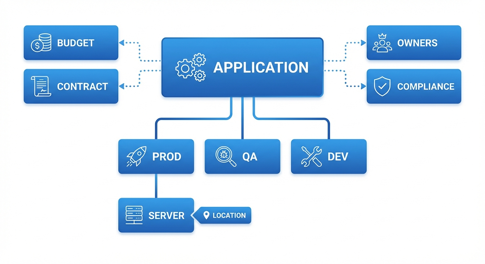

# IT Ops Fast Track: From Application to Server

This guide walks you through documenting an application and its supporting infrastructure -- from creating the app entry to linking it to the server that hosts it. It's designed to get you productive fast, covering the essential steps without drowning you in options.

!!! tip "Prefer a one-page summary? :material-file-pdf-box:"
    All the key steps on a single A4 page -- print it, pin it, share it with your team.

    [:material-download: Download the cheat sheet (PDF)](downloads/kanap-itops-fast-track.pdf){ .md-button .md-button--primary }

For full details, see the [Applications](../applications.md) and [Assets](../assets.md) reference docs.

---

## The Big Picture

Everything in KANAP's IT Landscape module connects to paint a complete picture of your landscape:

| Object | What it represents |
|--------|--------------------|
| **Application** | A business app or IT service you need to document |
| **Environment** | Where it runs -- Prod, QA, Dev, etc. (called "Deployments" in KANAP) |
| **Server (Asset)** | The infrastructure that hosts it -- VMs, physical servers, containers |

The chain is simple: **Application → Environment → Server**. By the end of this guide, you'll have this chain fully documented.

!!! info "Why this matters"
    When someone asks "where does this app run?", "who owns it?", or "is it compliant?" -- you'll have the answer in seconds instead of digging through spreadsheets.

---

## Step 1: Create Your Application

Go to **IT Landscape → Applications** and click **New App / Service**.

Fill in the essentials:

| Field | What to enter | Example |
|-------|--------------|---------|
| **Name** | A clear, recognizable name | `Salesforce CRM` |
| **Category** | The primary purpose | `Line-of-business` |
| **Supplier** | The supplier (from your master data) | `Salesforce Inc` |
| **Business criticality** | Business importance | `Business critical` |
| **Lifecycle** | Current status | `Active` |

Click **Create**. Your application is now in the registry, and the full workspace opens with six tabs for detailed documentation: **Overview**, **Deployments**, **Interfaces**, **Operations**, **Compliance**, and **Relations**.

!!! tip "Start with what you know"
    Description, publisher, version, licensing -- all useful, but optional at this stage. You can enrich later. The goal is to get the app into the system.

---

## Step 2: Add an Environment (Deployment)

Every application runs somewhere. The **Deployments** tab documents your environments.

Open your application and go to the **Deployments** tab. Click **Add deployment** and pick the environment (PROD, PRE-PROD, QA, TEST, DEV, or SANDBOX).

For each deployment, you can capture:

| Field | What it does | Example |
|-------|-------------|---------|
| **Environment** | The environment type | `PROD` |
| **Lifecycle** | Deployment-specific status | `Active` |
| **Base URL** | The access URL | `https://mycompany.salesforce.com` |
| **SSO enabled** | Is Single Sign-On active? | `Yes` |
| **MFA supported** | Is Multi-Factor Authentication supported? | `Yes` |
| **Notes** | Any additional context | `Primary EU instance` |

Each deployment appears as a card, with its servers listed underneath (see Step 8). Use the pencil icon to edit a deployment and the delete icon to remove it.

Deployment changes save as soon as you confirm the dialog.

---

## Step 3: Assign Owners

Owners live in the **Properties** panel on the right of the application workspace.

### Business owners

The business stakeholders accountable for the application. Add one or more people.

### IT owners

The IT team members responsible for technical operations and support. Same mechanism: add the people.

### Audience (Optional)

Under **Audience**, pick the **Company** and **Departments** that use this application. KANAP calculates the number of users from your master data, or you can switch the calculation to manual and type the number yourself.

!!! warning "Why owners matter"
    Ownership makes it easy to **reach the right people** when it matters -- planned maintenance, service disruptions, upgrade decisions, license renewals. It also drives the **My apps** and **My team's apps** scope filters on the main list. Without owners, the app is only visible in the "All apps" view -- which means nobody feels responsible for it, and nobody gets notified.

---

## Step 4: Set Access Methods

Go to the **Operations** tab. Under **Access methods**, select how users reach this application:

- **Web** -- browser-based access
- **Locally installed application** -- desktop client
- **Mobile application** -- phone/tablet app
- **VDI / Remote Desktop** -- virtual desktop
- **Terminal / CLI** -- command-line interface
- **Proprietary HMI** -- industrial interface
- **Kiosk** -- dedicated terminal

Access methods are configurable in [IT Landscape Settings](../it-ops-settings.md#access-methods), so your list may include additional options.

Also set:

| Field | What it means |
|-------|--------------|
| **External facing** | Is this app accessible from the internet? |
| **Data integration / ETL** | Does this app participate in data pipelines? |

The same tab holds the **Support** contacts (use **Add contact** and give each one a role) and free-text **Support notes**.

---

## Step 5: Link to Other Objects (Relations)

Go to the **Relations** tab to connect your application to the rest of your IT management data.

| Link type | What you're connecting | Why |
|-----------|----------------------|-----|
| **OPEX items** | Recurring costs (licenses, SaaS fees) | See the full cost picture |
| **CAPEX items** | Capital expenditure projects | Track investment |
| **Contracts** | Vendor agreements | Know when renewals are due |
| **Projects** | Portfolio projects | Connect to your project portfolio |
| **Relevant websites** | Documentation, wikis, runbooks | Quick access to external resources |
| **Attachments** | Files (drag-and-drop or file picker) | Keep specs and docs alongside the app |

The tab also lets you link **Tasks**, and suites list their **Components** there.

!!! tip "You can do this later"
    Relations are powerful but not blocking. Create them when you have the data -- the app is fully functional without them.

---

## Step 6: Add Compliance Information

Go to the **Compliance** tab. This is increasingly important for audits and regulatory requirements.

| Field | What to enter | Example |
|-------|--------------|---------|
| **Business criticality** / **Cyber criticality** | How critical the app is | `Business critical` |
| **Data confidentiality** | Sensitivity level | `Confidential` |
| **Contains personal data** | Stores personal data? | `Yes` |
| **Data residency** | Countries where data is stored | `France, Germany` |
| **Last recovery test** | Last disaster recovery test date | `2025-11-15` |

The tab also holds the **Recovery wave**, the recovery objectives (RTO and RPO) and a **Justification**. When you are done, mark the classification as reviewed.

!!! info "Classification levels are configurable"
    The default data classes (Public, Internal, Confidential, Restricted) and the criticality levels can be customized in **IT Landscape → Settings** to match your organization's classification policy.
---

## Step 7: Create Your Server (Asset)

Go to **IT Landscape → Assets** and click **Add asset**.

### Overview tab

Fill in the core fields:

| Field | What to enter | Example |
|-------|--------------|---------|
| **Name** | Hostname or identifier | `PROD-WEB-01` |
| **Asset type** | The server type (dropdown) | `Virtual Machine` |
| **Location** | Where it's hosted (required) | `Paris Datacenter` |
| **Environment** | Which environment it serves | `Prod` |
| **Description** | Any additional context | -- |

The **Properties** panel on the right holds the rest: **Sub-location**, **Lifecycle**, **Go live**, and **End of life**. Once a Location is selected, several **read-only fields** are automatically derived:

- **Hosting type** (on-premises, cloud, colocation, etc.)
- **Cloud provider / Operating company** (e.g., AWS, Azure, or the company running the facility)
- **Country**
- **City**

!!! info "Location is the key"
    The Location drives many attributes of your asset automatically. Locations are managed in **IT Landscape → Locations** -- set them up once and every asset assigned to them inherits hosting type, provider, country, and city. You don't need to fill these in manually.

Click **Create** to unlock the full workspace. For physical asset types, additional **Hardware** and **Support** tabs become available to track serial numbers, manufacturer details, and vendor support contracts.

### Technical tab

Go to the **Technical** tab to add:

| Section | Fields | Details |
|---------|--------|---------|
| **Cluster management** | Cluster switch | Turn it on if this asset is a cluster, then add its member servers |
| **Identity** | Hostname, Domain, FQDN, Aliases, Operating system | FQDN is auto-computed from Hostname + Domain |
| **IP addresses** | Type, IP address, Subnet | Network zone and VLAN are derived from Subnet |

!!! info "Multiple IP addresses"
    A server can have several IP addresses -- add as many as needed (e.g., management interface, production VLAN, backup network). Each entry can have its own type and subnet, and the Network zone and VLAN are derived automatically.

---

## Step 8: Link the Server to Your Application

This is the final connection -- tying your server to the application environment it supports.

There are **two ways** to create this assignment:

### From the Application side

1. Open your application
2. Go to the **Deployments** tab
3. On the **PROD** deployment card, click **Add server**
4. Select your asset (`PROD-WEB-01`)
5. Set the **Role** (Web, Database, Application, etc.), and optionally the **Since** date and **Notes**

### From the Asset side

1. Open your asset
2. On the **Overview** tab, find the **Assignments** section
3. Click **Add assignment**
4. Fill in the assignment fields:

| Field | What to enter | Example |
|-------|--------------|---------|
| **Application** | The application to link | `Salesforce CRM` |
| **Environment** | Which deployment | `PROD` |
| **Role** | Server role for this app | `Web` |
| **Since date** | When the assignment started | `2025-01-15` |
| **Notes** | Any context | -- |

!!! success "The chain is complete"
    You now have the full path documented:

    **Salesforce CRM** → **PROD deployment** → **PROD-WEB-01**

    Anyone can trace from "what app?" to "what server?" to "where is it?" in seconds.
---

## How It All Connects

Every piece of data you enter feeds into something bigger:

### Application Landscape View

Your Applications list becomes a live registry showing every application with its environments, criticality, hosting type, and ownership -- filterable by any attribute.

### Infrastructure Mapping

Assets linked to application deployments let you answer questions like:

- "Which servers support this business-critical app?"
- "What applications will be affected if this server goes down?"
- "How many apps are hosted in this datacenter?"

### Compliance Reporting

Data classification, PII flags, and data residency flow into compliance views. When the auditor asks "where is customer data stored?", you have a documented, traceable answer.

### Knowledge

Both Applications and Assets have a **Knowledge** section on their **Overview** tab where you can link runbooks, architecture decisions, operational procedures, and internal documentation. Having these references attached to the right records means your team can find what they need during incidents without hunting through wikis.

### Connection Map

Once assets are documented, you can create **Connections** (Server to Server or Multi-server) between them to visualize network flows and dependencies. The [Connection Map](../connection-map.md) renders these as an interactive graph with role-based vertical tiers for an architecture-style view.

### Interfaces & Interface Map

Take it one step further: document **Interfaces** between applications to capture data flows, integration points, and business context. Each interface has five tabs for thorough documentation: Overview, Flow, Environments, Data mapping, and Relations.

Then use the [Interface Map](../interface-map.md) to visualize the full application flow. In the default Business view, you see clean source-to-target relationships. Switch to the Technical view to reveal middleware platforms as diamond-shaped nodes, showing the actual data path. Depth filtering counts only primary application nodes -- middleware is transparent, so selecting an app with depth 2 shows you two real hops regardless of how many middleware platforms sit in between.

---

## Quick Reference

| I want to... | Go to... |
|------------|--------|
| Create an application | IT Landscape → Applications → New App / Service |
| Add environments | Open app → Deployments tab → Add deployment |
| Assign owners | Open app → Properties panel |
| Set access methods | Open app → Operations tab |
| Link budgets/contracts | Open app → Relations tab |
| Attach knowledge docs | Open app → Overview tab → Knowledge |
| Add compliance info | Open app → Compliance tab |
| Create a server | IT Landscape → Assets → Add asset |
| Link server to app (from app) | Open app → Deployments tab → Add server |
| Link server to app (from asset) | Open asset → Overview tab → Assignments → Add assignment |
| View server connections | Open asset → Overview tab → Connections |
| View connection map | IT Landscape → Connection Map |
| View interface map | IT Landscape → Interface Map |
| Configure dropdowns | IT Landscape → Settings |

---

!!! success "You're ready"
    You now know how to document the full chain from application to server. Start with your most critical apps, add their production environments, link the servers -- and you'll have a living, queryable IT landscape in no time. For detailed documentation on every feature, explore the [Applications](../applications.md) and [Assets](../assets.md) reference sections.
