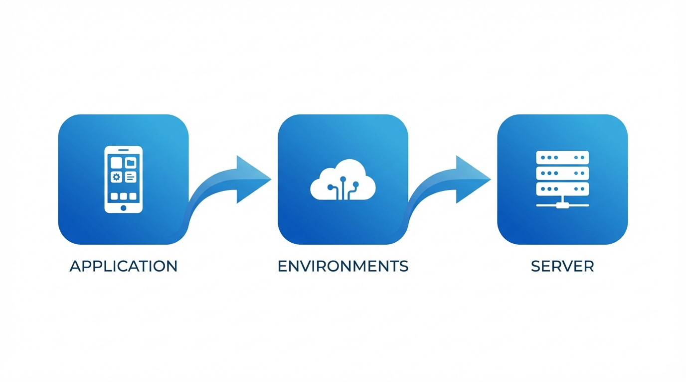

# Guía rápida IT Ops: De la aplicación al servidor

Esta guía le acompaña en la documentación de una aplicación y su infraestructura de soporte -- desde la creación de la entrada de la app hasta vincularla al servidor que la aloja. Está diseñada para hacerle productivo rápidamente, cubriendo los pasos esenciales sin abrumarle con opciones.

!!! tip "¿Prefiere un resumen en una página? :material-file-pdf-box:"
    Todos los pasos clave en una sola página A4 -- imprímala, cuélguela, compártala con su equipo.

    [:material-download: Descargar la hoja de referencia (PDF)](downloads/kanap-itops-fast-track.pdf){ .md-button .md-button--primary }

Para más detalles, consulte las documentaciones de referencia de [Aplicaciones](../applications.md) y [Activos](../assets.md).

---

## El panorama general

Todo en el módulo Panorama IT de KANAP se conecta para crear una imagen completa de su panorama:

| Objeto | Qué representa |
|--------|----------------|
| **Aplicación** | Una app de negocio o servicio IT que necesita documentar |
| **Entorno** | Dónde se ejecuta -- Prod, QA, Dev, etc. (llamados "Instancias" en KANAP) |
| **Servidor (Activo)** | La infraestructura que la aloja -- VMs, servidores físicos, contenedores |

La cadena es simple: **Aplicación → Entorno → Servidor**. Al final de esta guía, tendrá esta cadena completamente documentada.

!!! info "Por qué es importante"
    Cuando alguien pregunta "¿dónde se ejecuta esta app?", "¿quién es el responsable?" o "¿es conforme?" -- tendrá la respuesta en segundos en lugar de buscar en hojas de cálculo.

---

## Paso 1: Crear su aplicación

Vaya a **Panorama IT > Aplicaciones** y haga clic en **Nueva App / Servicio**.

Complete lo esencial:

| Campo | Qué introducir | Ejemplo |
|-------|----------------|---------|
| **Nombre** | Un nombre claro y reconocible | `Salesforce CRM` |
| **Categoría** | El propósito principal | `Línea de negocio` |
| **Proveedor** | El proveedor (de sus datos maestros) | `Salesforce Inc` |
| **Criticidad** | Importancia para el negocio | `Crítica para el negocio` |
| **Ciclo de vida** | Estado actual | `Activo` |

Haga clic en **Guardar**. Su aplicación está ahora en el registro, y el espacio de trabajo completo se abre con nueve pestañas para documentación detallada.

!!! tip "Empiece con lo que sabe"
    Descripción, editor, versión, licencia -- todo útil, pero opcional en esta etapa. Puede enriquecer más tarde. El objetivo es tener la app en el sistema.

---

## Paso 2: Añadir un entorno (Instancia)

Cada aplicación se ejecuta en algún lugar. La pestaña **Instancias** documenta sus entornos.

Abra su aplicación y vaya a la pestaña **Instancias**. Haga clic en **Añadir** y seleccione el tipo de entorno (Prod, Pre-prod, QA, Test, Dev o Sandbox).

Para cada instancia, puede capturar:

| Campo | Qué hace | Ejemplo |
|-------|----------|---------|
| **Entorno** | El tipo de entorno | `Prod` |
| **URL base** | La URL de acceso | `https://mycompany.salesforce.com` |
| **Ciclo de vida** | Estado específico de la instancia | `Activo` |
| **SSO habilitado** | ¿Está activo el inicio de sesión único? | `Sí` |
| **MFA soportado** | ¿Está soportada la autenticación multifactor? | `Sí` |
| **Notas** | Cualquier contexto adicional | `Instancia principal de la UE` |

!!! tip "Copiar desde Prod"
    Una vez configurada su instancia de Producción, utilice el botón **Copiar desde Prod** para crear rápidamente entornos de QA, Dev y otros con configuraciones similares.

Los cambios en instancias se guardan inmediatamente -- no es necesario hacer clic en el botón principal de Guardar.

---

## Paso 3: Asignar responsables

Vaya a la pestaña **Propiedad y audiencia**. Aquí es donde documenta quién es responsable.

### Responsables de negocio

Las partes interesadas del negocio responsables de la aplicación. Añada una o más personas -- su puesto de trabajo aparecerá automáticamente.

### Responsables IT

Los miembros del equipo IT responsables de las operaciones técnicas y el soporte. Mismo mecanismo -- añada las personas, los roles aparecen.

### Audiencia (Opcional)

Seleccione qué **Empresas** y **Departamentos** usan esta aplicación. KANAP calcula automáticamente el número de usuarios basándose en sus datos maestros.

!!! warning "Por qué importan los responsables"
    La propiedad facilita **contactar a las personas adecuadas** cuando importa -- mantenimiento planificado, interrupciones de servicio, decisiones de actualización, renovaciones de licencias. También alimenta los filtros de alcance **Mis apps** y **Apps de mi equipo** en la lista principal. Sin responsables, la app solo es visible en la vista "Todas las apps" -- lo que significa que nadie se siente responsable y nadie recibe notificaciones.

---

## Paso 4: Configurar métodos de acceso

Vaya a la pestaña **Técnico y soporte**. En **Métodos de acceso**, seleccione cómo los usuarios acceden a esta aplicación:

- **Web** -- acceso por navegador
- **Aplicación instalada localmente** -- cliente de escritorio
- **Aplicación móvil** -- app de teléfono/tableta
- **VDI / Escritorio remoto** -- escritorio virtual
- **Terminal / CLI** -- interfaz de línea de comandos
- **HMI propietario** -- interfaz industrial
- **Kiosk** -- terminal dedicado

Los métodos de acceso son configurables en [Configuración del Panorama IT](../it-ops-settings.md#metodos-de-acceso), por lo que su lista puede incluir opciones adicionales.

También configure:

| Campo | Qué significa |
|-------|---------------|
| **Acceso externo** | ¿Es esta app accesible desde internet? |
| **Integración de datos / ETL** | ¿Participa esta app en pipelines de datos? |

---

## Paso 5: Vincular a otros objetos (Relaciones)

Vaya a la pestaña **Relaciones** para conectar su aplicación con el resto de sus datos de gestión IT.

| Tipo de enlace | Qué está conectando | Por qué |
|----------------|---------------------|---------|
| **Partidas OPEX** | Costes recurrentes (licencias, cuotas SaaS) | Ver el panorama completo de costes |
| **Partidas CAPEX** | Proyectos de gasto de capital | Hacer seguimiento de la inversión |
| **Contratos** | Acuerdos con proveedores | Saber cuándo vencen las renovaciones |
| **Proyectos** | Proyectos del portafolio | Conectar con su portafolio de proyectos |
| **Sitios web relevantes** | Documentación, wikis, runbooks | Acceso rápido a recursos externos |
| **Adjuntos** | Archivos (arrastrar y soltar o selector) | Mantener especificaciones y documentos junto a la app |

!!! tip "Puede hacer esto más tarde"
    Las relaciones son potentes pero no bloqueantes. Créelas cuando tenga los datos -- la app es completamente funcional sin ellas.

---

## Paso 6: Añadir información de conformidad

Vaya a la pestaña **Conformidad**. Esto es cada vez más importante para auditorías y requisitos regulatorios.

| Campo | Qué introducir | Ejemplo |
|-------|----------------|---------|
| **Clase de datos** | Nivel de sensibilidad | `Confidencial` |
| **Contiene PII** | ¿Almacena datos personales? | `Sí` |
| **Residencia de datos** | Países donde se almacenan los datos | `Francia, Alemania` |
| **Última prueba DR** | Fecha de la última prueba de recuperación ante desastres | `2025-11-15` |

!!! info "Las clases de datos son configurables"
    Las clases predeterminadas (Público, Interno, Confidencial, Restringido) pueden personalizarse en **Panorama IT > Configuración** para coincidir con la política de clasificación de datos de su organización.

---

## Paso 7: Crear su servidor (Activo)

Vaya a **Panorama IT > Activos** y haga clic en **Añadir activo**.

### Pestaña Visión general

Complete los campos principales:

| Campo | Qué introducir | Ejemplo |
|-------|----------------|---------|
| **Nombre** | Hostname o identificador | `PROD-WEB-01` |
| **Tipo de activo** | El tipo de servidor (desplegable) | `Máquina virtual` |
| **Es clúster** | Active si es un clúster | `No` |
| **Ubicación** | Dónde está alojado (obligatorio) | `Centro de datos París` |
| **Ciclo de vida** | Estado actual | `Activo` |
| **Fecha de puesta en marcha** | Cuándo entró en servicio | `2025-01-15` |
| **Fecha de fin de vida** | Decomisionamiento planificado | -- |
| **Notas** | Cualquier contexto adicional | -- |

Una vez seleccionada una Ubicación, varios **campos de solo lectura** se derivan automáticamente:

- **Tipo de alojamiento** (local, nube, coubicación, etc.)
- **Proveedor cloud / Empresa operadora** (p. ej., AWS, Azure, o la empresa que opera la instalación)
- **País**
- **Ciudad**

!!! info "La ubicación es la clave"
    La Ubicación determina muchos atributos de su activo automáticamente. Las Ubicaciones se gestionan en **Panorama IT > Ubicaciones** -- configúrelas una vez y cada activo asignado a ellas hereda el tipo de alojamiento, proveedor, país y ciudad. No necesita completarlos manualmente.

Haga clic en **Guardar** para desbloquear el espacio de trabajo completo. Para tipos de activos físicos, pestañas adicionales de **Hardware** y **Soporte** se hacen disponibles para hacer seguimiento de números de serie, detalles del fabricante y contratos de soporte del proveedor.

### Pestaña Técnico

Vaya a la pestaña **Técnico** para añadir:

| Sección | Campos | Detalles |
|---------|--------|----------|
| **Entorno** | Desplegable de entorno | `Producción`, `QA`, `Dev`, etc. |
| **Identidad** | Hostname, Dominio, FQDN, Alias, SO | FQDN se calcula automáticamente desde Hostname + Dominio |
| **Direcciones IP** | Tipo, IP, Subred | Zona de red y VLAN se derivan de la Subred |

!!! info "Múltiples direcciones IP"
    Un servidor puede tener varias direcciones IP -- añada tantas como necesite (p. ej., interfaz de gestión, VLAN de producción, red de respaldo). Cada entrada puede tener su propio tipo y subred, y la Zona de red y VLAN se derivan automáticamente.

---

## Paso 8: Vincular el servidor a su aplicación

Esta es la conexión final -- unir su servidor al entorno de la aplicación que soporta.

Hay **dos formas** de crear esta asignación:

### Desde el lado de la aplicación

1. Abra su aplicación
2. Vaya a la pestaña **Servidores**
3. Seleccione el entorno **Producción**
4. Haga clic en **Añadir asignación**
5. Seleccione su activo (`PROD-WEB-01`)
6. Establezca el **Rol** (Web, Base de datos, Aplicación, etc.)

### Desde el lado del activo

1. Abra su activo
2. Vaya a la pestaña **Asignaciones**
3. Haga clic en **Añadir asignación**
4. Complete los campos de la asignación:

| Campo | Qué introducir | Ejemplo |
|-------|----------------|---------|
| **Aplicación** | La aplicación a vincular | `Salesforce CRM` |
| **Entorno / Instancia** | Qué instancia | `Producción` |
| **Rol** | Rol del servidor para esta app | `Web` |
| **Fecha desde** | Cuándo comenzó la asignación | `2025-01-15` |
| **Notas** | Cualquier contexto | -- |

!!! success "La cadena está completa"
    Ahora tiene la ruta completa documentada:

    **Salesforce CRM** → **Instancia de producción** → **PROD-WEB-01**

    Cualquiera puede trazar desde "¿qué app?" a "¿qué servidor?" a "¿dónde está?" en segundos.

---

## Cómo se conecta todo

Cada dato que introduce alimenta algo más grande:

### Vista del panorama de aplicaciones

Su lista de Aplicaciones se convierte en un registro vivo que muestra cada aplicación con sus entornos, criticidad, tipo de alojamiento y propiedad -- filtrable por cualquier atributo.

### Mapeo de infraestructura

Los activos vinculados a instancias de aplicación le permiten responder preguntas como:

- "¿Qué servidores soportan esta app crítica para el negocio?"
- "¿Qué aplicaciones se verán afectadas si este servidor se cae?"
- "¿Cuántas apps están alojadas en este centro de datos?"

### Informes de conformidad

La clasificación de datos, indicadores de PII y la residencia de datos fluyen hacia vistas de conformidad. Cuando el auditor pregunta "¿dónde se almacenan los datos de clientes?", tiene una respuesta documentada y trazable.

### Base de conocimiento

Tanto Aplicaciones como Activos tienen una pestaña de **Base de conocimiento** donde puede vincular runbooks, decisiones de arquitectura, procedimientos operativos y documentación interna. Tener estas referencias adjuntas a los registros correctos significa que su equipo puede encontrar lo que necesita durante incidentes sin buscar en wikis.

### Mapa de conexiones

Una vez documentados los activos, puede crear **Conexiones** (Servidor a servidor o Multi-servidor) entre ellos para visualizar flujos de red y dependencias. El [Mapa de conexiones](../connection-map.md) los renderiza como un grafo interactivo con niveles verticales basados en roles para una vista de estilo arquitectura.

### Interfaces y Mapa de interfaces

Vaya un paso más allá: documente **Interfaces** entre aplicaciones para capturar flujos de datos, puntos de integración y contexto de negocio. Cada interfaz tiene seis pestañas para documentación completa -- Visión general, Propiedad y criticidad, Definición funcional, Definición técnica, Enlaces y conexiones, y Datos y conformidad.

Luego utilice el [Mapa de interfaces](../interface-map.md) para visualizar el flujo completo de aplicaciones. En la vista de Negocio predeterminada, verá relaciones limpias origen-destino. Cambie a la vista Técnica para revelar plataformas middleware como nodos en forma de diamante, mostrando la ruta real de datos. El filtrado por profundidad cuenta solo los nodos de aplicación principales -- el middleware es transparente, por lo que seleccionar una app con profundidad 2 le muestra dos saltos reales independientemente de cuántas plataformas middleware haya en medio.

---

## Referencia rápida

| Quiero... | Ir a... |
|-----------|---------|
| Crear una aplicación | Panorama IT > Aplicaciones > Nueva App / Servicio |
| Añadir entornos | Abrir app > pestaña Instancias |
| Asignar responsables | Abrir app > pestaña Propiedad y audiencia |
| Configurar métodos de acceso | Abrir app > pestaña Técnico y soporte |
| Vincular presupuestos/contratos | Abrir app > pestaña Relaciones |
| Adjuntar documentos de conocimiento | Abrir app > pestaña Base de conocimiento |
| Añadir información de conformidad | Abrir app > pestaña Conformidad |
| Crear un servidor | Panorama IT > Activos > Añadir activo |
| Vincular servidor a app (desde la app) | Abrir app > pestaña Servidores > Añadir asignación |
| Vincular servidor a app (desde el activo) | Abrir activo > pestaña Asignaciones > Añadir asignación |
| Ver conexiones del servidor | Abrir activo > pestaña Conexiones |
| Ver mapa de conexiones | Panorama IT > Mapa de conexiones |
| Ver mapa de interfaces | Panorama IT > Mapa de interfaces |
| Configurar desplegables | Panorama IT > Configuración |

---

!!! success "Está listo"
    Ahora sabe cómo documentar la cadena completa de la aplicación al servidor. Comience con sus apps más críticas, añada sus entornos de producción, vincule los servidores -- y tendrá un panorama IT vivo y consultable en poco tiempo. Para documentación detallada de cada funcionalidad, explore las secciones de referencia de [Aplicaciones](../applications.md) y [Activos](../assets.md).
