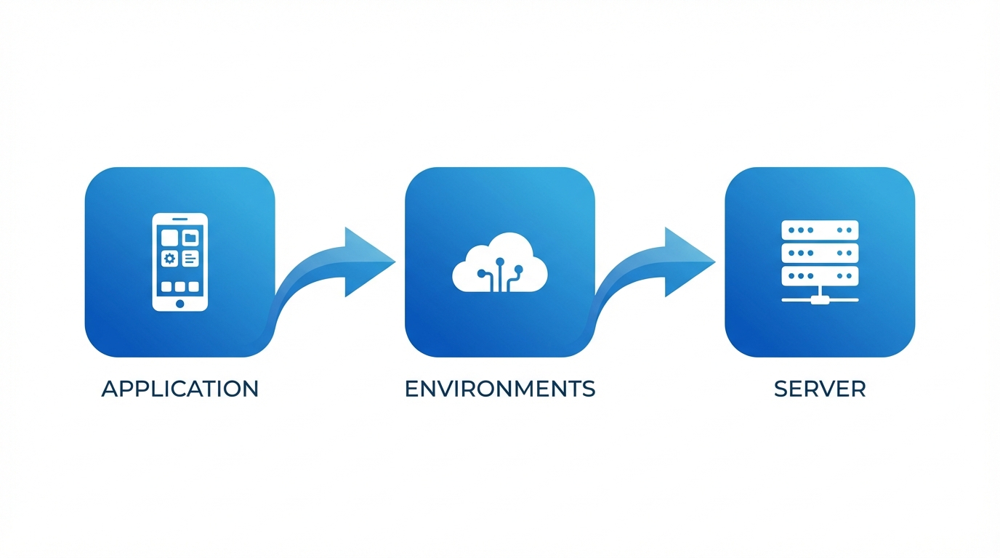

# Fast Track Cartographie SI : de l'application au serveur

Ce guide vous accompagne dans la documentation d'une application et de son infrastructure de support -- de la création de l'entrée applicative à la liaison avec le serveur qui l'héberge. Il est conçu pour vous rendre productif rapidement, couvrant les étapes essentielles sans vous noyer dans les options.

!!! tip "Conseil : Vous préférez un résumé sur une page ? :material-file-pdf-box:"
    Toutes les étapes clés sur une seule page A4 -- imprimez-la, épinglez-la, partagez-la avec votre équipe.

    [:material-download: Télécharger l'aide-mémoire (PDF)](downloads/kanap-itops-fast-track.pdf){ .md-button .md-button--primary }

Pour tous les détails, consultez la documentation de référence des [Applications](../applications.md) et [Actifs](../assets.md).

---

## La vue d'ensemble

Tout dans le module Cartographie SI de KANAP se connecte pour dresser un tableau complet de votre paysage :

| Objet | Ce qu'il représente |
|-------|---------------------|
| **Application** | Une app métier ou un service IT que vous devez documenter |
| **Environnement** | Où elle fonctionne -- Prod, QA, Dev, etc. (appelé « Déploiements » dans KANAP) |
| **Serveur (Actif)** | L'infrastructure qui l'héberge -- VMs, serveurs physiques, conteneurs |

La chaîne est simple : **Application > Environnement > Serveur**. À la fin de ce guide, vous aurez cette chaîne entièrement documentée.

!!! info "Information : Pourquoi c'est important"
    Quand quelqu'un demande « où tourne cette app ? », « qui en est responsable ? » ou « est-elle conforme ? » -- vous aurez la réponse en quelques secondes au lieu de fouiller dans des tableurs.

---

## Étape 1 : Créez votre application

Allez dans **Cartographie SI > Applications** et cliquez sur **Nouvelle app / Service**.

Remplissez l'essentiel :

| Champ | Quoi saisir | Exemple |
|-------|------------|---------|
| **Nom** | Un nom clair et reconnaissable | `Salesforce CRM` |
| **Catégorie** | L'objectif principal | `Métier` |
| **Fournisseur** | Le fournisseur (depuis vos données de référence) | `Salesforce Inc` |
| **Criticité business** | Importance métier | `Critique métier` |
| **Cycle de vie** | Statut actuel | `Actif` |

Cliquez sur **Créer**. Votre application est maintenant dans le registre, et l'espace de travail complet s'ouvre avec six onglets pour une documentation détaillée : **Vue d'ensemble**, **Déploiements**, **Interfaces**, **Exploitation**, **Conformité** et **Relations**.

!!! tip "Conseil : Commencez avec ce que vous savez"
    Description, éditeur, version, licences -- tout est utile, mais optionnel à ce stade. Vous pourrez enrichir plus tard. L'objectif est d'enregistrer l'app dans le système.

---

## Étape 2 : Ajoutez un environnement (Déploiement)

Chaque application tourne quelque part. L'onglet **Déploiements** documente vos environnements.

Ouvrez votre application et allez dans l'onglet **Déploiements**. Cliquez sur **Ajouter un déploiement** et choisissez l'environnement (PROD, PRE-PROD, QA, TEST, DEV ou SANDBOX).

Pour chaque déploiement, vous pouvez saisir :

| Champ | Ce qu'il fait | Exemple |
|-------|-------------|---------|
| **Environnement** | Le type d'environnement | `PROD` |
| **Cycle de vie** | Statut propre au déploiement | `Actif` |
| **URL de base** | L'URL d'accès | `https://mycompany.salesforce.com` |
| **SSO activé** | L'authentification unique est-elle active ? | `Oui` |
| **MFA prise en charge** | L'authentification multifacteur est-elle prise en charge ? | `Oui` |
| **Notes** | Tout contexte supplémentaire | `Instance principale UE` |

Chaque déploiement s'affiche sous forme de carte, avec ses serveurs listés en dessous (voir l'étape 8). Utilisez l'icône crayon pour modifier un déploiement et l'icône de suppression pour le retirer.

Les modifications d'un déploiement sont enregistrées dès que vous validez la boîte de dialogue.

---

## Étape 3 : Assignez les responsables

Les responsables se trouvent dans le panneau **Propriétés**, à droite de l'espace de travail de l'application.

### Responsables métier

Les parties prenantes métier responsables de l'application. Ajoutez une ou plusieurs personnes.

### Responsables IT

Les membres de l'équipe IT responsables de l'exploitation technique et du support. Même mécanisme : ajoutez les personnes.

### Audience (optionnel)

Sous **Audience**, choisissez la **Société** et les **Départements** qui utilisent cette application. KANAP calcule le nombre d'utilisateurs à partir de vos données de référence, ou vous pouvez passer le calcul en manuel et saisir le nombre vous-même.

!!! warning "Pourquoi les responsables comptent"
    La responsabilité permet de **joindre les bonnes personnes** quand c'est important -- maintenance planifiée, interruptions de service, décisions de mise à niveau, renouvellements de licences. Elle alimente aussi les filtres de périmètre **Mes apps** et **Apps de mon équipe** de la liste principale. Sans responsables, l'app n'est visible que dans la vue « Toutes les apps » -- ce qui signifie que personne ne s'en sent responsable et que personne n'est notifié.

---

## Étape 4 : Définissez les méthodes d'accès

Allez dans l'onglet **Exploitation**. Sous **Méthodes d'accès**, sélectionnez comment les utilisateurs accèdent à cette application :

- **Web** -- accès par navigateur
- **Application installée localement** -- client lourd
- **Application mobile** -- app téléphone/tablette
- **VDI / Bureau à distance** -- bureau virtuel
- **Terminal / CLI** -- interface en ligne de commande
- **IHM propriétaire** -- interface industrielle
- **Kiosque** -- terminal dédié

Les méthodes d'accès sont configurables dans les [paramètres de la Cartographie SI](../it-ops-settings.md#methodes-dacces), votre liste peut donc inclure d'autres options.

Définissez aussi :

| Champ | Ce qu'il signifie |
|-------|--------------|
| **Exposition externe** | Cette app est-elle accessible depuis Internet ? |
| **Intégration de données / ETL** | Cette app participe-t-elle à des flux de données ? |

Le même onglet contient les contacts de **Support** (utilisez **Ajouter un contact** et donnez un rôle à chacun) et des **Notes de support** en texte libre.

---

## Étape 5 : Liez à d'autres objets (Relations)

Allez dans l'onglet **Relations** pour relier votre application au reste de vos données de gestion IT.

| Type de lien | Ce que vous reliez | Pourquoi |
|-----------|----------------------|-----|
| **Postes OPEX** | Coûts récurrents (licences, abonnements SaaS) | Voir le coût complet |
| **Postes CAPEX** | Projets d'investissement | Suivre l'investissement |
| **Contrats** | Accords fournisseurs | Savoir quand les renouvellements arrivent |
| **Projets** | Projets du portefeuille | Relier à votre portefeuille de projets |
| **Sites web pertinents** | Documentation, wikis, runbooks | Accès rapide aux ressources externes |
| **Pièces jointes** | Fichiers (glisser-déposer ou sélecteur) | Garder les spécifications et documents avec l'app |

L'onglet permet aussi de lier des **Tâches**, et les suites y listent leurs **Composants**.

!!! tip "Vous pouvez le faire plus tard"
    Les relations sont utiles mais pas bloquantes. Créez-les quand vous avez les données -- l'app est pleinement fonctionnelle sans elles.

---

## Étape 6 : Ajoutez les informations de conformité

Allez dans l'onglet **Conformité**. C'est de plus en plus important pour les audits et les exigences réglementaires.

| Champ | Quoi saisir | Exemple |
|-------|--------------|---------|
| **Criticité business** / **Criticité cyber** | Le niveau de criticité de l'app | `Critique métier` |
| **Confidentialité des données** | Niveau de sensibilité | `Confidentiel` |
| **Contient des données personnelles** | Stocke des données personnelles ? | `Oui` |
| **Résidence des données** | Pays où les données sont stockées | `France, Allemagne` |
| **Dernier test de reprise** | Date du dernier test de reprise après sinistre | `2025-11-15` |

L'onglet contient aussi la **Vague de reprise**, les objectifs de reprise (RTO et RPO) et une **Justification**. Une fois terminé, marquez la classification comme revue.

!!! info "Les niveaux de classification sont configurables"
    Les classes de données par défaut (Public, Interne, Confidentiel, Restreint) et les niveaux de criticité peuvent être personnalisés dans **Cartographie SI > Paramètres** pour correspondre à la politique de classification de votre organisation.
---

## Étape 7 : Créez votre serveur (Actif)

Allez dans **Cartographie SI > Actifs** et cliquez sur **Ajouter un actif**.

### Onglet Vue d'ensemble

Remplissez les champs principaux :

| Champ | Quoi saisir | Exemple |
|-------|--------------|---------|
| **Nom** | Nom d'hôte ou identifiant | `PROD-WEB-01` |
| **Type d'actif** | Le type de serveur (liste déroulante) | `Machine virtuelle` |
| **Site** | Où il est hébergé (obligatoire) | `Datacenter Paris` |
| **Environnement** | L'environnement qu'il sert | `Prod` |
| **Description** | Tout contexte supplémentaire | -- |

Le panneau **Propriétés** à droite contient le reste : **Sous-site**, **Cycle de vie**, **Mise en service** et **Fin de vie**. Une fois un site sélectionné, plusieurs **champs en lecture seule** sont dérivés automatiquement :

- **Type d'hébergement** (sur site, cloud, colocation, etc.)
- **Fournisseur cloud / Société exploitante** (ex. : AWS, Azure, ou la société qui exploite le site)
- **Pays**
- **Ville**

!!! info "Le site est la clé"
    Le site détermine automatiquement de nombreux attributs de votre actif. Les sites se gèrent dans **Cartographie SI > Sites** -- configurez-les une fois et chaque actif qui leur est rattaché hérite du type d'hébergement, du fournisseur, du pays et de la ville. Vous n'avez pas à les saisir manuellement.

Cliquez sur **Créer** pour déverrouiller l'espace de travail complet. Pour les types d'actifs physiques, des onglets supplémentaires **Matériel** et **Support** deviennent disponibles pour suivre les numéros de série, les détails du fabricant et les contrats de support fournisseur.

### Onglet Technique

Allez dans l'onglet **Technique** pour ajouter :

| Section | Champs | Détails |
|---------|--------|---------|
| **Gestion du cluster** | Interrupteur Cluster | Activez-le si cet actif est un cluster, puis ajoutez ses serveurs membres |
| **Identité** | Nom d'hôte, Domaine, FQDN, Alias, Système d'exploitation | Le FQDN est calculé automatiquement à partir du nom d'hôte et du domaine |
| **Adresses IP** | Type, Adresse IP, Sous-réseau | La zone réseau et le VLAN sont dérivés du sous-réseau |

!!! info "Plusieurs adresses IP"
    Un serveur peut avoir plusieurs adresses IP -- ajoutez-en autant que nécessaire (ex. : interface de management, VLAN de production, réseau de sauvegarde). Chaque entrée peut avoir son propre type et sous-réseau, et la zone réseau et le VLAN sont dérivés automatiquement.

---

## Étape 8 : Liez le serveur à votre application

C'est la dernière connexion -- relier votre serveur à l'environnement applicatif qu'il supporte.

Il y a **deux façons** de créer cette affectation :

### Depuis le côté Application

1. Ouvrez votre application
2. Allez dans l'onglet **Déploiements**
3. Sur la carte du déploiement **PROD**, cliquez sur **Ajouter un serveur**
4. Sélectionnez votre actif (`PROD-WEB-01`)
5. Définissez le **Rôle** (Web, Base de données, Application, etc.) et, si besoin, la date **Depuis** et des **Notes**

### Depuis le côté Actif

1. Ouvrez votre actif
2. Dans l'onglet **Vue d'ensemble**, repérez la section **Affectations**
3. Cliquez sur **Ajouter une affectation**
4. Remplissez les champs de l'affectation :

| Champ | Quoi saisir | Exemple |
|-------|--------------|---------|
| **Application** | L'application à lier | `Salesforce CRM` |
| **Environnement** | Quel déploiement | `PROD` |
| **Rôle** | Rôle du serveur pour cette app | `Web` |
| **Date de début** | Quand l'affectation a commencé | `2025-01-15` |
| **Notes** | Tout contexte | -- |

!!! success "La chaîne est complète"
    Vous avez maintenant le chemin complet documenté :

    **Salesforce CRM** → **Déploiement PROD** → **PROD-WEB-01**

    Chacun peut remonter de « quelle app ? » à « quel serveur ? » à « où est-il ? » en quelques secondes.
---

## Comment tout s'interconnecte

Chaque donnée que vous saisissez alimente quelque chose de plus grand :

### Vue du paysage applicatif

Votre liste Applications devient un registre vivant montrant chaque application avec ses environnements, sa criticité, son type d'hébergement et sa responsabilité -- filtrable par n'importe quel attribut.

### Cartographie d'infrastructure

Les actifs liés aux déploiements d'applications vous permettent de répondre à des questions comme :

- « Quels serveurs supportent cette application critique ? »
- « Quelles applications seront affectées si ce serveur tombe ? »
- « Combien d'apps sont hébergées dans ce datacenter ? »

### Reporting de conformité

La classification des données, les indicateurs PII et la résidence des données alimentent les vues de conformité. Quand l'auditeur demande « où sont stockées les données clients ? », vous avez une réponse documentée et traçable.

### Base de connaissances

Les Applications et les Actifs ont tous deux une section **Base de connaissances** dans leur onglet **Vue d'ensemble**, où vous pouvez lier des runbooks, des décisions d'architecture, des procédures opérationnelles et de la documentation interne. Avoir ces références attachées aux bons enregistrements signifie que votre équipe peut trouver ce dont elle a besoin pendant les incidents sans fouiller dans les wikis.

### Carte des connexions

Une fois les actifs documentés, vous pouvez créer des **Connexions** (Serveur à serveur ou Multi-serveur) entre eux pour visualiser les flux réseau et les dépendances. La [Carte des connexions](../connection-map.md) les affiche sous forme de graphique interactif avec des niveaux verticaux basés sur les rôles pour une vue de type architecture.

### Interfaces et carte des interfaces

Allez encore plus loin : documentez les **Interfaces** entre applications pour capturer les flux de données, les points d'intégration et le contexte métier. Chaque interface a cinq onglets pour une documentation complète : Vue d'ensemble, Flux, Environnements, Mapping des données et Relations.

Puis utilisez la [Carte des interfaces](../interface-map.md) pour visualiser le flux applicatif complet. Dans la vue Métier par défaut, vous voyez des relations source-cible épurées. Basculez en vue Technique pour révéler les plateformes middleware sous forme de noeuds en losange, montrant le chemin réel des données. Le filtrage de profondeur ne compte que les noeuds d'application principaux -- le middleware est transparent, donc sélectionner une app avec une profondeur de 2 vous montre deux sauts réels quel que soit le nombre de plateformes middleware entre les deux.

---

## Référence rapide

| Je veux... | Aller à... |
|------------|-----------|
| Créer une application | Cartographie SI > Applications > Nouvelle app / Service |
| Ajouter des environnements | Ouvrir l'app > onglet Déploiements > Ajouter un déploiement |
| Assigner des responsables | Ouvrir l'app > panneau Propriétés |
| Définir les méthodes d'accès | Ouvrir l'app > onglet Exploitation |
| Lier les budgets/contrats | Ouvrir l'app > onglet Relations |
| Attacher des documents | Ouvrir l'app > onglet Vue d'ensemble > Base de connaissances |
| Ajouter les infos de conformité | Ouvrir l'app > onglet Conformité |
| Créer un serveur | Cartographie SI > Actifs > Ajouter un actif |
| Lier un serveur à une app (depuis l'app) | Ouvrir l'app > onglet Déploiements > Ajouter un serveur |
| Lier un serveur à une app (depuis l'actif) | Ouvrir l'actif > onglet Vue d'ensemble > Affectations > Ajouter une affectation |
| Voir les connexions du serveur | Ouvrir l'actif > onglet Vue d'ensemble > Connexions |
| Voir la carte des connexions | Cartographie SI > Carte des connexions |
| Voir la carte des interfaces | Cartographie SI > Carte des interfaces |
| Configurer les menus déroulants | Cartographie SI > Paramètres |

---

!!! success "Vous êtes prêt"
    Vous savez maintenant comment documenter la chaîne complète de l'application au serveur. Commencez par vos applications les plus critiques, ajoutez leurs environnements de production, liez les serveurs -- et vous aurez une cartographie IT vivante et interrogeable en un rien de temps. Pour la documentation détaillée de chaque fonctionnalité, explorez les sections de référence [Applications](../applications.md) et [Actifs](../assets.md).
