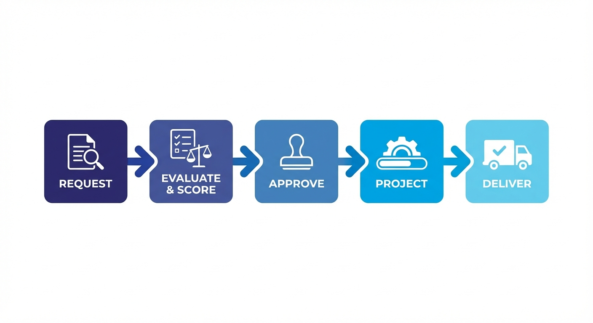

# Fast Track Portefeuille : de la demande à la livraison

Ce guide vous accompagne tout au long du cycle de vie du portefeuille -- de la soumission de votre première demande à la livraison d'un projet terminé. Il est conçu pour vous rendre productif rapidement, pas pour couvrir chaque option.

!!! tip "Conseil : Vous préférez un résumé sur une page ? :material-file-pdf-box:"
    Toutes les étapes clés sur une seule page A4 -- imprimez-la, épinglez-la, partagez-la avec votre équipe.

    [:material-download: Télécharger l'aide-mémoire (PDF)](downloads/kanap-portfolio-fast-track.pdf){ .md-button .md-button--primary }

Pour tous les détails, consultez la [documentation de référence du Portefeuille](../portfolio-requests.md).

---

## La vue d'ensemble



Chaque initiative dans KANAP suit le même flux :

| Étape | Ce qui se passe |
|-------|----------------|
| **Demande** | Quelqu'un soumet une idée ou un besoin |
| **Analyser et évaluer** | Un comité examine la faisabilité, capture une recommandation et note la priorité |
| **Approuver** | Les décideurs donnent le feu vert (ou rejettent) |
| **Projet** | La demande approuvée devient un projet avec une équipe, une chronologie et un plan de charge |
| **Livrer** | L'équipe exécute, saisit du temps et suit l'avancement jusqu'à l'achèvement |

Ce pipeline garantit que chaque initiative est évaluée équitablement, priorisée de manière transparente et suivie de manière cohérente. Plus de projets favoris qui passent devant la file d'attente.

!!! info "Information : Pourquoi c'est important"
    L'étape d'analyse et d'évaluation est ce qui fait la différence entre une liste de souhaits et un vrai portefeuille. Elle donne à la direction une base défendable et fondée sur les données pour dire oui -- ou non.

---

## Étape 1 : Soumettez une demande

Allez dans **Portefeuille > Demandes** et cliquez sur **+ Nouvelle demande**.

Les nouvelles demandes s'ouvrent sur le **Résumé** avec la barre latérale de propriétés déjà visible. Commencez par les champs structurels dans la barre latérale, puis capturez le récit dans l'**Objet**.

<!-- screenshot: Espace de travail Nouvelle demande avec Résumé et barre latérale de propriétés -->

Remplissez les détails minimaux pour commencer :

| Champ | Quoi saisir |
|-------|------------|
| **Nom** | Un titre clair et concis pour l'initiative |
| **Source** | D'où vient-elle ? (Direction métier, réglementation, stratégie IT...) |
| **Catégorie** | Le type d'initiative (ex. : Nouvelle application, Infrastructure, Amélioration de processus) |
| **Demandeur** | Qui fait la demande ? |
| **Date de livraison cible** | Quand est-ce idéalement nécessaire ? |

Puis utilisez le document **Objet** dans le **Résumé** pour expliquer le besoin métier et le résultat attendu en langage courant. Si vous avez déjà un brief dans Word, utilisez le bouton **Import** sur l'éditeur d'Objet pour importer le fichier `.docx` directement -- sans copier-coller.

Cliquez sur **Enregistrer**. Votre demande entre dans le pipeline avec le statut **En attente de revue**.

!!! tip "Conseil : Restez léger"
    Vous pourrez ajouter une analyse plus approfondie, des documents de base de connaissances liés et des preuves de support plus tard. L'objectif maintenant est d'introduire la demande dans le flux d'intake gouverné.

Pour tous les champs et options disponibles, consultez la [référence Demandes](../portfolio-requests.md).

---

## Étape 2 : Analysez et évaluez

C'est l'étape qui transforme un backlog d'idées en un portefeuille défendable. Dans l'espace de travail de la demande, ce travail est réparti entre l'onglet **Analyse** et l'onglet **Évaluation**.

### Qui devrait évaluer ?

!!! warning "Avertissement : N'évaluez pas seul"
    L'évaluation fonctionne mieux lorsqu'elle est faite par un **comité** avec des perspectives diverses. Visez à inclure des représentants de :

    - **IT Fonctionnel** -- comprend les processus métier et le paysage applicatif
    - **IT Technique** -- comprend l'infrastructure, l'architecture et la dette technique
    - **Cybersécurité** -- évalue les risques, la conformité et les implications de sécurité
    - **Métier** -- valide l'alignement stratégique et la valeur métier

    Le score d'une seule personne est une opinion. Le score d'un comité est un cadre de décision.

### Onglet Analyse

Utilisez l'**Analyse** pour comprendre si la demande est suffisamment viable pour avancer.

<!-- screenshot: Onglet Analyse avec revue de faisabilité et sélecteur de processus métier -->

L'analyse combine quatre éléments :

- Les **processus métier impactés** pour que les relecteurs voient quels domaines opérationnels la demande touche
- La **revue de faisabilité** sur sept dimensions
- Les **Risques et mesures d'atténuation** en tant que document géré (avec import et export DOCX)
- La **Recommandation d'analyse** comme verdict formel du comité

### Analyse de faisabilité (7 dimensions)

Au-delà de la valeur, vous devez évaluer si c'est réellement faisable. L'analyse de faisabilité couvre **sept dimensions** :

<!-- screenshot: Graphique radar ou formulaire d'analyse de faisabilité -->

| Dimension | Ce que vous vérifiez |
|-----------|---------------------|
| **Faisabilité technique** | L'approche proposée est-elle techniquement solide ? |
| **Intégration et compatibilité** | S'inscrit-elle dans le paysage et les interfaces existants ? |
| **Besoins d'infrastructure** | Les changements d'hébergement, plateforme ou opérations sont-ils réalistes ? |
| **Sécurité et conformité** | Les contrôles, obligations et risques sont-ils compris ? |
| **Ressources et compétences** | Avez-vous les personnes et l'expertise ? |
| **Contraintes de livraison** | Le timing, le séquencement et les dépendances sont-ils gérables ? |
| **Gestion du changement** | L'organisation peut-elle absorber le changement ? |

Chaque dimension est notée de **Non évaluée** à **Bloquant**. Le Résumé fait alors remonter le niveau de préoccupation le plus fort pour que les problèmes majeurs restent visibles même lorsque personne n'est sur l'onglet Analyse.

### Onglet Évaluation

Utilisez l'**Évaluation** pour noter la demande par rapport aux critères de portefeuille configurés pour votre tenant.

<!-- screenshot: Onglet Évaluation avec critères pondérés -->

Les noms exacts des critères et les pondérations peuvent varier selon le tenant, car ils proviennent de **Portefeuille > Paramètres**. KANAP calcule la priorité pondérée automatiquement, et certains tenants utilisent aussi une règle de contournement obligatoire pour le travail qui doit passer en tête de file.

### La recommandation d'analyse

Après avoir examiné la faisabilité et l'évaluation, rédigez la **Recommandation d'analyse**. C'est un résumé narratif court -- typiquement 2 à 4 phrases -- qui capture le verdict du comité :

<!-- screenshot: Champ texte Recommandation d'analyse -->

!!! example "Exemples de bonnes recommandations"
    - *« Forte valeur stratégique, business case solide. Faisabilité technique modérée en raison de l'intégration historique. Recommandation d'approbation avec une phase de preuve de concept. »*
    - *« Urgence faible, impact métier limité. Les contraintes de ressources rendent une livraison Q2 peu probable. Recommandation de report au S2. »*

Soumettre la recommandation publie une décision formelle dans l'**Activité**, de sorte que la justification et tout changement de statut lié restent attachés à l'historique de la demande.

La combinaison **scores + faisabilité + recommandation** donne aux décideurs tout ce dont ils ont besoin pour approuver ou rejeter -- sans avoir à assister à une présentation de deux heures.

!!! info "Information : La transparence est l'objectif"
    Lorsque les parties prenantes demandent « pourquoi ma demande a-t-elle été rejetée ? » ou « pourquoi ce projet a-t-il eu la priorité ? », l'enregistrement d'analyse et d'évaluation fournit la réponse. C'est ce qui rend le pipeline équitable.

Pour la configuration détaillée de l'évaluation et la gestion des pondérations, consultez la [référence Paramètres](../portfolio-settings.md).

---

## Étape 3 : Approuvez et convertissez

Une fois l'analyse et l'évaluation terminées, c'est le moment de la décision.

<!-- screenshot: Demande avec bouton Approuver mis en évidence -->

1. **Examinez** les scores, la faisabilité et la recommandation
2. **Faites évoluer la demande** vers **Candidate**, **En attente** ou **Rejetée** selon les besoins pendant que la revue est encore en cours
3. **Passez le statut** à **Approuvée** lorsque la demande est prête à entrer en livraison
4. Cliquez sur **Convertir en projet**

!!! tip "Conseil : Passage de relais fluide"
    Lorsque vous convertissez une demande en projet, KANAP ouvre une boîte de dialogue de conversion où vous pouvez confirmer le nom du projet, les dates planifiées et la charge initiale. L'objet de la demande est affiché pour référence, et les données liées de la demande sont reportées dans le projet.

Le statut de la demande passe à **Convertie**, et un nouveau projet est créé et lié à la demande d'origine.

Pour les demandes qui ne sont pas prêtes à être converties, gardez-les en **Candidate**, passez-les **En attente** ou définissez-les comme **Rejetée** avec une raison.

Consultez la [référence Demandes](../portfolio-requests.md) pour toutes les transitions de statut.

---

## Étape 4 : Configurez votre projet

Votre nouveau projet hérite du contexte de la demande, mais il a encore besoin d'une configuration d'exécution.

Allez dans **Portefeuille > Projets** et ouvrez votre projet nouvellement créé. L'espace de travail du projet comporte sept onglets -- **Résumé**, **Activité**, **Chronologie**, **Avancement**, **Tâches**, **Évaluation** et **Base de connaissances** -- avec une barre latérale persistante **Propriétés du projet** pour les champs principaux, l'équipe et les relations.

### Barre latérale -- Assignez vos personnes et la structure principale

<!-- screenshot: Espace de travail du projet avec section Équipe développée dans la barre latérale -->

Utilisez la barre latérale **Propriétés du projet** pour configurer les rôles principaux :

| Rôle | Qui | Objectif |
|------|-----|----------|
| **Sponsor métier** | Dirigeant métier senior | Redevable des résultats métier |
| **Sponsor IT** | Dirigeant IT senior | Lève les blocages de livraison et soutient l'initiative |
| **Responsable IT** | Chef de projet technique | Pilote la livraison IT |
| **Responsable métier** | Chef de projet côté métier | Pilote la préparation et l'adoption métier |
| **Contributeurs IT / Contributeurs métier** | Membres de l'équipe opérationnelle | Alimentent le contexte de livraison, les ventilations et les filtres de périmètre |

!!! warning "Avertissement : Les contributeurs doivent être configurés d'abord"
    Pour que la planification de capacité fonctionne, chaque contributeur **doit** être configuré dans **Portefeuille > Contributeurs** avec :

    - Son affectation d'**équipe**
    - Sa **disponibilité** (jours par mois)
    - Ses **compétences**
    - Ses **valeurs de classification par défaut** (Source, Catégorie, Flux, Société) pour que les nouvelles tâches et demandes soient pré-remplies automatiquement

    Sans données d'équipe, de disponibilité et de compétences, le générateur de roadmap ne peut pas calculer la capacité, et votre planification naviguera à l'aveugle. Voir la [référence Contributeurs](../portfolio-team-members.md).

La même barre latérale garde aussi les **Propriétés principales** et les **Relations** visibles pendant que vous travaillez, vous n'avez donc plus besoin d'onglets séparés Équipe ou Relations.

### Onglet Résumé -- Objet et tableau de bord du projet

Le **Résumé** est le tableau de bord du projet. Il affiche le statut actuel, la fenêtre de livraison, la consommation de charge, la couverture de l'équipe et la dernière activité en une seule passe. L'éditeur d'**Objet** est ici aussi -- si votre brief projet existe déjà en tant que document Word, utilisez le bouton **Import** pour importer le `.docx` directement.

### Onglet Avancement -- Validez la charge et les ventilations

<!-- screenshot: Onglet Avancement montrant les champs Charge IT et Charge Métier -->

Utilisez l'**Avancement** pour confirmer la charge qui pilotera la planification de livraison :

- **Charge IT (JH)** -- Total de jours-homme attendus des contributeurs IT
- **Charge Métier (JH)** -- Total de jours-homme attendus des contributeurs métier

!!! info "Information : Ces chiffres alimentent la roadmap"
    Le générateur de roadmap utilise ces estimations de charge, combinées à la disponibilité des contributeurs, pour planifier automatiquement les projets sur la chronologie. Des estimations plus précises = de meilleures roadmaps.

### Onglet Chronologie -- Appliquez un modèle de phases (optionnel)

<!-- screenshot: Onglet Chronologie avec sélecteur de modèle -->

Si votre organisation a défini des modèles de phases (ex. : « Projet standard », « Cycle Sprint Agile »), vous pouvez en appliquer un ici pour créer instantanément la chronologie de votre projet avec des phases et jalons prédéfinis. La chronologie peut être visualisée en tableau ou en diagramme de Gantt.

Vous pouvez aussi définir les dates manuellement ou sauter cette étape entièrement pour les initiatives plus simples.

Voir la [référence Projets](../portfolio-projects.md) pour toutes les options de configuration de projet.

---

## Étape 5 : Suivez l'exécution

Maintenant le vrai travail commence. Au fur et à mesure que le projet avance, gardez KANAP à jour.

### Mettez à jour l'avancement

<!-- screenshot: Curseur Avancement de l'exécution -->

Utilisez le curseur **Avancement de l'exécution** dans l'onglet Avancement pour refléter la progression du projet. C'est un simple pourcentage (0-100 %) qui alimente les tableaux de bord et les rapports.

Faites évoluer le projet à travers les statuts au fur et à mesure que le travail progresse. En pratique, la plupart des projets passent de **Liste d'attente** ou **Planifié** vers l'exécution active :

**Liste d'attente / Planifié** --> **En cours** --> **En test** --> **Terminé**

### Saisissez du temps -- C'est critique

!!! warning "Avertissement : Pas de saisie de temps = pas de planification automatique"
    La saisie de temps n'est pas que pour le reporting -- elle alimente directement le générateur de roadmap.

Il y a deux endroits pour saisir du temps :

1. **Onglet Avancement** -- Saisissez le temps d'overhead projet (réunions, coordination, management)
2. **Tâches** -- Saisissez le temps spécifique aux tâches contre des éléments de travail individuels

<!-- screenshot: Boîte de dialogue de saisie de temps -->

Voici pourquoi c'est important :

```
Temps saisi --> Statistiques de temps du contributeur --> Données de capacité historiques
                                                     --> Générateur de roadmap (mode historique)
                                                     --> Planification future précise
```

Le générateur de roadmap a un **mode de capacité historique** qui utilise le temps réellement saisi pour comprendre combien chaque contributeur livre réellement par mois (par opposition à sa disponibilité théorique). Sans données de temps, le générateur se rabat sur des estimations théoriques -- qui sont presque toujours optimistes.

!!! tip "Conseil : Faites-en une habitude"
    Encouragez les membres de l'équipe à saisir du temps chaque semaine. Même des entrées approximatives sont bien meilleures que rien. Les données se composent au fil du temps et rendent chaque itération de roadmap plus précise.

### Statuts

| Statut | Signification |
|--------|--------------|
| **Liste d'attente** | Approuvé mais pas encore planifié dans le travail actif |
| **Planifié** | Planifié et préparé, mais l'exécution n'a pas commencé |
| **En cours** | Le travail actif est en cours |
| **En test** | Les livrables sont en cours de validation |
| **En attente** | Temporairement suspendu (capturez la raison) |
| **Terminé** | Tous les livrables acceptés, projet terminé |
| **Annulé** | Arrêté avant l'achèvement |

Voir la [référence Projets](../portfolio-projects.md) pour les détails de chaque statut.

---

## Étape 6 : Structurez avec des phases et des tâches

Pour les projets plus importants, vous aurez besoin d'un suivi plus granulaire.

### Phases

Les phases décomposent le projet en étapes logiques (ex. : Analyse, Développement, Test, Déploiement).

<!-- screenshot: Vue des phases du projet -->

- **À partir d'un modèle** : Appliquez un modèle de phases depuis l'onglet Chronologie pour obtenir une structure prédéfinie
- **Personnalisé** : Ajoutez des phases manuellement avec noms, dates de début/fin et responsables

Chaque phase peut avoir son propre statut, ses dates et son comportement de jalon. L'onglet Chronologie vous permet de visualiser la structure des phases en tableau ou en diagramme de Gantt.

### Tâches

Au sein de chaque phase (ou au niveau projet), créez des tâches pour des éléments de travail spécifiques. Ouvrez l'onglet **Tâches** dans l'espace de travail du projet pour les gérer.

<!-- screenshot: Liste de tâches au sein d'une phase -->

- Assignez les tâches aux contributeurs
- Définissez les dates d'échéance, priorités et types de tâches
- Rédigez des descriptions détaillées avec l'éditeur markdown -- ou **importez un fichier `.docx`** directement dans le champ Description
- Saisissez du temps directement contre les tâches (catégorie IT ou Métier)
- Liez les tâches aux phases pour un suivi structuré
- Attachez des documents de la **base de connaissances** depuis la barre latérale de la tâche pour le matériel de référence

Les tâches peuvent aussi être créées directement depuis une phase de la chronologie en utilisant le raccourci **[+]**, qui pré-lie la tâche à la fois au projet et à la phase sélectionnée.

!!! tip "Conseil : Les tâches projet doivent avoir du temps saisi avant clôture"
    Vous ne pouvez pas marquer une tâche projet comme **Terminé** tant qu'au moins un peu de temps n'a pas été saisi. Cela maintient le suivi de charge honnête.

### Jalons

Marquez les points de contrôle clés -- décisions go/no-go, échéances de livrables ou dépendances externes.

<!-- screenshot: Jalon sur la chronologie -->

Les jalons apparaissent sur la chronologie du projet et dans les rapports, donnant aux parties prenantes une visibilité claire sur les points de décision à venir. Ils peuvent être créés comme jalons autonomes ou en activant le suivi de jalon sur une phase.

!!! tip "Conseil : Commencez simple, ajoutez de la structure au besoin"
    Vous n'avez pas besoin de phases et de tâches pour chaque projet. Les petites initiatives peuvent être suivies avec juste le curseur d'avancement et le statut. Ajoutez de la structure lorsque le projet est assez complexe pour en avoir besoin.

Pour tous les détails sur les phases, tâches et jalons, consultez la [référence Projets](../portfolio-projects.md) et la [référence Tâches](../tasks.md).

---

## Comment tout s'interconnecte

Chaque donnée que vous saisissez alimente quelque chose de plus grand. Voici pourquoi l'effort en vaut la peine :

### Planification automatique de roadmap

Le générateur de roadmap prend vos estimations de charge de projet, la disponibilité des contributeurs et les données de temps historiques pour **planifier automatiquement les projets** sur la chronologie. Plus de gymnastique manuelle de diagrammes de Gantt.

Voir la [référence Planification](../portfolio-planning.md).

### Cartes de chaleur de capacité

La disponibilité des contributeurs et les affectations de projets se combinent pour vous montrer **qui est surchargé et qui a de la bande passante** -- à travers les équipes et les périodes. Cela prévient le classique « tout le monde est assigné à 5 projets à 100 % ».

### Analyse des goulots d'étranglement

Lorsque plusieurs projets se disputent les mêmes contributeurs ou compétences, KANAP met en évidence le goulot d'étranglement pour que vous puissiez faire des arbitrages avant qu'ils ne deviennent des crises.

### Reporting exécutif

Les scores de priorité, le statut du projet, l'avancement, le budget et les données de chronologie se consolident dans des **rapports au niveau portefeuille** qui donnent à la direction une image claire sans création manuelle de PowerPoint. Le hub de reporting inclut un rapport de changements de statut, une carte de chaleur de capacité et un rapport hebdomadaire.

Voir la [référence Rapports](../portfolio-reporting.md).

---

## Référence rapide

| Je veux... | Aller à... |
|------------|-----------|
| Soumettre une nouvelle idée | Portefeuille > Demandes > + Nouveau |
| Évaluer une demande | Ouvrir la demande > onglet Évaluation |
| Évaluer la faisabilité | Ouvrir la demande > onglet Analyse |
| Définir l'équipe projet | Ouvrir le projet > Barre latérale Propriétés du projet > Équipe |
| Importer un document Word | Ouvrir demande/projet/tâche > bouton Import sur Objet ou Description |
| Voir le pipeline de projets | Portefeuille > Planification |
| Vérifier la capacité de l'équipe | Portefeuille > Planification > Vue capacité, ou Portefeuille > Rapports > Carte de chaleur capacité |
| Saisir du temps sur un projet | Ouvrir le projet > onglet Avancement ou Tâches |
| Générer une roadmap | Portefeuille > Planification > Générateur de roadmap |
| Consulter les rapports | Portefeuille > Rapports |
| Configurer les pondérations d'évaluation | Portefeuille > Paramètres > Critères d'évaluation |
| Configurer les contributeurs | Portefeuille > Contributeurs |
| Définir les valeurs par défaut de classification | Portefeuille > Contributeurs > ouvrir le profil > onglet Valeurs par défaut |

---

!!! success "Vous êtes prêt"
    Vous connaissez maintenant le cycle de vie complet de la demande à la livraison. Commencez par une demande, évaluez-la correctement, et laissez KANAP gérer le reste. Pour une documentation détaillée sur chaque fonctionnalité, explorez la section [Gestion de portefeuille](../portfolio-requests.md).
