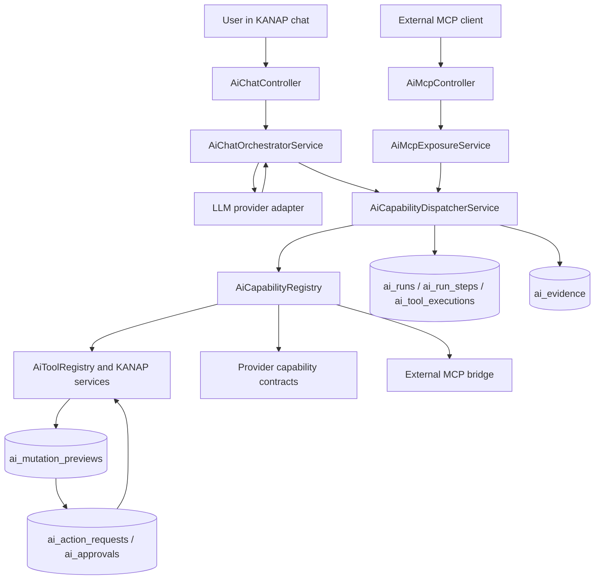

# Plaid Architecture

Metadata
- Purpose: Explain how Plaid is implemented as KANAP's AI agent and agentic control plane
- Audience: Engineers, architects, technical IT leaders
- Status: current
- Owner: Engineering
- Last Updated: 2026-05-31

**Related Documentation**:
- [architecture.md](architecture.md) - Overall KANAP architecture, tenancy, RLS, and runtime model
- [features/components/plaid-read-coverage-review.md](features/components/plaid-read-coverage-review.md) - Plaid read coverage

---

## Summary

Plaid is the native AI agent in KANAP. It uses the governed IT system of record
as its context, exposes typed tools to the model, executes those tools through
tenant-scoped services, and gates mutations through durable previews and
approvals. The control-plane layer records runs, steps, tool executions,
evidence, action requests, approvals, policy decisions, and external capability
contracts so Plaid can move from "answering questions" toward governed action
across the IT environment.

## Core Idea

An IT agent is only dependable when it can reason from a trustworthy source of
truth. KANAP is that source of truth: budgets, applications, assets, interfaces,
connections, projects, requests, tasks, suppliers, contracts, locations, and
knowledge all live in one tenant-isolated model.

Plaid does not bypass that model. It reads through typed AI tools, uses the same
RBAC and RLS boundaries as the application, and writes through preview objects
that must be approved before execution. That is the difference between a clever
assistant and an operational agent: the agent can act because the action is
grounded, scoped, reviewable, and auditable.

## Architecture At A Glance

The same dispatcher path is used from chat and MCP in the current
implementation. Chat can use read and write-preview capabilities. KANAP MCP
only exposes read-only capabilities today.

## Chat Runtime

The chat endpoint is `POST /ai/chat/stream` in
`backend/src/ai/ai-chat.controller.ts`. It builds an AI execution context with
tenant, user, request, and surface metadata, then delegates to
`AiChatOrchestratorService`.

The orchestrator:

- validates chat access through `AiPolicyService`
- resolves the provider source, model, API key, and endpoint from tenant or
  platform AI settings
- loads conversation history, user profile context, attachments, and pending
  previews
- selects a context profile from the latest turn, for example read, entity
  inspection, document write, task write, financial write, relation write, or
  web
- builds the system prompt with current user context, readable entity types,
  tool guidance, write-preview guidance, and writable field summaries
- streams the model response and buffers provider-native tool calls
- executes each tool call through `AiCapabilityDispatcherService`
- injects tool results, preview events, context items, activity events, and final
  assistant text back into the stream

The loop is bounded by `MAX_TOOL_ITERATIONS = 20`. Tool schemas are filtered by
the context profile so the model sees the smallest useful tool surface for the
turn.

## Context Engineering

Plaid context comes from the system of record, not a free-form database dump.
The main context layers are:

- **Current user and tenant context** from the authenticated request.
- **Readable entity types** from `AiPolicyService.listReadableEntityTypes`.
- **Conversation history and previews** from `AiConversationService` and
  `AiMutationPreviewService`.
- **Structured read tools** from `AiToolRegistry`, `AiQueryExecutor`, and
  `AiAggregateExecutor`.
- **Relationship context** from `AiEntityService.getEntityContext`.
- **Knowledge context** from `KnowledgeService`, including document search and
  document detail DTOs.

The query executor strips internal fields such as tenant IDs, object keys, file
paths, secrets, tokens, API keys, and encrypted fields before returning detail
payloads to the model.

## KANAP Data Tools

Plaid can currently read these entity families:

`accounts`, `analytics_categories`, `applications`, `assets`,
`business_processes`, `capex_items`, `chart_of_accounts`, `companies`,
`connections`, `contacts`, `contracts`, `departments`, `documents`,
`interfaces`, `locations`, `projects`, `requests`, `spend_items`, `suppliers`,
`tasks`, and `users`.

The core read tools are:

- `search_all`
- `describe_entity_filters`
- `query_entities`
- `aggregate_entities`
- `get_filter_values`
- `get_entity_detail`
- `get_entity_context`
- `get_entity_comments`
- `search_knowledge`
- `get_document`
- `web_search`, when the feature and tenant setting are enabled

Structured query and aggregate tools are authoritative for counts, filters, and
complete lists. Discovery tools are intentionally treated as ranked and
incomplete.

## Write Model

Plaid writes are chat-only. The model cannot execute a mutation directly.
Instead, a write tool creates a backend preview. The user then approves or
rejects that preview through the chat approval card. Approval is recorded as a
durable action request and approval row before execution.

Live write-preview coverage includes:

- task creation, status updates, assignee changes, richer task field updates,
  task comments, and bulk task reassignment previews
- document creation, content updates, metadata updates, and relation updates
- master-data create/update for companies, departments, suppliers, contacts,
  accounts, charts of accounts, analytics categories, business processes, and
  locations
- business-record create/update for applications, assets, contracts, projects,
  requests, interfaces, connections, spend items, and CAPEX items
- relation updates for supported application, asset, supplier, contract, spend,
  CAPEX, project, request, document, and location links
- financial plan writes for spend and CAPEX versions, amounts, and allocations
- GLPI ticket import into a KANAP task
- grouped mutation plans and undo previews where a reversible operation supports
  reversal

Writes go through existing domain services where practical, so normal validation,
workflow rules, side effects, and audit logging still apply. AI-originated domain
audit rows use `source: ai_chat` and the preview ID as `sourceRef`.

## MCP Exposure

KANAP exposes an MCP endpoint at `POST /ai/mcp` using stateless Streamable HTTP.
MCP API keys can be sent as `Authorization: Bearer <key>` or `x-api-key`.

Current MCP behavior is deliberately read-only:

- API keys have scoped policies: `mcp:tools:list`, `mcp:tools:execute`, and
  optionally `mcp:audit:read`
- default allowed capability group is `kanap.read.core`
- API key policy enforces `mcp_max_effect = read`
- `AiMcpExposureService` only exposes capabilities whose effect is `read`,
  default approval is `none`, and MCP exposure is marked read-only
- MCP calls are dispatched through the same control-plane dispatcher and are
  recorded in `ai_runs`, `ai_tool_executions`, and `ai_evidence`
- `GET /ai/mcp/audit` returns MCP tool execution audit entries for authorized
  keys/admins

Read-write MCP is roadmap. It needs an explicit approval protocol rather than
reusing chat approval cards.

## Agentic Control Plane

The control plane generalizes Plaid tools into capability contracts. A
capability declares:

- name and version
- provider kind
- supported surfaces: chat, MCP, scheduler, alert, or internal
- input and output schemas
- effect: read, propose, notify, write, or remediate
- risk level and maximum autonomy level
- approval strategy
- evidence persistence and redaction rules
- timeout, retry, idempotency, rollback, and MCP exposure metadata

`AiCapabilityRegistry` wraps existing KANAP AI tools as compatibility
capabilities and also registers provider capability contracts for monitoring,
ticketing, virtualization, directory, automation, and external MCP tools.
`AiCapabilityDispatcherService` validates inputs, enforces surface and approval
rules, checks emergency pauses, executes the handler, records evidence, and
updates run/step/tool status.

The main durable records are:

- `ai_runs`
- `ai_run_steps`
- `ai_tool_executions`
- `ai_evidence`
- `ai_action_requests`
- `ai_approvals`
- `ai_observations`
- `ai_recommendations`
- `ai_decisions`
- `ai_evaluations`
- `ai_approval_policies`
- `ai_autonomy_ceilings`
- `ai_autonomy_routines`
- `ai_emergency_pauses`
- `ai_automation_job_catalog`
- `ai_external_mcp_servers`
- `ai_external_mcp_tool_snapshots`
- `ai_live_test_targets`

These tables are tenant-scoped and RLS-protected in the corresponding
migrations.

## External Environment State

There are three different states to keep separate:

| Area | Current state |
| --- | --- |
| GLPI ticket import | Live. Plaid can import one GLPI ticket by numeric ID into one KANAP task, including public followups and inline images where possible, after preview approval. |
| Public web search | Live when `BRAVE_SEARCH_API_KEY`, feature flags, and tenant settings enable it. Queries are sanitized to avoid sending internal identifiers. |
| Provider contracts | Live as capability contracts and dispatcher paths for monitoring, ticketing, virtualization, directory, and automation. |
| In-tree provider implementations | Mock/contract implementations. Non-mock adapter configurations currently return unavailable in this control-plane build. |
| External MCP bridge | Live as governed read-only snapshots and a mock transport for internal/scheduler/alert surfaces. Live external transports are not enabled, and external MCP bridge tools are not re-exported through KANAP MCP. |
| Automation catalog | Live control-plane machinery for allowlisted jobs, variable schemas, dry runs, approval-gated launch requests, idempotency, cooldowns, and output reads. Production launches are blocked in the current implementation. |
| Live-readiness harness | Live test harness and safe target model for GLPI, PRTG, Nutanix, Active Directory, AWX dry-run, and GLPI sandbox-write scenarios. It is a gated readiness/contract mechanism, not a general production adapter claim. |

This means KANAP already has the control-plane foundation for native IT
environment interaction, but public documentation should not imply that every
monitoring, ticketing, collaboration, directory, virtualization, or automation
platform is connected out of the box.

## Model-Agnostic Design

Plaid is model-agnostic at the provider boundary. `AiProviderRegistry` registers
adapters for:

- Anthropic
- OpenAI
- Ollama
- custom OpenAI-compatible endpoints

Each adapter implements the same provider interface for configuration
validation, streaming, message conversion, and tool-call events. Tenant settings
choose custom provider configuration, while platform AI configuration supports a
built-in provider mode with rate limits and monthly usage accounting.

The tool and capability layers are independent from any one model. The model
receives JSON schemas, emits tool calls, and the backend decides which tools are
available for the tenant, user, surface, and turn.

## Enterprise Constraints

Plaid is designed around enterprise controls rather than added after the fact:

- **Tenant isolation**: domain data access and tool execution run inside
  tenant-scoped database sessions; control-plane tables and domain tables use
  RLS.
- **RBAC**: readable entity types and writable mutation tools are filtered by
  user permissions and business resources.
- **Approval gates**: non-read actions become previews or action requests before
  execution.
- **Auditability**: runs, tool executions, evidence, action requests, approvals,
  and domain audit rows preserve the chain of action.
- **Redaction**: evidence capture redacts secret-like keys, bearer tokens, email
  addresses, IP addresses, and configured fields.
- **Secrets handling**: adapter credential references point to tenant-scoped
  environment or secret references; plaintext-looking credentials are rejected.
- **MCP least privilege**: API keys have scopes, allowlists, denylists,
  read-only max effect, per-key rate limits, revocation metadata, and audit.
- **Emergency pause**: tenant-scoped pauses can block capabilities by name,
  category, or effect.
- **Automation guardrails**: automation jobs must be cataloged, target selectors
  are allowlisted, broad selectors are rejected, dry-run evidence can be
  required, blast radius and cooldowns are enforced, and production launch is
  blocked in the current implementation.

## Roadmap

These items are direction, not current out-of-the-box functionality:

- production adapter implementations for monitoring, ticketing, directory,
  virtualization, communication, and automation providers
- broader GLPI behavior beyond the current import-by-ticket-ID flow
- live external MCP transports beyond the current mock/snapshot bridge
- read-write MCP with a durable approval protocol suitable for external clients
- scheduler and alert-triggered routines beyond the current mock diagnostic and
  policy-controlled foundations
- production controlled-autonomy policies beyond the current mock-only safety
  boundary
- richer user-facing administration for provider adapters, action requests,
  live-readiness targets, and control-plane audit review

## Code References

- `backend/src/ai/ai-chat.controller.ts`
- `backend/src/ai/ai-chat-orchestrator.service.ts`
- `backend/src/ai/ai-system-prompt.service.ts`
- `backend/src/ai/ai-context-profile.ts`
- `backend/src/ai/ai-tool.registry.ts`
- `backend/src/ai/query/ai-query.executor.ts`
- `backend/src/ai/ai-mcp.controller.ts`
- `backend/src/ai/control-plane/capability/capability-contract.ts`
- `backend/src/ai/control-plane/capability/ai-capability.registry.ts`
- `backend/src/ai/control-plane/dispatcher/ai-capability-dispatcher.service.ts`
- `backend/src/ai/control-plane/action-request/ai-action-request.service.ts`
- `backend/src/ai/control-plane/approval/ai-approval.service.ts`
- `backend/src/ai/control-plane/evidence/ai-evidence.service.ts`
- `backend/src/ai/control-plane/providers/provider-registry.service.ts`
- `backend/src/ai/control-plane/mcp/ai-mcp-exposure.service.ts`
- `backend/src/ai/control-plane/mcp/ai-external-mcp-bridge.service.ts`
- `backend/src/ai/control-plane/live-readiness/ai-live-contract-harness.service.ts`
