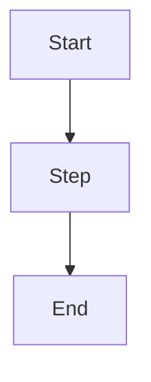

# <Title>

Metadata
- Purpose: <why this document exists>
- Audience: <who should read this>
- Status: <draft | current | archived | deprecated>
- Owner: <team/person>
- Last Updated: <YYYY-MM-DD>

**Related Documentation**:
- [related-doc.md](path/to/related-doc.md) - Brief description
- [another-doc.md](path/to/another-doc.md) - Brief description

---

## Summary
<One-paragraph overview of the key points>

## Context
<Background, constraints, goals, non-goals>

## Details
<Main content. Use headings to organize sections>

**Cross-Reference Convention**: When referencing related documentation, use:
```markdown
**See:** [document-name.md](path/to/document.md) for detailed information on X.
```

Avoid duplicating content - link to the authoritative source instead.

## Diagram


## Decisions
- <Decision 1 with rationale>
- <Decision 2 with rationale>

## Open Questions
- <Question 1>

## References
- <Links to specs, tickets, ADRs, external resources>

